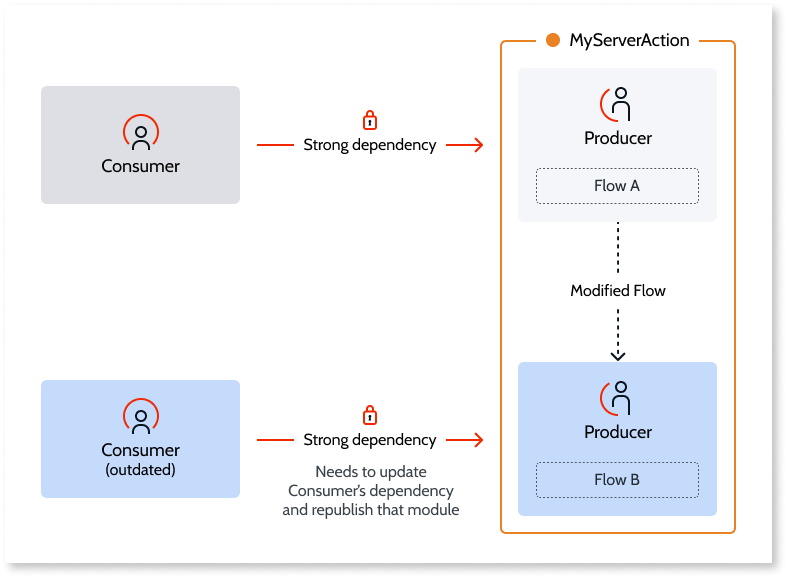

# Understand Strong and Weak Dependencies

Depending on the type of element exposed by a producer module, OutSystems will generate a **strong dependency** or a **weak dependency** between the producer module and its consumers.

## Strong Dependencies

When a consumer module has a **strong dependency** to a producer, those modules are tightly-coupled. The producer logic is executed just as if it is defined in the consumer module: they run in the same request, share the same transaction, session variables, site properties, etc.

 
In runtime, the consumer module needs to know both the **signature** and the **implementation** of the element exposed by the producer to be able to reuse it. For this reason, when the [producer changes the signature or the implementation](handle-changes.md#change-functionality-in-the-producer-module) of the exposed element, the consumer module becomes outdated and needs to be republished to start using the latest producer version. 

Reusing the following elements, will make the consumer’s dependency to the producer a **strong** dependency:

* Server Actions
* Client Actions
* Blocks
* Images
* Resources
* Scripts
* Themes
* Roles
* Processes
* Process Activities

If the consumer is reusing more than one element exposed by the same producer module, and **at least one** of the elements belongs to the list above, the consumer has a **strong dependency** to that producer.

## Weak Dependencies

When a consumer module has a **weak dependency** to a producer, those modules are loosely-coupled. Depending on the type of the producer’s element reused by the consumer, one of the following happens:

* Elements having associated **logic**, such as actions or screens, run in the context of the producer’s request. Changes in the producer implementation take immediate effect in the consumer.

* **Data type** elements, such as entities or structures, are defined only by the signature (there is no associated logic). Queries over reused entities run in the same transaction as the consumer logic. Changes in entities take immediate effect in the database.

In runtime, the consumer module only needs to know the **signature** of the element to be able to reuse it. For this reason, when the [producer changes only the implementation](handle-changes.md#change-functionality-in-the-producer-module) of the exposed elements, the consumer module does not become outdated and the latest producer version is immediately available to the consumer in runtime.

Reusing the following elements, will make the consumer’s dependency to the producer a **weak** dependency:

* Screens
* Service Actions
* Database Entities
* Local Storage Entities
* Static Entities
* Structures

If the consumer is reusing more than one element exposed by the same producer module, the consumer has a **weak dependency** to that producer only if **all the elements** belong to the list above.
