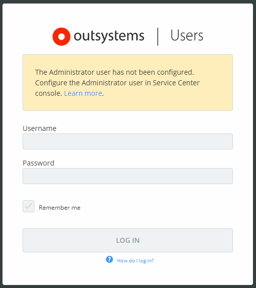
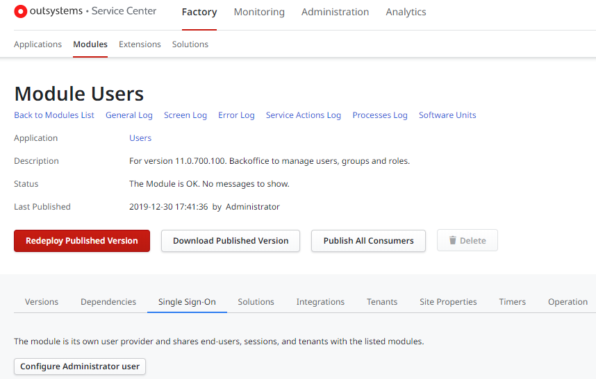

# Access the Users application

The OutSystems **Users** application lets you create, update, and delete end users (the users of your applications) and their roles. You can also manage user roles individually or in bulk using groups.

To access the Users application for a specific OutSystems environment, go to:

`https://<environment_address>/Users`.

To log in to the Users application, you must have an account with administrator privileges.

This account is **not** the same one you use to connect to Service Center, LifeTime or Service Studio, as those are [IT Administrator Users](../../../managing-the-applications-lifecycle/manage-it-teams/intro.md).

Before accessing the Users application for the first time, you must [configure the Administrator user](#configure-users-admin).

## Configuring the Administrator user of the Users app { #configure-users-admin }

Configuring the Administrator user of the Users application sets the user password and grants the Administrator user ("admin") with all the available roles.

### Prerequisites

To perform this operation, your administrator users must have the [Change and Deploy Applications permission](../../../managing-the-applications-lifecycle/manage-it-teams/about-permission-levels.md#env-permission-levels), which means they must have one of the following:

* A role assigned to them with the **Change and Deploy Applications** permission level (or higher) as default role.
* A role assigned to them with the **Change and Deploy Applications** permission level (or higher) for the Users application.

For environments that aren't managed by LifeTime, users accessing Service Center must have one of the following:

* A role assigned to them that has **Full Control** over the Users module.
* A role assigned to them that has  **Full Control** directly over the Users module.

### Configure the Administrator user

To configure the Administrator user for the Users application, do the following:

1. Log in to Service Center (`http://<environment_address>/ServiceCenter`). Make sure your user meets the prerequisites to perform the operation.

1. Go to **Factory** > **Modules**.

1. Search for **Users** and click the module name to open the details page.

1. Click the **Single Sign-On** tab.

1. Click the **Configure Administrator user** button.

    

1. Set the password for the Administrator user.

1. Click **Apply**.

OutSystems saves the password you entered for the Administrator user ("admin") of the Users application, and grants the Administrator user with all the available Roles.
