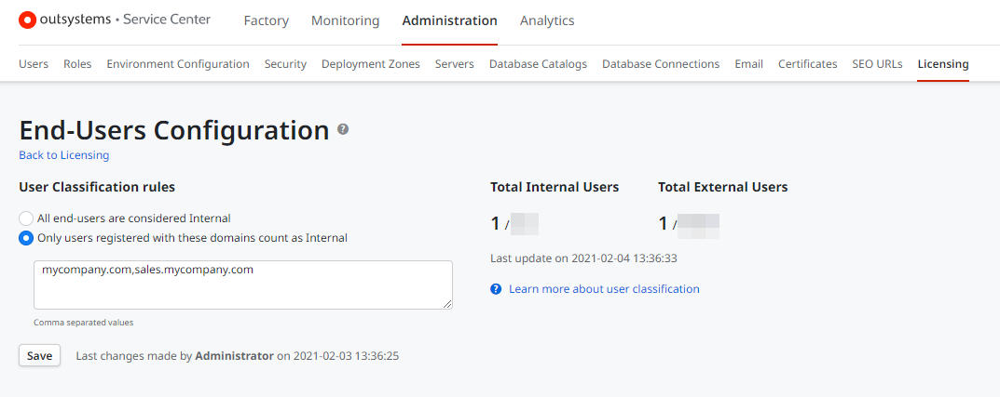

# Classify Users as Internal Users

By default, all end users are considered internal until you configure specific domains that you own within Service Center. When you specify the domains that you own, any users with an email address matching those domains will be classified as internal, and any other email domains will be classified as external. Users without an email on their profile are classified as internal. This is important since you license internal and external end-user capacities separately. [Learn more](intro.md)

## How to configure your domains

1. Open the Service Center management console.

1. Navigate to **Administration** > **Licensing** and click the "End-Users Configuration" link.

1. Under **User Classification Rules**, select **Only users registered with these domains count as Internal** and enter the domain names that you own. 

    

1. Click **Save**.

After saving your changes, OutSystems starts the process of calculating the current internal and external end users, which might take a few minutes. The totals are recalculated periodically using a timer process. The **Last update on** indicates the last time the user counts were calculated.

## How end users are counted

Each OutSystems infrastructure has an associated end-user capacity: the maximum number of unique individuals who use the infrastructure's apps.

OutSystems consoles provide an estimate of the current usage of this capacity based on the user records in the OutSystems database:

* By default, each user record is assumed to be a unique individual.

* If the same individual uses apps in different production runtimes, it is counted in the estimate presented for each of the production runtimes.

* For the purpose of counting users, the platform deduplicates records with the same email address or login, as long as they are assigned to a [default tenant](https://success.outsystems.com/documentation/how_to_guides/development/how_to_build_a_multi_tenant_application/#multi-tenancy-in-outsystems-platform), even across [user providers](intro.md#User-providers).

* If you use shared email addresses, you may end up with an incorrect user count.

### Additional details

* Users without an email in neither the **Email** nor **Username** fields always count as internal.

* The values displayed on the **User Distribution Per User Provider** table show the total number of users without deduplication.

* From Platform Server version 11.11.3 and higher, users are counted by deduplicating records with the same email address or login, as long as they are assigned to a [default tenant](https://success.outsystems.com/documentation/how_to_guides/development/how_to_build_a_multi_tenant_application/#multi-tenancy-in-outsystems-platform), even across [user providers](intro.md#User-providers). In earlier versions, all users were counted individually without deduplication.
