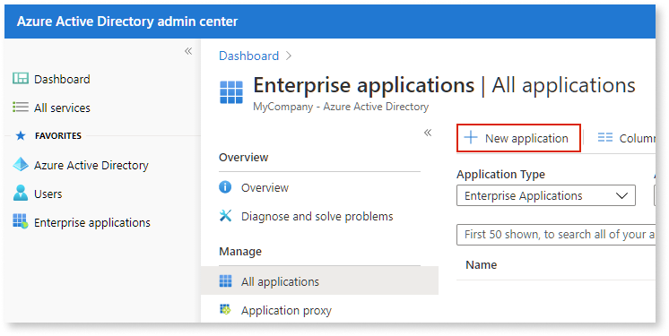
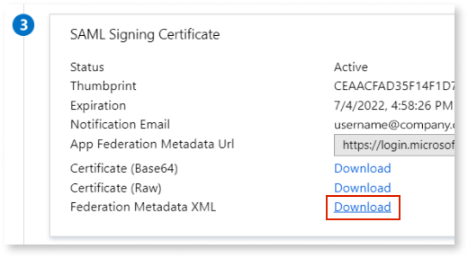
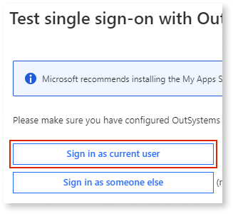

# Configure Azure AD Authentication

The configuration of the Azure AD authentication method is quite similar to the [SAML 2.0](configure-saml.md) one, but in this case the "Claims" settings are already filled in with Azure AD default values.

Additionally, the configuration settings for Azure AD authentication can be filled in by uploading/downloading files with metadata, which helps avoid human errors. 

To set up SAML for Azure AD, you need Platform Server Release Jul.2019 CP2 or later.

The [limitations of the current SAML 2.0 implementation](configure-saml.md#current-limitations) also apply to the Azure AD authentication method. Be sure to check them when using Azure AD end user authentication.

To set up Azure AD authentication for end users do the following:

1. Sign in to the [Azure Active Directory portal](https://aad.portal.azure.com/) and create your own application. 

    

1. Search for the **OutSystems Azure AD** application on Azure AD marketplace and select it.

    

1. Select the **SAML** single sign-on method.

    

1. In the [Users application](../accessing-users.md), click "Configure Authentication" in the sidebar, choose `Azure AD` in **Authentication** and fill the **Service Provider Connector Settings** accordingly, or keep the default values.

    

1. Download the Service Provider metadata file by clicking **Download SP Metadata XML**.

    

1. In the Azure Active Directory portal, upload the metadata file downloaded in the previous step by clicking **Upload metadata file**.

    

1. Edit the Basic SAML configuration by clicking the pencil icon and fill in the Logout URL field with the following URL:  
`https://<your_server_name>/Users/SLO.aspx`

1. Download the Federation Metadata XML in the Azure Active Directory portal by clicking the corresponding "Download" link.

    

1. In the Users application, upload the XML file you downloaded in the previous step by clicking **Upload from IdP/Federation Metadata XML**.

    

1. Make sure you assign a user or a group to the Azure application you created to be able to proceed. You can do this operation in the Azure portal. Check [Microsoft's documentation](https://docs.microsoft.com/en-us/azure/active-directory/manage-apps/assign-user-or-group-access-portal#assign-users-or-groups-to-an-app-via-the-azure-portal) for more information.

1. In the Azure Active Directory portal, click **Test** in step 5 to test your configuration. 

    

1. Click **Sign in as current user**.

    

1. After entering your credentials, if the authentication is successful you will be redirected to the Users application and you will get an error stating that you don't have permissions to view the screen. 

    

    This happens because this user doesn't have any roles yet. You will need to configure user roles after the user logs in for the first time using Azure AD authentication, so that the user already exists in the OutSystems database.

    If the authentication is unsuccessful, double-check your configuration settings.

1. Follow the instructions provided for the SAML 2.0 authentication method to [change the Logout flow of your OutSystems applications](configure-saml.md#change-logout-flow).

## Troubleshooting Azure AD authentication issues

Since the Azure AD end user authentication method is very similar to the SAML 2.0 one, you can troubleshoot them in the same way:

* Check the [SAML Message Logs page](configure-saml.md#logs) for detailed information on Azure AD messages exchanged for end user authentication.

* Use the same method for [accessing the Users application when you're locked out](configure-saml.md#locked-access) due to incorrect configuration settings in end user authentication.
