# Configure Okta Authentication

Applies only to Traditional Web Apps and Reactive Web Apps.

Requires Platform Server Release Jul.2019 CP2 (11.0.542.0) or later.

OutSystems allows you to use Okta for authenticating the end users of your OutSystems applications. This authentication method is configured in a way that's quite similar to the [SAML 2.0](configure-saml.md) one.

The [limitations of the current SAML 2.0 implementation](configure-saml.md#current-limitations) also apply to Okta. Be sure to check them when using Okta end user authentication.

## Configuring Okta

To configure Okta authentication you must complete these general steps:

1. Configure general Okta authentication settings in Users app
1. Create application in the Okta portal
1. Configure SAML settings of Okta application
1. Finish configuration in the Users app
1. Assign user or group to Okta application
1. Test your configuration
1. Configure user roles in the Users app
1. Perform some final checks and configurations

The following sections describe these steps in detail.

### Configure general Okta authentication settings in Users app

1. In the [Users application](../accessing-users.md), click **Configure Authentication** in the right sidebar.

1. In **Authentication** choose `OKTA` (A).

    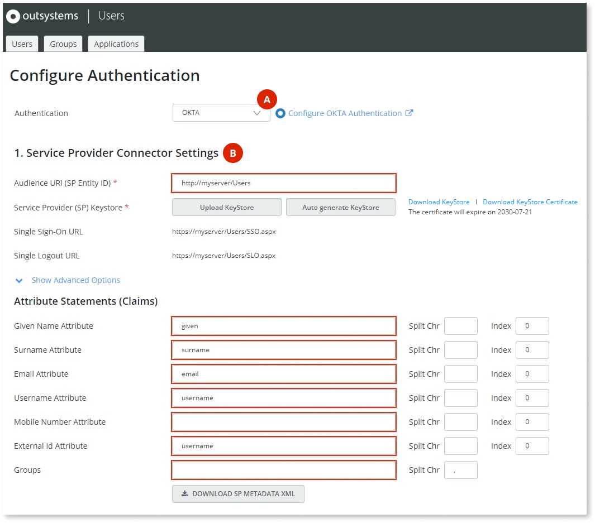

1. Fill the **1. Service Provider Connector Settings** (B). OutSystems suggests that you use the following values for the settings under **Attribute Statements (Claims)**:

    Given Name Attribute = `given`  
    Surname Attribute = `surname`  
    Email Attribute = `email`  
    Username Attribute = `username`  
    External Id Attribute = `username`  

1. Click **Download KeyStore Certificate** to download the certificate PEM file.

    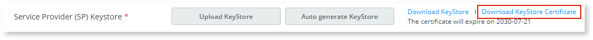

### Create an application in the Okta portal

1. Sign into the Okta portal and click **Admin**.

    This brings you to the Developer Console.

    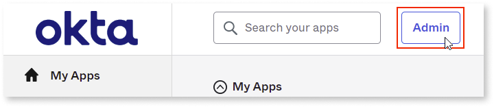

1. Go to **Applications** > **Applications**.

    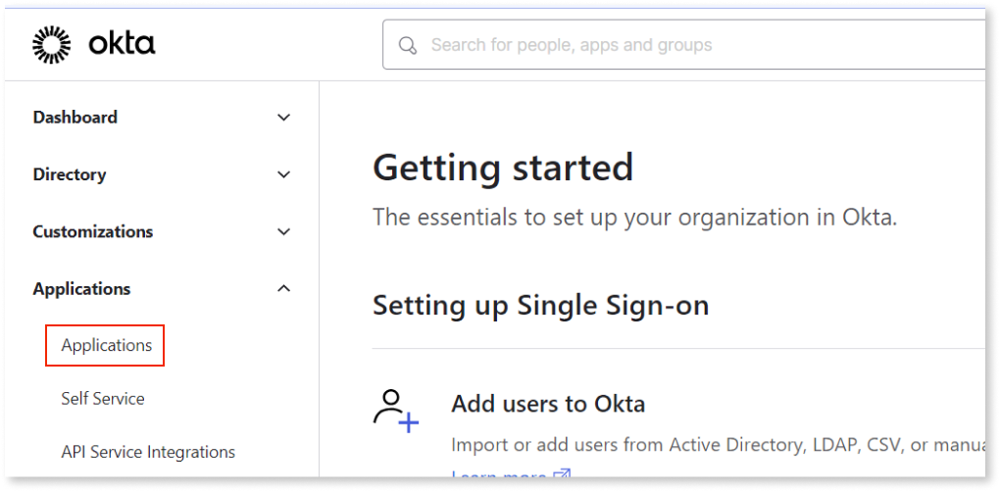

1. Click **Create App Integration**.

    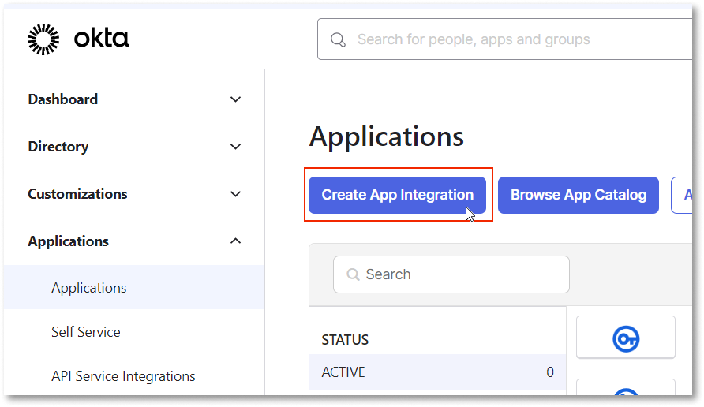

1. Select the **SAML 2.0** sign-in method and click **Next**.

    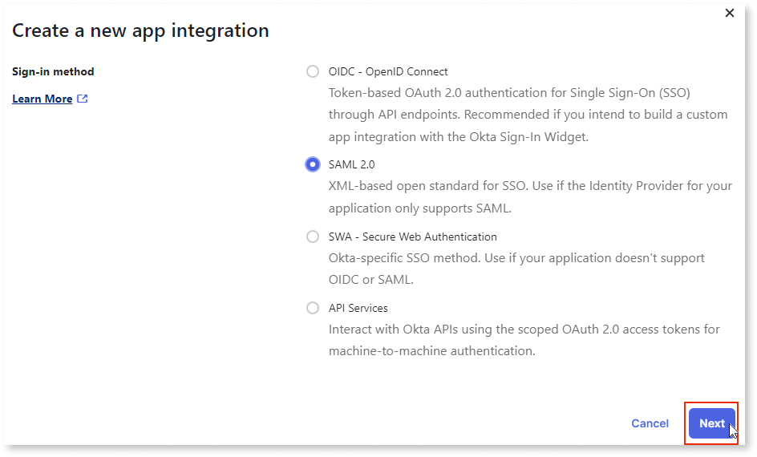

1. Enter a name for your application and (optionally) select an app logo.

    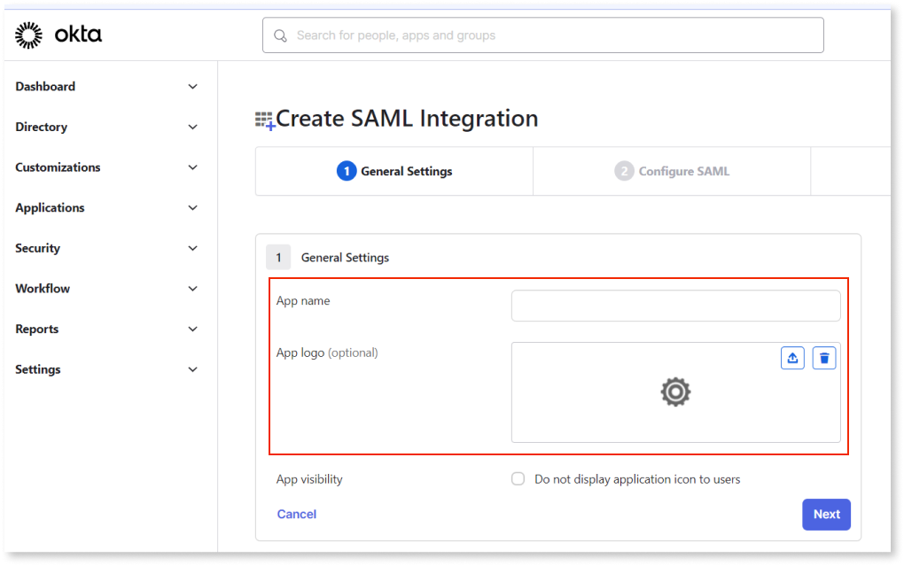

1. Click **Next**.

### Configure SAML settings of Okta application

1. Configure the fields in **SAML Settings** > **General**.

    Enter the values for the **Single sign on URL** and **Audience URI (SP Entity ID)** fields according to what's configured in the Users application.

    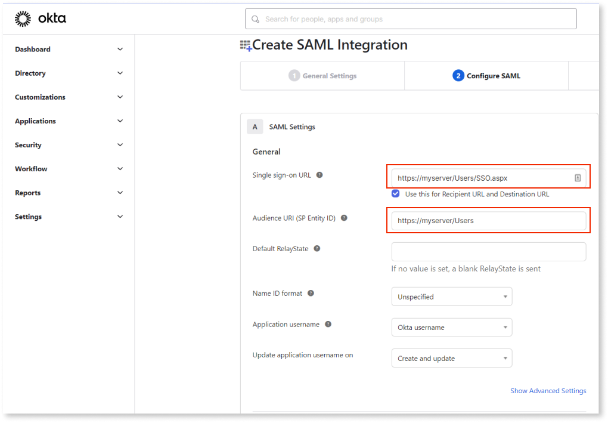

1. Click **Show Advanced Settings** to show some more fields that you must configure.

    

    Two particular configuration settings in Okta depend on the value of a setting in the Users app.

    Go back to the Users app, scroll to the **Service Provider Connector Settings** section, and click **Show Advanced Options**.

    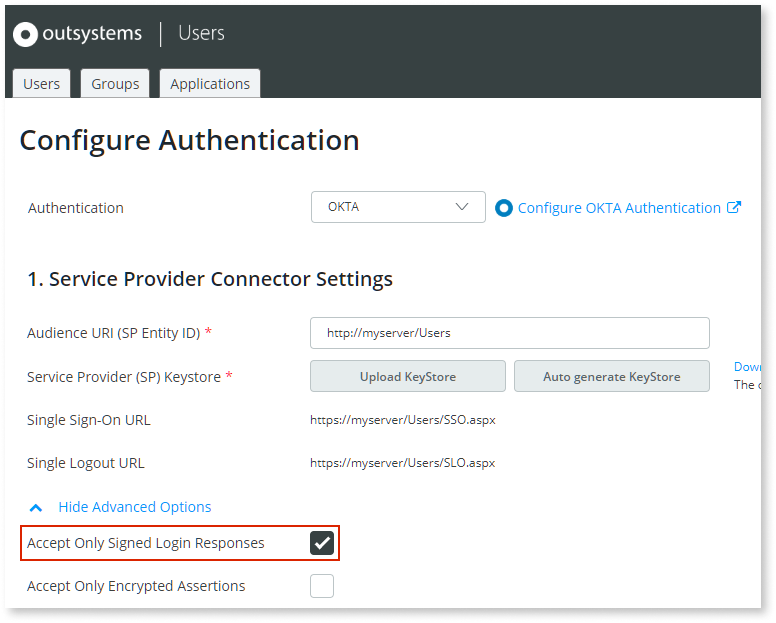

    If the option **Accept Only Signed Login Responses** is **enabled**, activate the corresponding options in Okta:

    * Set the **Response** and **Assertion Signature** fields to **Signed**.

        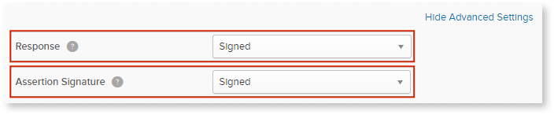

    

1. In the **Signature Certificate** field, click **Browse files** and select the certificate PEM file downloaded from the Users application.
    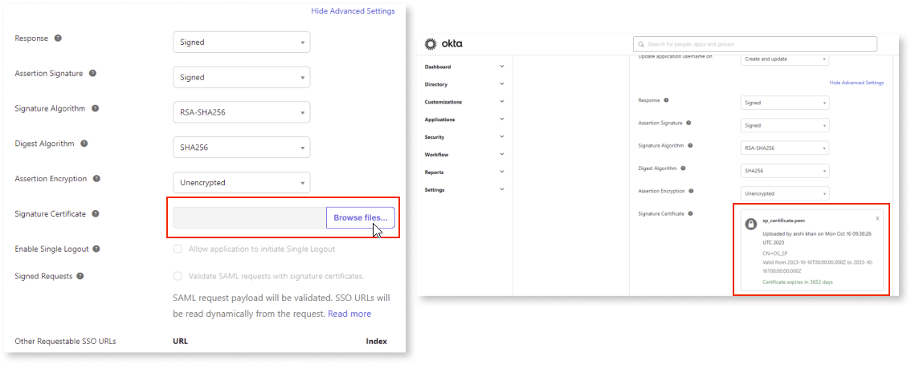

1. Select the **Allow application to initiate Single Logout** checkbox.

    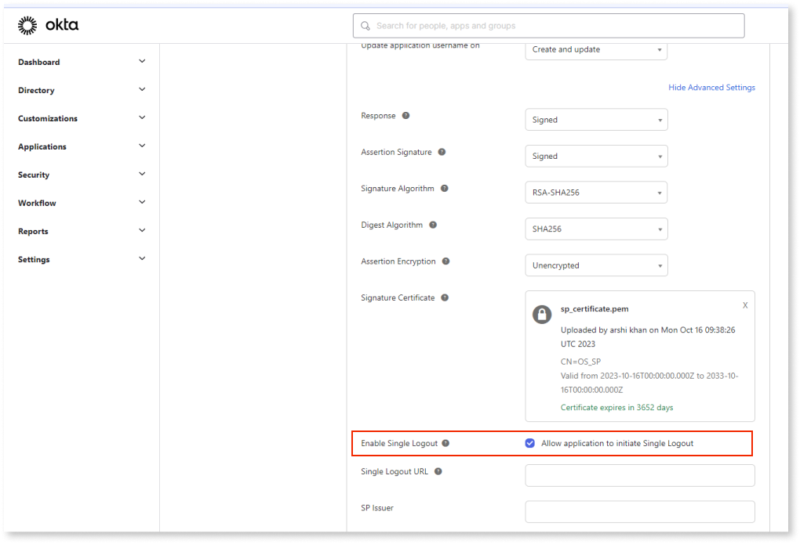

1. Fill in the **Single Logout URL** and **SP Issuer** fields with the corresponding values from the Users application.  

    Ensure the **SP Issuer** field is the same as the value you entered for the **Audience URI (SP Entity ID)** field.

    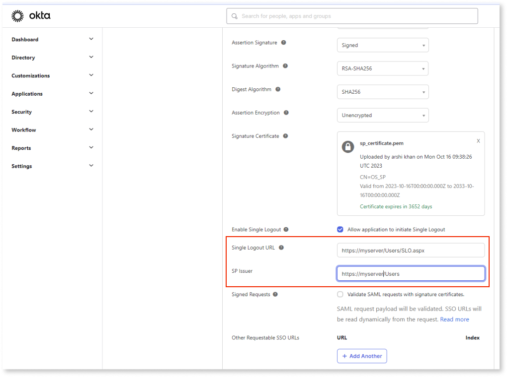

1. In the **Attribute Statements** section, add an attribute for each claim configured in the Users application by clicking **Add Another**.

    Fill in the **Name** and **Value** fields according to the following suggested values:

    Name = `given` (the value previously entered in Users) / Value = `user.firstName`  
    Name = `surname` /  Value = `user.lastName`  
    Name = `email` /  Value = `user.email`  
    Name = `username` /  Value = `user.login`

    **Note:** Names and values are **case sensitive**. Consider selecting values from the drop-down instead of typing them.

    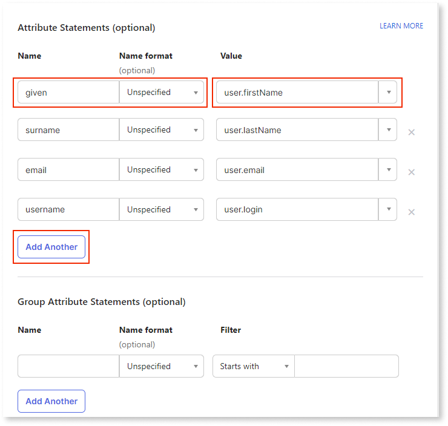

1. After creating and filling in the fields, click **Next**.

1. Answer the question **Are you a customer or a partner?** accordingly to your situation and click **Finish**.

    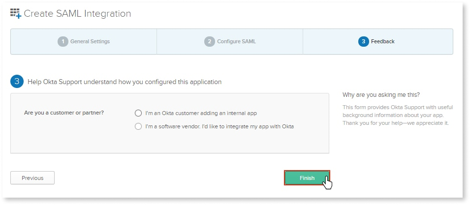

1. Copy the **Metadata URL** and open it on a browser. Right-click and select **Save As** to download the Identity Provider (IdP) metadata XML file.

    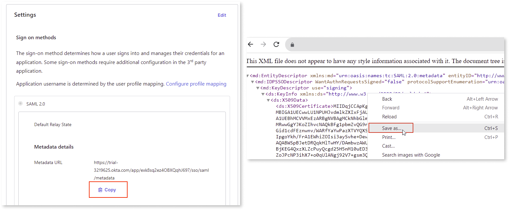

### Finish configuration in the Users app

Back in the Users app, upload the XML file you downloaded in the previous step.

1. Locate the **2. IdP Server Settings** section in the **Configure Authentication** page.

1. Click **Upload from IdP/Federation Metadata XML**.

    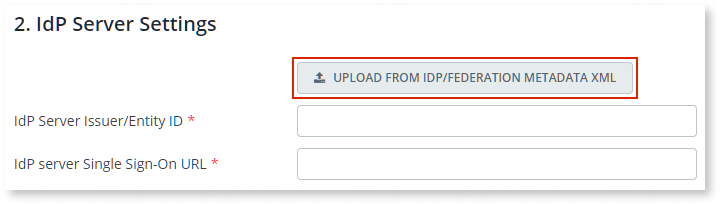

1. Select the Federation Metadata XML file you downloaded from Okta.

1. Click **Save**.

### Assign user or group to Okta application { #assign-user-okta-app }

Assign your new Okta application to a user or a group to be able to proceed. You can do this operation in the Okta portal.

Check [Okta's documentation](https://help.okta.com/en/prod/Content/Topics/users-groups-profiles/usgp-assign-apps.htm) for step-by-step instructions.

### Test your configuration

1. Log out of the Users app if you're still logged in. The Users app redirects you to an Okta login page.

1. Enter the credentials of a user you previously associated with your Okta application in [Assign user or group to Okta application](#assign-user-okta-app).

If the authentication is **successful**, the browser redirects you back to the Users app and you get an error message about not having permissions to view the screen.

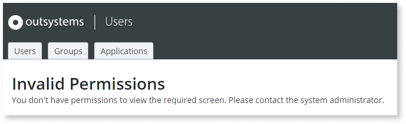

This happens because the user you used for testing Okta authentication doesn't have any assigned OutSystems roles yet. You need to grant user roles in the Users app after the user logs in for the first time using Okta authentication, so that the user already exists in the OutSystems database.

If the authentication is unsuccessful, double-check your configuration settings.

### Configure user roles in the Users app

You're currently logged in with a user account that doesn't have the required permissions to grant roles to end users. You must first log in with an administrator account.

Do the following:

1. Log out of the Users app, since the current user doesn't have the required role.

1. Open the following URL:

    `https://<your_server_name>/Users/Login.aspx`

    Using this specific URL allows you to log in to the Users app skipping the external authentication method that's currently configured (Okta).

1. Log in with an administrator account.

You now have permissions to grant OutSystems roles to users. Check [Grant a role to an end user](../end-user-roles.md#grant-role) for detailed instructions.

### Perform some final checks and configurations

Just like when using SAML 2.0 authentication, you must perform these two final tasks:

1. [Check if the authentication flows of your OutSystems application already support external authentication](configure-saml.md#change-auth-flows). The instructions provided for the SAML 2.0 authentication method are also applicable to Okta.

1. In **Reactive Web Apps**, [enable the "Single Sign-On Between App Types" setting](configure-saml.md#enable-sso-between-app-types) in Service Center.

## Troubleshooting Okta authentication issues

Since the Okta end user authentication method is very similar to the SAML 2.0 one, you can troubleshoot them in the same way:

* Check the [SAML Message Logs page](configure-saml.md#logs) for detailed information on Okta messages exchanged for end user authentication.

* Use the same method for [accessing the Users application when you're locked out](configure-saml.md#locked-access) due to incorrect configuration settings in end user authentication.
