# Configure OKTA Authentication

OutSystems allows you to use OKTA for authenticating the end users of your OutSystems applications. This authentication method is configured in a way that is quite similar to the [SAML 2.0](configure-saml.md) one.

The [limitations of the current SAML 2.0 implementation](configure-saml.md#current-limitations) also apply to the OKTA authentication method. Be sure to check them when using OKTA end user authentication.

To set up OKTA authentication for end users do the following:

1. Sign in to the OKTA administration page and make sure that you're using the "Classic UI" view.
    Select Applications > "Applications" to open the **Applications** screen, and then click **Add Application**.

    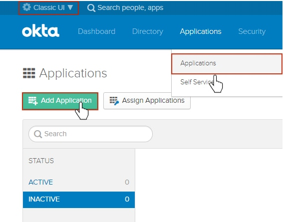

1. Click **Create New App**.

    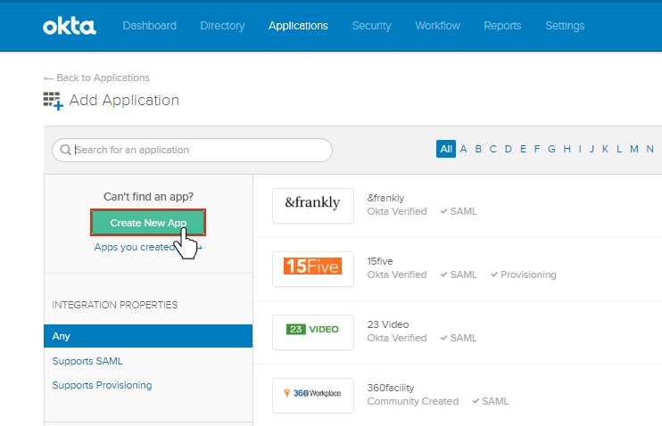

1. Select the platform `Web` and the sign-on method `SAML 2.0`. Click **Create**.

    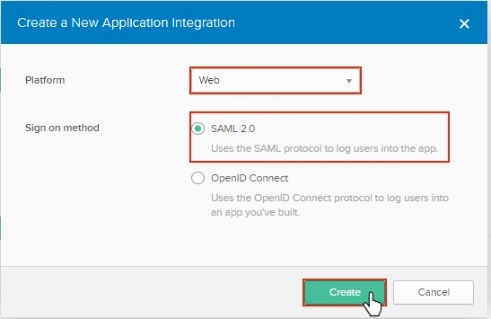

1. Enter a name for your application and (optionally) select an app logo. Click **Next**.

    

1. In the Users application, choose `OKTA` in **Authentication** and fill the **1. Service Provider Connector Settings**.

    We suggest that you use the following values for the fields in the **Attribute Statements (Claims)** section:

    Given Name Attribute = `given`  
    Surname Attribute = `surname`  
    Email Attribute = `email`  
    Username Attribute = `username`  
    External Id Attribute = `username`  

    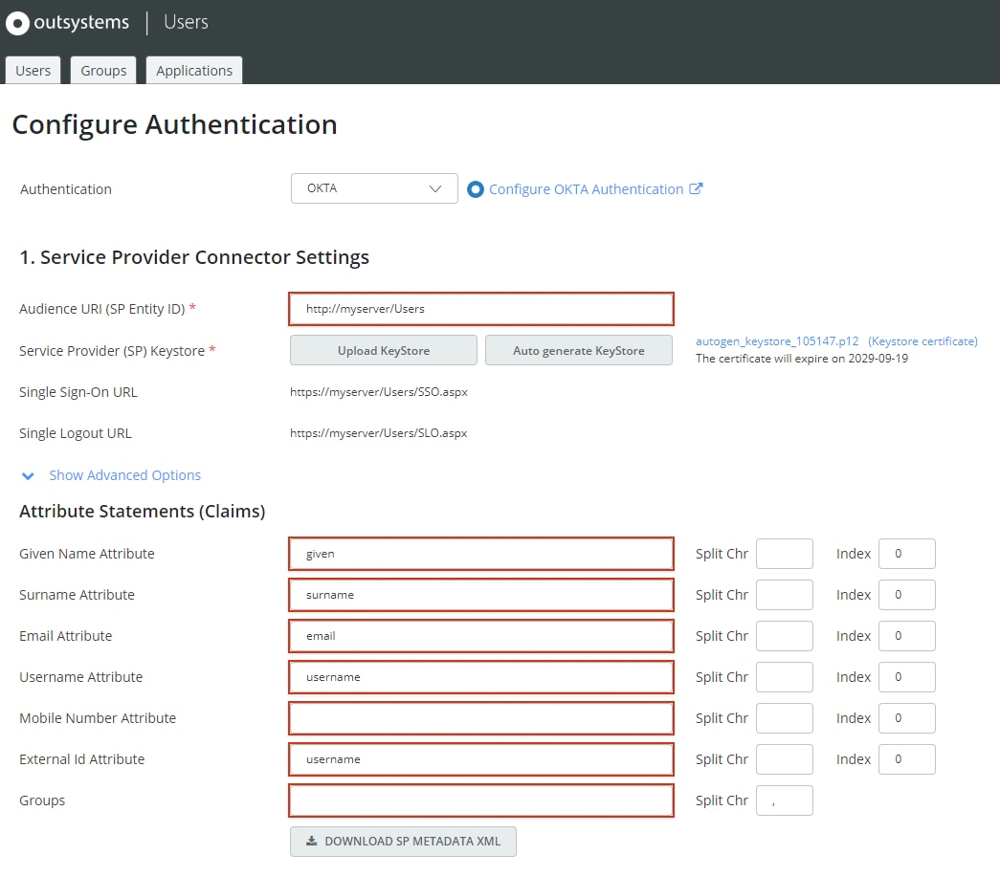

1. Download the keystore certificate by clicking **(Keystore certificate)**.  
    This file will be used later when doing the configurations in the OKTA portal (step 9).

    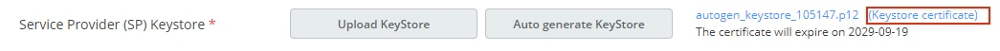

1. In the OKTA portal, configure the fields in General > "SAML Settings" by entering the values for the **Single sign on URL** and **Audience URI (SP Entity ID)** fields as displayed or as configured before in the Users application (step 5).

    Before continuing, click **Show Advanced Settings** to show some more fields that you will need to configure.

    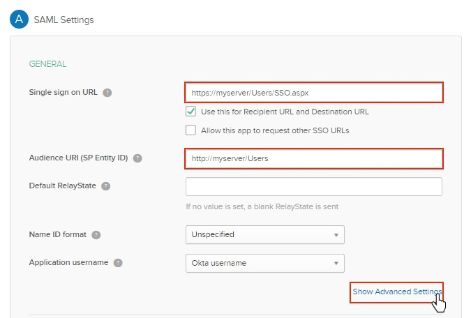

1. Select the **Enable Single Logout** checkbox and fill in the **Single Logout URL** and **SP Issuer** fields with the corresponding values from the Users application.  
    Fill in the **SP Issuer** field with the same value you entered for the **Audience URI (SP Entity ID)** field (step 7).

    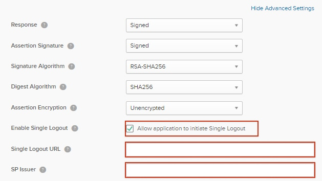

1. Upload the certificate file downloaded from the Users application (step 6) in the **Signature Certificate** field.

    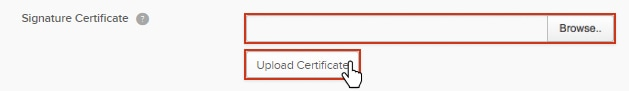

1. In the "Attribute Statements" section, add an attribute for each claim configured in the Users application by clicking **Add Another** until you have a total of four lines of attribute statements.

    Fill in the **Name** and **Value** fields of the four rows according to the following suggested values:

    Name = `given` (i.e. the value previously entered in Users) / Value = `user.firstName`  
    Name = `surname` /  Value = `user.lastName`  
    Name = `email` /  Value = `user.email`  
    Name = `username` /  Value = `user.login`

	After creating and filling in the fields, click **Next**. 

    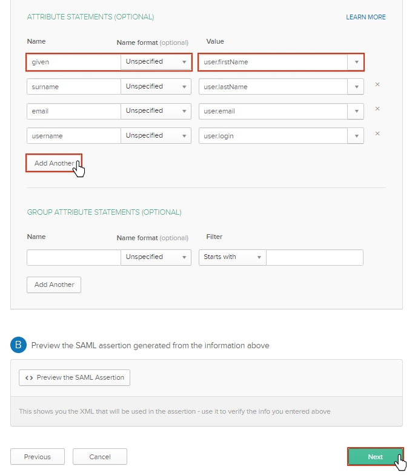

1. Answer the question **Are you a customer or a partner?** accordingly to your situation and click **Finish**.

    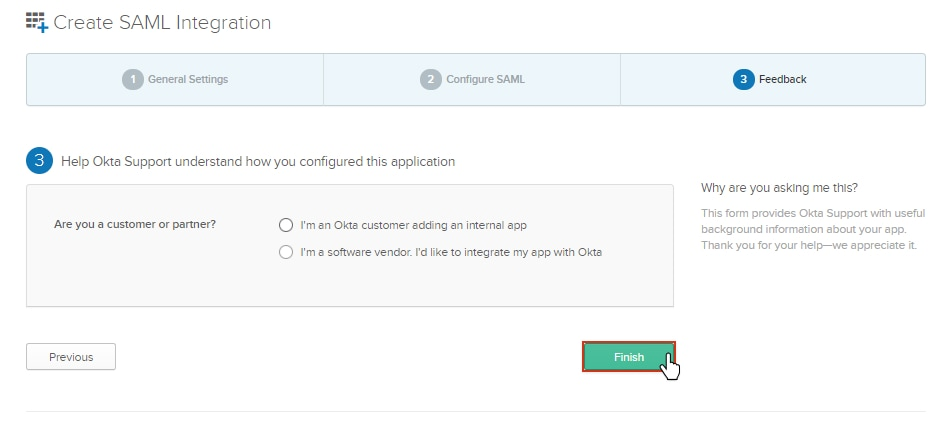

1. Right-click the **Identity Provider metadata** link and select **Save Link As** to download the Identity Provider (IdP) metadata file.

    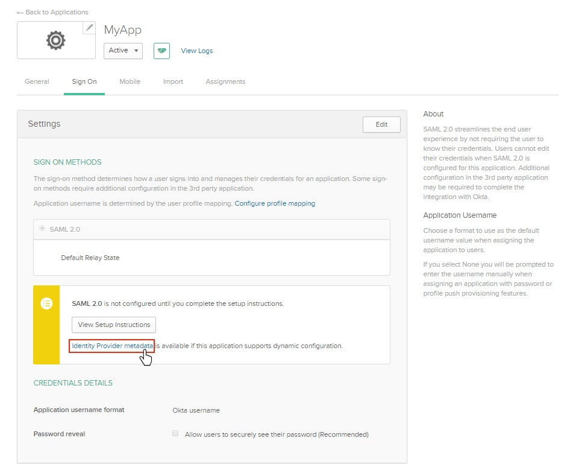

1. In the Users application, upload the metadata file obtained in the previous step by clicking **Upload from IdP/Federation Metadata XML** and then click **Save**.

    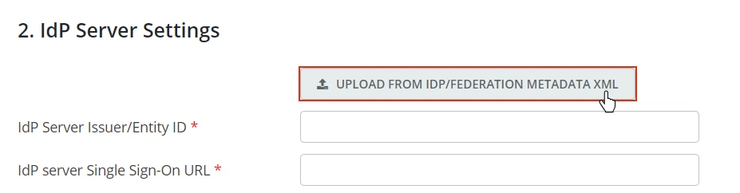

1. Make sure you assign your new OKTA application to a user or a group to be able to proceed. You can do this operation in the OKTA portal. Check [OKTA's documentation](https://help.okta.com/en/prod/Content/Topics/Directory/eu-assign-apps.htm) for more information.

1. Test your new authentication settings by logging in the Users application again.  
    Logout of the Users application if you're logged in.

1. The Users application will redirect you to an OKTA login page. Enter your OKTA user credentials.

    If the authentication is successful, you will be redirected to the Users application. 

    You may get an "Invalid Permissions" message if the OKTA user is logging in for the first time, since the user is provisioned in OutSystems at this point and it still doesn't have any associated roles. You will need to configure the user roles after the user's first login.

    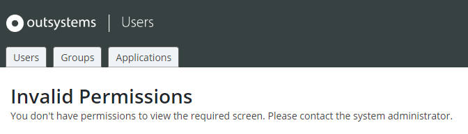

    If the authentication is unsuccessful, double-check your configuration settings.

**Note:** If you're using an older version of OutSystems UI you must change the logout flow of your OutSystems applications, as described for the SAML 2.0 authentication method in [Check the authentication flows of your OutSystems applications](configure-saml.md#change-auth-flows).

## Troubleshooting OKTA authentication issues

Since the OKTA end user authentication method is very similar to the SAML 2.0 one, you can troubleshoot them in the same way:

* Check the [SAML Message Logs page](configure-saml.md#logs) for detailed information on OKTA messages exchanged for end user authentication.
* Use the same method for [accessing the Users application when you're locked out](configure-saml.md#locked-access) due to incorrect configuration settings in end user authentication.
