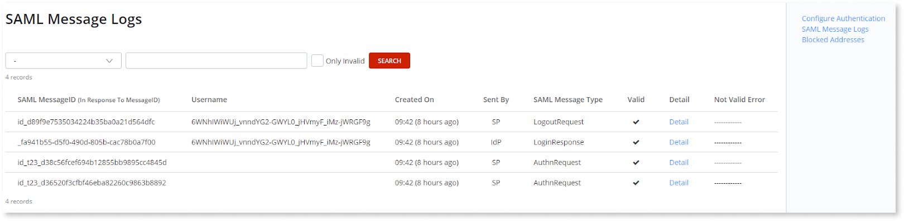

# Configure SAML 2.0 Authentication

You can integrate OutSystems in your Federated Authentication system using the SAML 2.0 protocol to connect to an external Identity Provider (IdP), allowing for single sign-on (SSO) and single logout operations. 

The general authentication workflow is the following:

1. A non-logged in user tries to access an OutSystems application, known in SAML as the Service Provider (SP).
1. The user is then redirected to a web page, known as the enterprise's login manager, where they will be prompted to enter their enterprise username and password.
1. Upon verification of the user’s login, the enterprise Identity Provider informs OutSystems application of the verified identity for the user who is logging in, and the user is redirected back to the portal website.

## Current limitations { #current-limitations }

The current SAML 2.0 implementation in OutSystems has some limitations that are outlined below. Since the OutSystems platform is being continuously improved, be sure to check this page regularly for an updated list of limitations.

* The SAML 2.0 support provided by the Users module is only applicable to **Traditional Web Apps** and **Reactive Web Apps**. To use SAML 2.0 in Mobile apps you can use Forge components that address those use cases, like [IdP Connector](https://www.outsystems.com/forge/component-overview/599/idp) and [IdP Mobile](https://www.outsystems.com/forge/component-overview/2044/idp-mobile).  
    _Note:_ The Forge components mentioned above are not supported by OutSystems and are maintained by the Forge community.
* To implement single logout you may need to change the authentication flows of your OutSystems application. Check below for details.

* Though the Users application is multi-tenant, multi-tenancy is not supported when using SAML 2.0, Azure AD or OKTA authentication methods.

If you have some logic that must run at each login, or if your IdP has some particular configuration not supported by the Users application, consider cloning the Users module of the Users application and extend it to fulfill your specific requirements.

## Using SAML in your OutSystems applications

To configure SAML 2.0 end user authentication you need to take the following steps:

1. Configure SAML 2.0 authentication in the Users application.
1. Check if your application authentication flows (login/logout) already support SAML 2.0. If not, you must change these flows according to the instructions we provide.

### Configure SAML 2.0 authentication in the Users application { #configure-users }

Make sure you gather all the required information from your Identity Provider beforehand to be able to configure SAML 2.0 authentication in the Users application.

Do the following:

1. In the Users application, click "Configure Authentication" in the sidebar.
1. Choose `SAML 2.0` in the **Authentication** drop-down list.
1. Provide the required configuration values according to the Identity Provider you will be using.

    **Tip:** To speed up configuration, and if your Identity Provider (IdP) has this feature, you can export a Service Provider (SP) metadata XML file in the Users application to import it in your IdP.  
    Similarly, you can import a Federation metadata XML file containing the IdP Server Settings in the Users application if your IdP has the option to export this metadata file.

### Check the authentication flows of your OutSystems applications { #change-auth-flows }

Depending on the version of OutSystems UI Web (for Traditional Web Apps) or OutSystems UI Reactive Templates (for Reactive Web Apps) that was installed in your development environment when you created your application, you may need to update the login/logout flows of your app so that they are compatible with SAML 2.0 authentication.

For more information, check the following topics according to your application type:

* For **Reactive Web Apps** check [Updating the login/logout flows of your Reactive Web App to support SAML 2.0](https://success.outsystems.com/Support/Enterprise_Customers/Upgrading/Updating_the_login%2F%2Flogout_flows_of_your_Reactive_Web_App_to_support_SAML_2.0).
* For **Traditional Web Apps** check [Updating the logout flow of your Traditional Web App to support SAML 2.0](https://success.outsystems.com/Support/Enterprise_Customers/Upgrading/Updating_the_logout_flow_of_your_Traditional_Web_App_to_support_SAML_2.0). 

## Mapping Identity Provider Server Groups to OutSystems Groups

If you configure the **Groups** claim in the "Configure Authentication" screen of the Users application, when a user login occurs OutSystems tries to match each group name received from the external Identity Provider (Azure AD, OKTA, or another SAML-based provider) with the groups configured in the platform.

When there is a match, the Users application will associate the user logging in to the existing OutSystems group. If there's no match, OutSystems will first create a new group with the same name as the Identity Provider Server group and then associate the user to that group.

_Known limitation:_ In Azure AD, group names received from the Identity Provider Server consist only of a GUID identifier. This means that to have a match between Azure AD groups and OutSystems groups you must name the OutSystems groups using these GUID values.

## Troubleshooting SAML authentication issues

### Accessing message logs { #logs }

The SAML Message Logs page is very useful when troubleshooting SAML configuration or authentication issues. It's available from the right sidebar by clicking "SAML Message Logs".

These logs will be available for 7 days by default. This log retention period can be customized using the `DeleteSAMLLogsOlderThen` multi-tenant Site Property of the Users module.

To customize the value of this site property, do the following:

1. Open Service Center, navigate to Factory > Modules and open the Users module.
1. Open the **Tenants** tab and click the "Users" link to navigate to the Users tenant detail page.
1. In the **Site Properties** tab, click the link to edit the `DeleteSAMLLogsOlderThen` property and enter the new value for the site property.

### Accessing the Users application when locked out { #locked-access }

If your authentication configuration is incorrect and preventing you from logging in using SAML you can still login with an administrator account (it must be a user with the UserManager role) by navigating to the default users login page. This will bypass the configured authentication method, allowing you to login and fix the incorrect settings.

The default users login page is available at the following URL:  
`https://<your_server_name>/Users/Login.aspx`
