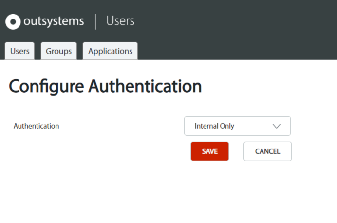

# End Users Authentication

This section applies only to the authentication of **end users**, i.e. the users of your OutSystems applications.  
The authentication of **IT users**, like Developers and IT Administrators, is [configured in LifeTime](../../../../managing-the-applications-lifecycle/secure-the-applications/use-an-external-authentication-provider.md).

When you start developing a new module it has the built-in logic for end user authentication. OutSystems comes with six distinct authentication method: Internal, Active Directory, LDAP (Lightweight Directory Access Protocol), SAML 2.0 (Security Assertion Markup Language), Azure AD (Azure Active Directory) and OKTA.

Internal
:   The default authentication method. The end user information is stored in the OutSystems database. The credentials are not stored, but a cryptographic hash function is computed using the credentials and only its result is stored. When the end user attempts to log in, the hash function is computed again and its result is compared with what is in the database.

Active Directory
:   Uses your Active Directory to authenticate the end users. Available only in on-premises installations.  
    Check how to [Configure Active Directory Authentication](configure-active-directory.md).

LDAP
:   Authenticates the end user against your LDAP server, either using LDAP configured for Active Directory or standard LDAP.  
    Check how to [Configure LDAP Authentication](configure-ldap.md).

SAML 2.0
:   Uses SAML-based authentication to authenticate the end users with single sign-on (SSO) provided by commercial Identity Provider companies like OneLogin and PingFederated.  
    Check how to [Configure SAML 2.0 Authentication](configure-saml.md).

Azure AD
:   Uses SAML-based authentication to authenticate the end users with single sign-on (SSO) provided by the Azure AD Identity Provider.  
    Check how to [Configure Azure AD Authentication](configure-azuread.md).

OKTA
:   Uses SAML-based authentication to authenticate the end users with single sign-on (SSO) provided by OKTA.  
    Check how to [Configure OKTA Authentication](configure-okta.md).

**Notes:**

* If you use Active Directory, LDAP, SAML 2.0, Azure AD or OKTA to authenticate users, you do not need to create the users manually. Instead, they will be automatically created in the OutSystems database on the first login without storing any password data.

* When using Active Directory or LDAP authentication, the Users module will try to authenticate the user locally first, if it exists in the OutSystems database and if it has a password defined. This first authentication attempt is not done when using SAML 2.0, Azure AD or OKTA authentication methods.

## Configure the Authentication of End Users

To configure how end users are authenticated do the following:

1. In the [Users application](../accessing-users.md), click "Configure Authentication" in the sidebar.

1. Select one of the authentication methods in the **Authentication** drop-down list: `Internal Only`, `Active Directory`, `LDAP`, `Azure AD`, `SAML 2.0`, or `OKTA`.

    

1. If you chose **Active Directory**, **LDAP**, **SAML 2.0**, **Azure AD** or **OKTA** in the previous step, you will need to fill in other configuration fields specific to the authentication method you selected in step 2. Check the other topics in this section for more information on configuring these authentication methods.

## Authentication Flow

When the end user uses the application for the first time and the accessed screen allows only authenticated end users to see it, a security exception is raised. OutSystems will do the following: 

1. If the platform is configured to use SAML 2.0, Azure AD or OKTA authentication, the end user is redirected to a web page where he must enter his enterprise credentials (username and password). Upon successful authentication, the end user is redirected back to the OutSystems application.

1. If the platform is [configured to use Integrated Windows Authentication](<integrated-authentication.md>) and the end user is in the same domain as the platform server, the end user is authenticated using Integrated Windows Authentication.

    Once the end user makes a request, the server replies with an HTTP 401 status, signaling to the end user browser that authentication is required. If the browser already has the end user credentials stored, it automatically sends the credentials to the web server. Otherwise, the browser displays a form for the end user to input the credentials and sends them to the server. This means that even if you have a custom Login page, the end user will not see it.

1. If the platform is not configured to use Integrated Windows Authentication, the end user is redirected to a Login screen. When the end user submits the credentials:

    1. The credentials are validated against the OutSystems database.

    1. The platform checks if the authentication is configured to use Active Directory or LDAP authentication and does does one of the following:

        A) If the platform is configured to authenticate using Active Directory, the credentials are validated against the configured domain server.

        B) If the platform is configured to authenticate using LDAP, the credentials are validated against the configured LDAP server.

1. If after this process the end user could not be authenticated, then an "Invalid Login" message is displayed to the end user.

## User Data Synchronization

When end user authentication is done using Active Directory, LDAP, SAML 2.0, Azure AD or OKTA, the user data in the OutSystems database is updated, in one or more occasions, with the most recent data from the external authentication system. The updated attributes for each user are the following:

* Name
* Email 
* Mobile Phone

This synchronization occurs at the following moments, depending on the configured authentication:

After a successful login
:   The data for the **logged in user** is updated. Occurs when using Active Directory, LDAP, SAML 2.0, Azure AD or OKTA authentication.

On a daily timer
:   The data for **all existing users from external authentication sources** in the OutSystems database is updated. These users are the ones whose username contains a `\` (slash) character.  
The timer is named `SynchronizeDomainUsers` and is configured in the Users module. This timer-based synchronization only occurs when using Active Directory.  
Note that this process does not create any new users in the OutSystems database.
