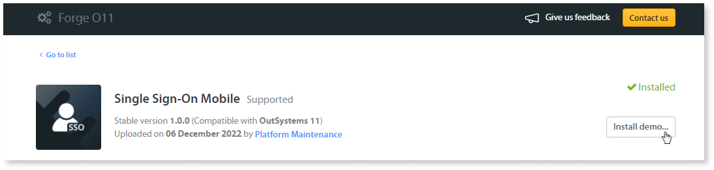
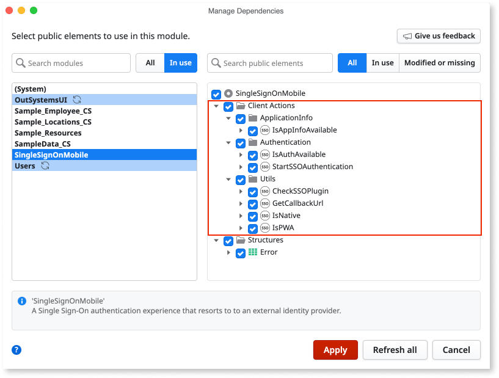
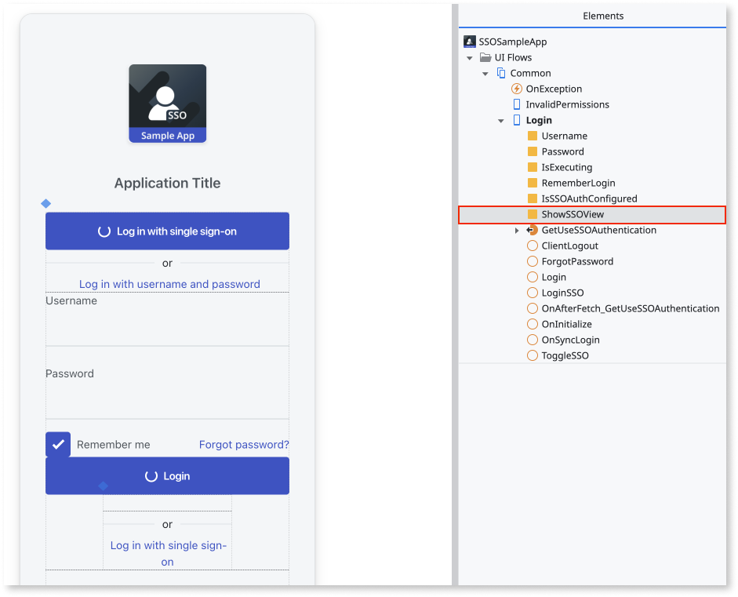
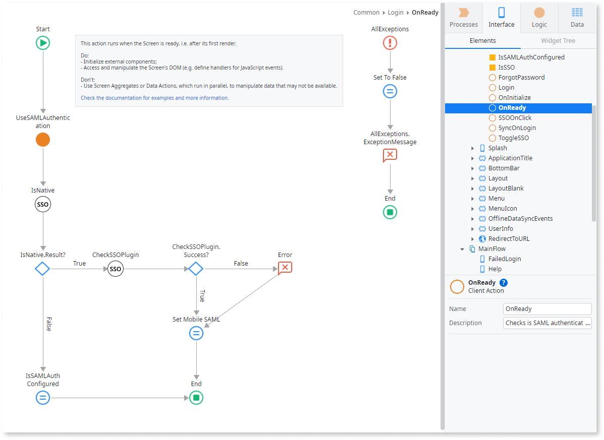
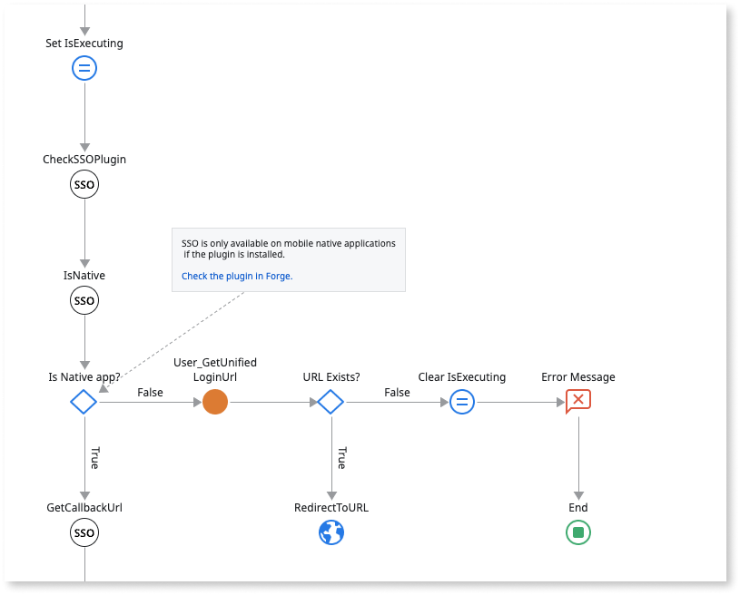
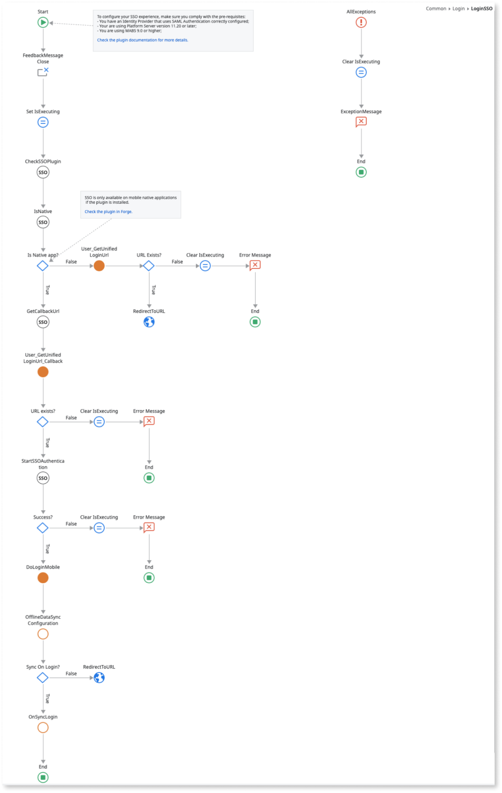
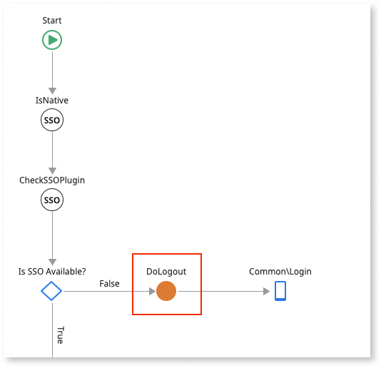
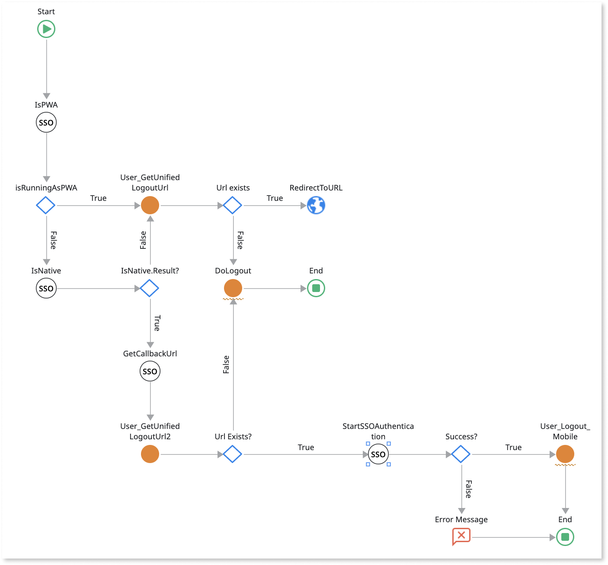

# Updating the login and logout flows of your Mobile App to support SAML 2.0

## Pre-requisites

Before implementing a Single Sign-On experience for your mobile app, you need to make sure that you have an Identity Provider that uses SAML Authentication correctly configured.

SAML 2.0 Authentication in mobile apps requires:

* Platform Server version 11.18.0 or later

* MABS 9.0 or later.

* Configure SAML 2.0 to add your identity provider (check [the documentation](../configure-saml.md) for more information)

* Activating the **Single Sign-On Between App Types** setting in Service Center (check [Configure App Authentication](../../../../../managing-the-applications-lifecycle/secure-the-applications/configure-authentication.md) for more information)

## Updating the login/logout flows

The procedure consists of the following general steps:

1. Install the [**Single Sign-On Mobile**](https://www.outsystems.com/forge/component-overview/14284/single-sign-on-mobile) plugin and add its dependencies in the home module of your app.

1. **Create UI** for an SSO Mobile experience.

1. Update the **SSO** **Login button on-click Client Action**.

1. Update the **UserInfo** **Block** to manage the logout flow.

You can check a sample app with the UI and login flow by installing also the demo of **Single Sign-On Mobile**.



### Install the Single Sign-On Mobile plugin

Go to Forge and download the Single Sign-On Mobile, a supported plugin.  After installing the plugin in your environment, you'll need to manage dependencies on your target project, so you can access the SSO capabilities enclosed in this plugin:

1. In Service Studio, open the home module of your mobile app.

1. Open the **Manage Dependencies** window.

1. Select **Single Sign-On Mobile** in the producer modules list on the left.

1. Select all Client Actions as dependencies:

    * ApplicationInfo folder:

        1. IsAppInfoAvailable

    * Authentication folder:

        1. IsAuthAvailable

        1. StartSSOAuthentication

    * Utils folder:

        1. CheckSSOPlugin

        1. GetCallbackUrl

        1. IsNative

        1. IsPWA

1. Click **Apply**.



Verify you are working on a Platform Server version 11.18.0 or later as you will need to use the following server actions available on the Users folder:

* UseSAMLAuthentication
* User_GetUnifiedLoginUrl
* User_GetUnifiedLogoutUrl
* User_Login_Mobile
* User_Logout_Mobile

If you are using Platform Server version 11.18.0 or later and don’t see some of these server actions make sure you have fetched all dependencies from Users.

### Create UI for an SSO Mobile experience.

In this step we suggest you adapt your app's user interface to reflect the option of SSO authentication for your users. Here we provide an example where the user can toggle between an SSO authentication and a more conventional username/password authentication, using a local variable called IsSSO



You can use the screen’s OnReady action to check if SSO is available and adapt the screen accordingly.

Do the following:

1. Add the **UseSAMLAuthentication** server action;

1. Use the IsNative client action to check if this is a native application:

    1. If native, use the **CheckSSOPlugin** client action to confirm you have all necessary resources from the plugin to show the mobile SSO option.  You can use an Assign node (**Set** **Mobile SAML**) to change the condition of the local variable **IsSSO** in the event that the following expression returns true:

        ```
        UseSAMLAuthentication.IsActive and CheckSSOPlugin.Success
        ```

    1. If PWA, you can use an Assign node (**Is SAML Auth Configured**) to change the condition of the local variable **IsSSO** in case the following expression returns true:

        ```
        UseSAMLAuthentication.IsActive
        ```



### Update the **SSOLogin** button OnClick action.

In this step you’ll need to create logic for the OnClick action of the SSOLogin button to deal with SSO authentication in both PWA and Native applications.

Do the following:

1. Add the **IsPWA** action to verify if you are running a PWA or Native application:

    1. If you’re running a PWA application, add the **User_GetUnifiedLoginUrl** server action, verify if an URL was returned and if so redirect to that url.

        

    1. If you’re running a native application, see point 2.

1. Add the **IsNative** client action and upon checking that it returns TRUE:

    1. Run the **GetCallbackURL** client action. This action will return a URL;

    1. Add the **User_GetUnifiedLoginURL** server action, setting its OriginalUrl parameter as: GetCallbackUrl.Url (the output of the GetCallbackURL action);

    1. Verify that the URL exists. You can use the condition:

        ```
        Length(UserGetUnifiedLoginURL2.Url) > 0
        ```

    1. If the URL exists add the **StartSSOAuthentication** client action and verify if it runs successfully;

    1. If so, run the **User_Login_Mobile** server action passing as value for the parameter Token the output parameter of the StartSSOAuthentication action, called **StartSSOAuthentication.Token**. You can also set the Remember login property of the User_Login_Mobile server action to TRUE as to allow the session to persist;

    1. Finally, add the SyncOnLogin client action. This is an action available
       on the default Login screen of the Common UI flow.

Below you can find a overview of the complete logic:



### Update the **UserInfo** block to manage the logout flow.

In this step you will need to update the **ClientLogout** client action of the **UserInfo block**.

We suggest you do the following:

1. Add the **IsPWA** action to verify if you are running a PWA or Native
   application:

    1. If you’re running a PWA application, add the **User_GetUnifiedLogoutUrl** server action, verify if an URL was returned and if so redirect to that url (if not, run the **DoLogout** server action).

        

    1. If you’re running a native application, see point 2.

1. Add the IsNative client action and upon checking that it returns TRUE:

    1. Run the **GetCallbackURL **client action. This action will return a URL;

    1. Add the **User_GetUnifiedLoginURL** server action, setting the OriginalUrl parameter as: GetCallbackUrl.Url;

    1. Verify that the URL exists. You can use the condition:

        ```
        Length(UserGetUnifiedLoginURL2.Url > 0)
        ```

    1. If the URL exists add the **StartSSOAuthentication** client action and verify if it runs successfully;

    1. If so, run the **User_Logout_Mobile** server action.

Below you can find a overview of the complete Logic:


