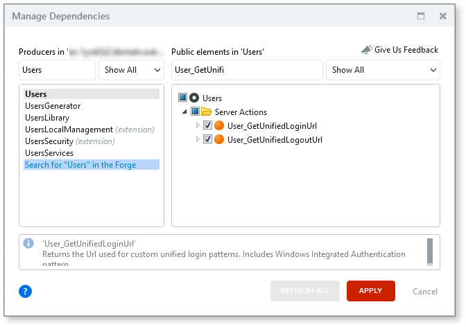
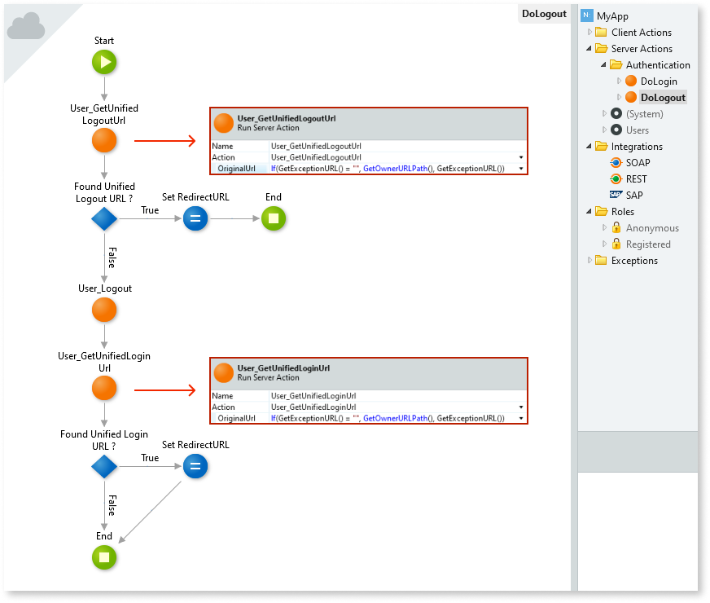
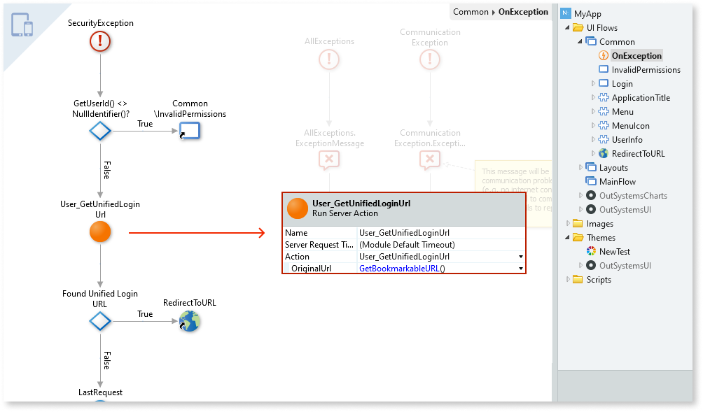
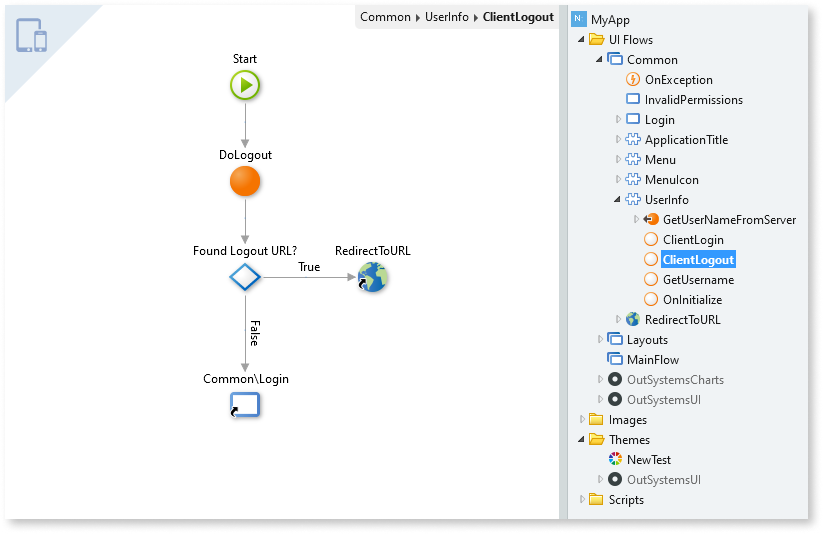
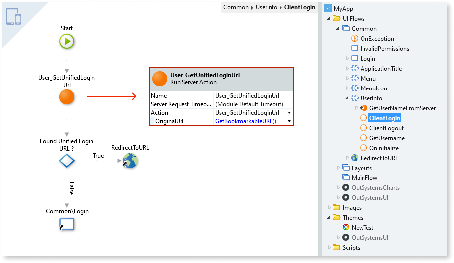
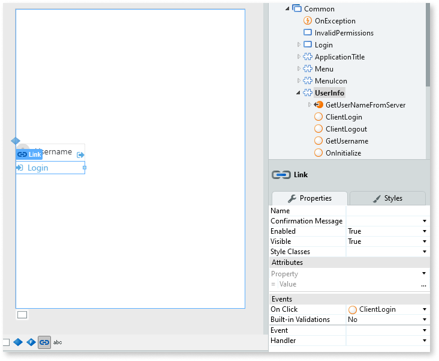

# Updating the login and logout flows of your Reactive Web App to support SAML 2.0

The procedure outlined in this document is only required if you created your Reactive Web App using a version of [OutSystems UI Templates Reactive](https://www.outsystems.com/forge/component-overview/6335/outsystems-ui-templates-reactive) **earlier than version 1.2.3**.  
If you don't know the exact version of these templates when you created your app, check if the login and logout flows are already updated according to the instructions below.

If you created your Reactive Web App using an older version of the OutSystems UI Reactive Templates, you must update your app's login and logout flows if you want to use SAML 2.0 authentication.

## Pre-requisites

SAML 2.0 Authentication in Reactive Web Apps requires:

* Platform Server version 11.8.0 or later
* Service Studio version 11.6.30 or later
* Activating the **Single Sign-On Between App Types** setting in Service Center (check [Configure App Authentication](https://success.outsystems.com/Documentation/11/Managing_the_Applications_Lifecycle/Secure_the_Applications/Configure_App_Authentication#configure-app-authentication-settings) for more information)

## Updating the login/logout flows

The procedure consists of the following general steps:

1. Add dependencies in the home module of your app.
1. Update the **DoLogout** Server Action.
1. Update the **OnException** Action.
1. Update the **UserInfo** Block.

### Add dependencies

Do the following:

1. In Service Studio, open the home module of your Reactive Web App.
1. Open the **Manage Dependencies** window.
1. Select **Users** in the producer modules list on the left.
1. Select the following Server Actions as dependencies:

    * **User\_GetUnifiedLoginUrl**
    * **User\_GetUnifiedLogoutUrl**

    

1. Click **Apply**.

### Update the DoLogout Server Action

In this step, edit the **DoLogout** Server Action in your app's home module, so that it performs a redirect if there's a logout URL specified in the SAML 2.0 configuration settings.

The **DoLogout** Server Action is available under **Server Actions** > **Authentication** in the **Logic** tab of Service Studio.

Do the following:

1. Add a new output parameter named `RedirectURL`, of type `Text`, to the **DoLogout** Server Action.

1. Get the logout URL from the **User\_GetUnifiedLogoutUrl** Server Action, using the following value in the **OriginalUrl** input parameter of this action:

    `If(GetExceptionURL()="", GetOwnerURLPath(), GetExceptionURL())`

1. If the logout URL retrieved from the previous action has a value, set the **RedirectURL** output parameter with that URL using the **Assign** tool. Otherwise, log out the user and terminate the session by calling the **User\_Logout** Server Action.

1. After the **User\_Logout** flow element, check if there's a defined login URL in the SAML 2.0 configuration settings by calling the **User\_GetUnifiedLoginUrl** server action. Use the following value on the **OriginalUrl** input parameter of this action:

    `If(GetExceptionURL()="", GetOwnerURLPath(), GetExceptionURL())`

1. Use the **Assign** tool to set the value of the **RedirectURL** output parameter with the login URL retrieved from the previous action.

Here's the flow of a possible implementation, obtained by following the steps above:

### Update the OnException Action

In this step, change the **OnException** Action, namely the **SecurityException** flow, to perform a redirect if there's a login URL specified in the SAML 2.0 configuration settings.

The **OnException** action is available under **UI Flows** > **Common**  in the **Interface** tab of Service Studio.

Do the following:

1. In the **SecurityException** flow of the **OnException** Action, after validating if the **UserId** is null (if it's equal to a null Identifier), get the login URL from the **User\_GetUnifiedLoginUrl** Server Action, using the following value in the **OriginalUrl** input parameter of this action:

    `GetBookmarkableURL()`

1. If the login URL retrieved from the previous action has a value, redirect the user to that URL. Otherwise, redirect the user to the **Common\Login** Screen.

Here's the flow of a possible implementation, obtained by following the steps above:

### Update the UserInfo Block

In this Block you need to:

* Edit the **ClientLogout** Client Action.
* Create a new **ClientLogin** Client Action.
* Change the UI of the Block.

The **UserInfo** Block is available under **UI Flows** > **Common** in the **Interface** tab of Service Studio.

Open the **ClientLogout** Action, available under the **UserInfo** Block in the element tree, and do the following:

1. After the call to the **DoLogout** Server Action, use the **If** tool to validate if the output of the Server Action (the **RedirectURL** output parameter) is empty.

1. If the **RedirectURL** is not empty, redirect the user to that URL. Otherwise, redirect the user to the **Common\Login** Screen.

Here's the flow of a possible implementation, obtained by following the steps above:

Create a new Client Action named **ClientLogin** under the **UserInfo** Block and define its flow according to the following:

1. Get the login URL from the **User\_GetUnifiedLoginUrl** Server Action, using the following value in the **OriginalUrl** input parameter of this action:

    `GetBookmarkableURL()`

1. If the login URL retrieved from the previous action has a value, redirect the user to that URL. Otherwise, redirect the user to the **Common\Login** Screen.

Here's the flow of a possible implementation, obtained by following the steps above:

Finally, change the UI of the **UserInfo** Block according to the following:

1. Double-click the **UserInfo** Block in the element tree to open the interface editor.

1. Select the **Login** link.

1. In the link properties, change the value of the **On Click** event to point to the **ClientLogin** Client Action you created previously.

