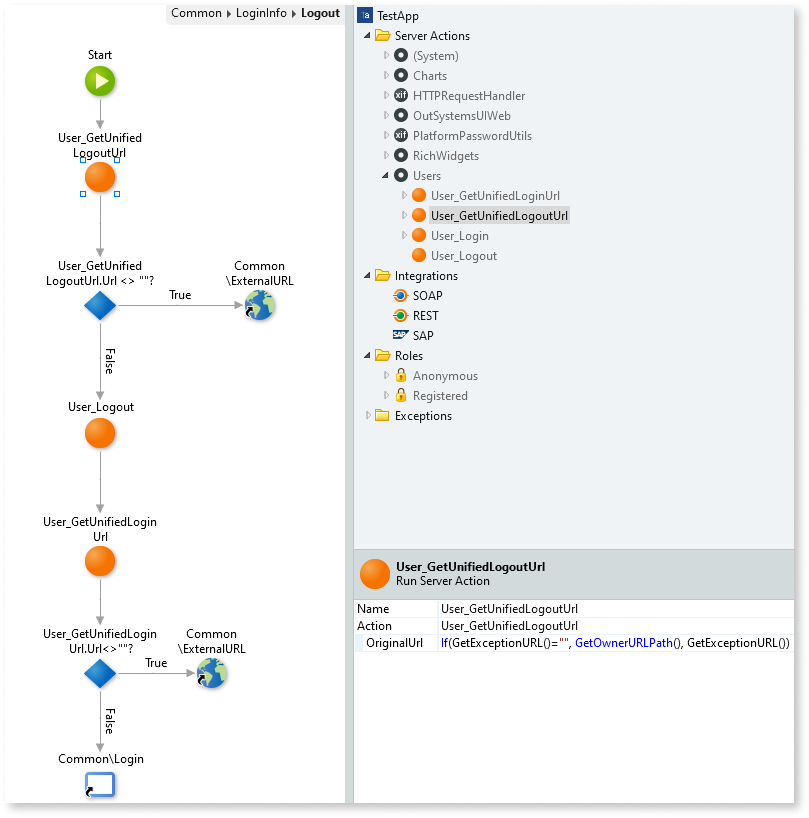
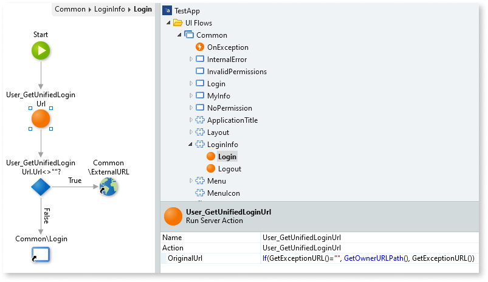

# Updating the logout flow of your Traditional Web App to support SAML 2.0

The procedure outlined in this document is only required if you created your app using a version of [OutSystems UI Web](https://www.outsystems.com/forge/component-overview/4143/outsystems-ui-web) **earlier than version 1.7.7**.  
If you don't know the exact version of these templates when you created your app, check if the login and logout flows are already updated according to the instructions below.

If your Identity Provider (IdP) supports Single Logout operations started by the Service Provider (SP) and you wish to support this functionality, while still using an older version of OutSystems UI Web, you need to change the Logout flow of your OutSystems applications. The procedure outlined below is optional and applicable to this Single Logout scenario of SAML-based authentication.

By default, the Logout flow invalidates the session in the OutSystems application server. However, in an IdP SSO scenario most of the times the logout must also be performed on the IdP Server, even though the logout operation may start on the Service Provider side (in an OutSystems application). This is done by redirecting the user to a specific URL in the IdP Server. In this case, you need to update each OutSystems application using Users as its user provider to perform this redirect when logging out a user.

Do the following:

1. In the [Users application](https://success.outsystems.com/Documentation/11/Developing_an_Application/Secure_the_Application/End_User_Management/Access_the_Users_application), configure the **IdP server Single Logout URL** field in the **Configure Authentication** page with the specific logout URL provided by your IdP Server.

1. In Service Studio, open the home module of your OutSystems application.

1. Open the **Manage Dependencies** window, select **Users** in the producer modules list on the left, and select the following Server Actions as dependencies:

    * **User\_GetUnifiedLoginUrl**
    * **User\_GetUnifiedLogoutUrl**

    

1. Click **Apply**.

1. Open the **Logout** Screen Action of the **LoginInfo** Web Block, available at **UI Flows** > **Common** > **LoginInfo**.

Following the instructions in the next steps, edit the action flow to perform the redirect if there's a logout URL specified in the SAML 2.0 configuration settings.

Do the following:

1. Get the IdP's logout URL by calling the **User_GetUnifiedLogoutUrl** Server Action, using the following value in the **OriginalUrl** input parameter of this action:

    `If(GetExceptionURL()="", GetOwnerURLPath(), GetExceptionURL())`

1. if the logout URL is empty, redirect the user to that URL. Otherwise, log out the user, terminating the session, by calling the **User_Logout** server action.

1. After the Server Action call, redirect the user to the IdP's login URL. Get this URL by calling the **User_GetUnifiedLoginUrl** Server Action, using the following value in the **OriginalUrl** input parameter of this action:

    `If(GetExceptionURL()="", GetOwnerURLPath(), GetExceptionURL())`

1. If the login URL isn't empty, redirect the user to that URL. Otherwise, navigate the user to the **Common\Login** Screen.

Check the following sample flow for a possible implementation of the steps above:

If your **LoginInfo** Web Block contains a **Login** link pointing to the **Logout** Screen Action, you must also do the following:

1. Create a new Screen Action in the **LoginInfo** Web Block named **Login**, and edit the flow of the new action.

1. Get the IdP's login URL by calling the **User_GetUnifiedLoginUrl** Server Action, using the following value in the **OriginalUrl** input parameter of this action:

    `If(GetExceptionURL()="", GetOwnerURLPath(), GetExceptionURL())`

1. If the login URL isn't empty, redirect the user to that URL. Otherwise, navigate the user to the **Common\Login** Screen.

1. Edit the UI of the **LoginInfo** Web Block and point the **Login** link to the new **Login** Screen Action.

Check the following sample flow for a possible implementation of the steps above:

