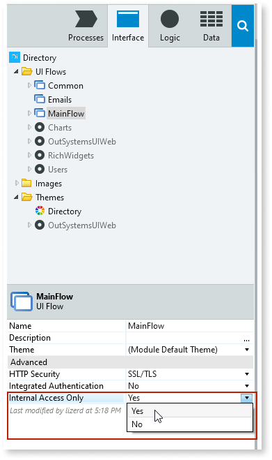

# Restrict Access to an Internal Network

To effectively use this feature, you need to [configure your environment Internal Network](https://success.outsystems.com/Documentation/11/Managing_the_Applications_Lifecycle/Secure_the_Applications/Configure_an_Internal_Network) in Service Center.

You can tighten the security of your applications, or part of them, by only allowing the access to end users who have authenticated themselves in an IP belonging to an internal network.

You will first need to define the IP range of your Internal Network. See [Configure an Internal Network](<../../managing-the-applications-lifecycle/secure-the-applications/configure-internal-network.md>).

You can restrict internal network access to the following elements:

* UI Flows of a Web application (restricts the access of the Web Screens within the Flow). This is only available for Traditional Web apps.
* Exposed SOAP Web Services
* Exposed REST APIs

To restrict these elements to internal network access, set its **Internal Access Only** property to `Yes`.

