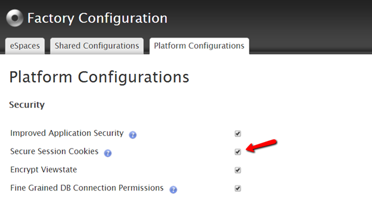
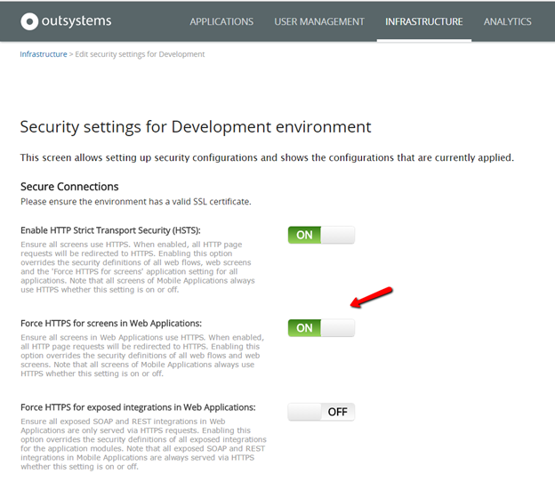
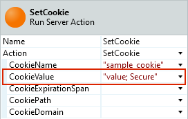

# Enable secure session cookies and set application cookies as secure

## Overview

Cookies may contain sensitive information that shouldn't be accessible to an attacker eavesdropping a channel. To ensure that cookies aren't transmitted in clear text, it's possible to send them with a secure flag.

Web browsers supporting the "secure" flag only send cookies having the "secure" flag when the request uses HTTPS. This means that setting the "secure" flag of a cookie prevents browsers from sending it over an unencrypted channel.

The unsecure cookies issue is commonly raised in penetration test reports performed on OutSystems applications if the environment they're running on is missing some configurations. See the next sections for instructions on securing both session and application cookies.

## Secure session cookies

Session cookies store information about a user session after the user logs in to an application. This information is very sensitive, since an attacker can use a session cookie to impersonate the victim (see more about [Session Hijacking](https://en.wikipedia.org/wiki/Session_hijacking)).

You can configure an OutSystems environment to have secure session cookies. Service Studio and LifeTime have options that enable you to configure your security settings, such as [SameSite and Secure](https://success.outsystems.com/Support/Enterprise_Customers/Maintenance_and_Operations/Upcoming_changes_in_cookie_handling_in_Google_Chrome#patch). For example, activating the **Secure option** adds the `Secure` attribute to all cookies that the platform generates. Alternatively, you can configure these security settings by installing [Factory Configuration](https://www.outsystems.com/forge/component/25/factory-configuration/) from Outsystems Forge.

After installing Factory Configuration, access the application and, in the *Platform Configurations* tab, find the option to enable secure session cookies:



<div class="info" markdown="1">

After you change the settings using Factory Configuration, make sure you **apply new configurations to you environment**.

</div>


**Important note:** When you activate the secure flag, OutSystems only sends session cookies when using HTTPS. Therefore, to prevent unexpected behavior with user sessions, when you activate secure session cookies you should also force HTTPS for all screens. By enabling the Improved Application Security option, you have access to additional security configurations for your environment on Service Center and LifeTime, which allow not only to force HTTPS for web screens but also for web references:



This option is enabled by default since OutSystems 10 and it's available for OutSystems 9.1 since revision patch 9.1.600.0.

## Secure application cookies

To activate the "secure" flag when setting a custom cookie in a **server-side context** (for example, in the context of a Server Action), set **CookieSecure** to `True` when calling the [SetCookie](https://success.outsystems.com/Documentation/11/Reference/OutSystems_APIs/HTTPRequestHandler_API#SetCookie) Server Action:


This Input Parameter is available since Platform Server 11.7.0.

In older versions of Platform Server this optional argument doesn't exist. As a workaround, you can append "`; Secure`" to the cookie value to activate the "secure" flag. Here's an example:



To set the "secure" flag in a **client-side context** (for example, in JavaScript code), append "`; Secure`" to the cookie:

```javascript
document.cookie = 'sample_cookie=value; Secure';
```
