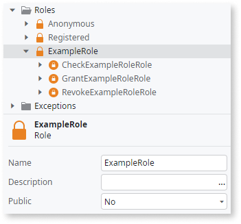
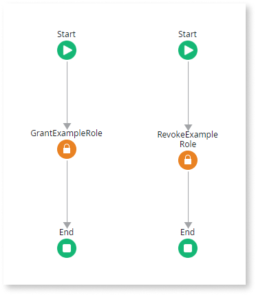

# Create and Use Roles

You can restrict or allow end users access to specific screens and operations of your application using your own custom Roles. For example, you can create a back-office Role, set the Role in your application's back-office screens, and grant this Role only to those end users who are entitled to access the back-office screens.

To create a custom Role, do the following:

1. Go to the **Logic** tab.
1. Right-click the **Roles** folder and select the **Add Role** option.
1. Set the Name of your Role and the remaining information.

Once you create a new Role, you can assign it to end users through the **Users** application or you can create logic in your application to manage the access.

## Use the Role in your Application's Logic

When you define a new Role in your module, OutSystems provides a set of System Actions, built-in functions, and exceptions necessary to use the Role in your logic.

### Role Actions

For each Role in your module, OutSystems provides the following Actions:

`Check<role_name>Role`
:   Checks whether a specific end user has been granted access to a specific role.  
    Note: This function is only applicable to **active users**. When you use it for an inactive user, the result is always "False", even if the user has been granted the role.

`Grant<role_name>Role`
:   Provides access for a specific end user to a specific role. You can use it both for active and inactive users.  
    This action is not available for the System Roles **Anonymous** and **Registered**.

`Revoke<role_name>Role`
:   Denies access for a specific end user to a specific role.  
    This action is not available for the System Roles **Anonymous** and **Registered**. 

Role Actions are available in the **Logic** tab, within the **Roles** folder, under the corresponding Role, and can simply be dropped into your action flow.

### Role Functions

To check end user Roles in your expressions, OutSystems provides the following built-in function:

* `Check<role_name>Role`

This function is available in the Scope Tree of the Expression Editor, under the **Roles** folder. It's only applicable to **active users**.

Besides this function for each role, there are other built-in functions related to Roles. Check the [Roles built-in functions](../../../ref/lang/auto/builtinfunction.Roles.final.md).

### Role Exceptions

For each Role in your module, OutSystems creates the following Exception:

* `Not <role_name>`

This Exception is raised when a user tries to access an element, for example a Screen, that requires a specific Role and the user has not been granted with that Role.
