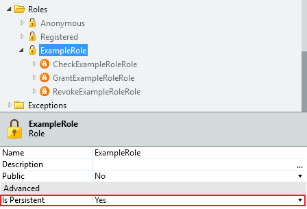
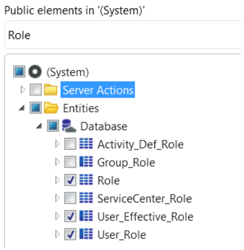

# User Roles

Use Roles to restrict or allow end users to access specific screens and operations of your application.

Set Roles at design time. You can use them when designing the logic of your application and you can associate them with the following elements:

* Screen
* Human Activity

## System Roles and Custom Roles

When you create a new module in Service Studio, OutSystems provides you with a default set of **System Roles** but you are allowed to define your own **custom Roles**.

OutSystems provides the following System Roles:

* **Anonymous:** Allows any end user to access the element, including users that aren't logged in (non-authenticated users). Anonymous is the most general Role and when you associate this Role, for example with a screen, all the existing Roles are automatically associated with it.

* **Registered:** Allows any end user who has logged into an Application running in the same Platform Server (authenticated users) to access the element. This is possible due to the Single Sign-On mechanism of OutSystems, which allows sharing end user sessions among applications/modules. When you associate this Role with an element all the existing Roles are automatically associated with it, except the Anonymous role.

Besides the System Roles already provided, you can define your own custom Roles to manage the access of end users to the screens and operation of your application.

## Persistency in Roles

Granting and revoking Roles during runtime (using the Grant&lt;Role name&gt;Role and Revoke&lt;Role name&gt;Role actions) can be persistent across multiple sessions or only be active for a single session. You can only change this setting for Traditional Web Apps.

* **Persistent:** The runtime granting or revoking of Roles is stored in the database and is kept in between login sessions. Set the `Is Persistent` property of the Role to `Yes`.

* **Not persistent:** The runtime granting or revoking of Roles is not stored in the database, lasting only for a single session. When the end user is logged out, the runtime granting or revoking of Roles is lost. Set the `Is Persistent` property of the Role to `No`.

When an external system performs end user authentication and authorization, you should use non-persistent Roles. This makes it easier to map permissions defined in an external system, such as Active Directory, to OutSystems Roles. Using non-persistent Roles ensures that OutSystems reflects any changes to end user permissions made in the external system.

## User Roles in the OutSystems metamodel

The **Role** entity stores the roles created in the OutSystems platform. As a developer, you can check the Roles of a User in two different entities:

* The **User_Role** entity is a metamodel table that stores the user and Role association. This entity only stores Roles that are directly added to a specific user through the Users application.

* The **User_Effective_Role** entity is a metamodel view that contains user-specific roles. This entity includes Roles assigned directly to a user and Roles assigned to a Group to which the user belongs.

Before using User_Role and User_Effective_Role in your app, add them as dependencies by following these steps:

1. Open **Manage Dependencies**.
1. In the producers list, select **(System)**.
1. In the public elements list, select **User_Role** and **User_Effective_Role**.

If you can't see **User_Role** and **User_Effective_Role** entities in **(System)**, make sure to select **Show all** in the filter dropdown of the public elements list.

