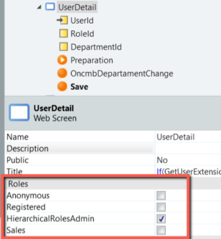
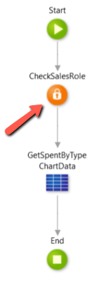
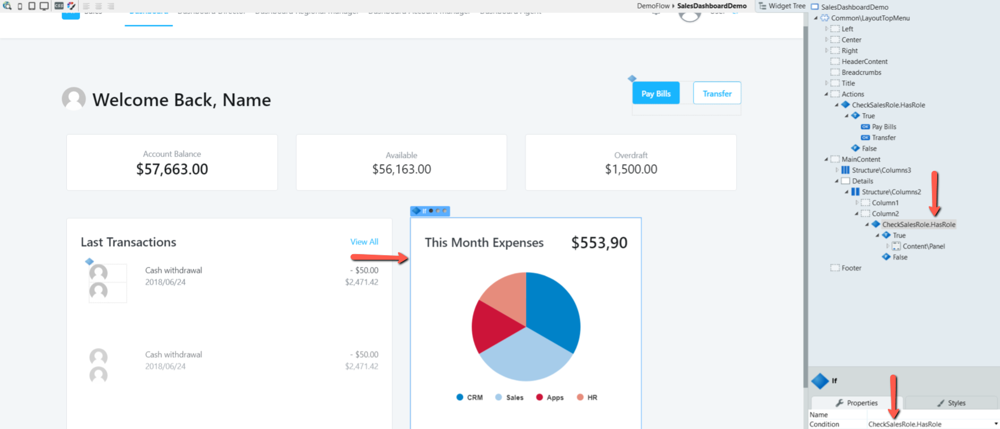
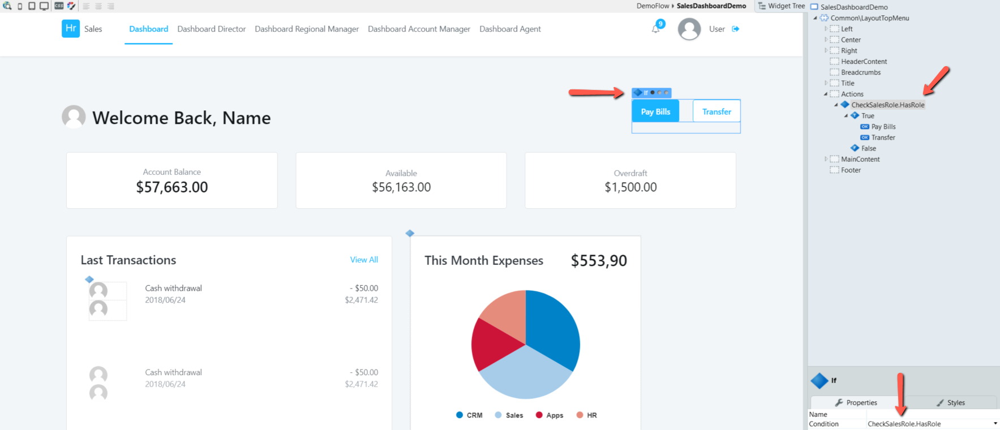
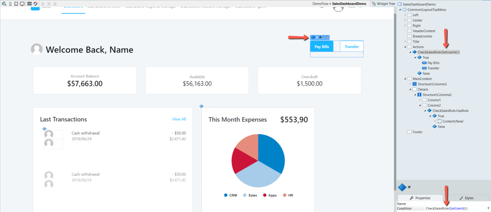

# Validate End User Permissions in the Application

If you need to restrict end user access to specific areas or operations in a web application, you must validate their permissions using roles to control access to screens, screen elements or actions.

To restrict end user access to the screens of the application, select the end user roles that can view the screen in the Properties editor of the screen. 

To validate the permissions of end users to screen elements or actions of an app, use the CheckRole built-in function to determine if the end user has the necessary roles.

## In Traditional Web

In the screen Preparation add the **CheckRole** action.

You can use these functions to:

* Hide or display the interface elements using If elements. 

* Block or allow executing the actions.

Alternatively, you can use CheckRole as a function directly in if elements. In case you need to check the same permission several times, call the CheckRoles built-in function in screen preparation.

