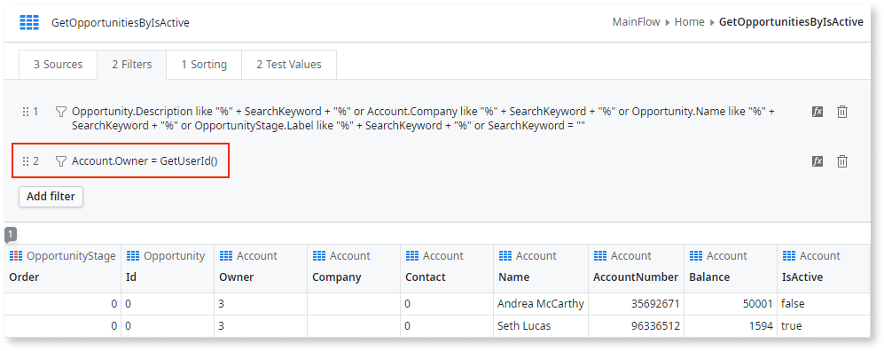
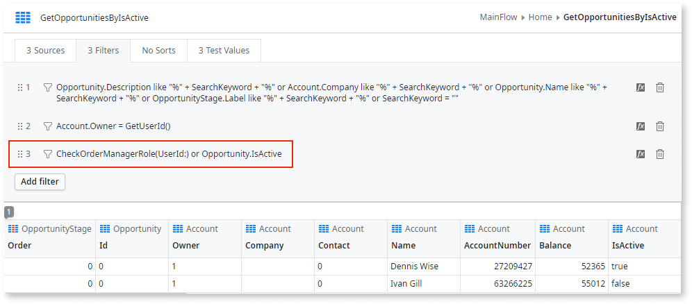

# Validate End User Permissions in the Application

You can restrict end-user access to specific areas, operations or data of an app.

By validating their user ID or Roles you can control access to screens, screen elements or actions. It's also possible to restrict access to data depending on the logged in user or their role.

## Restricting access to screens, processes, and actions

To restrict access to a screen of an app, in the **Roles** property of the screen select the end user Roles that can view the screen.

To restrict access to screen elements or actions of a screen, use the **Check&lt;Role_name&gt;Role** action or function to determine if the end user has the necessary Role.

## Restricting access to data

You can also restrict access to data based on the user ID or the user Role.

In this next example, `GetUserId()` was used so that account owners can only see the opportunities of their own accounts:

To restrict the displayed data by Role, use **Check&lt;Role_name&gt;Role** in an expression on an aggregate filter.

In this next example, we're checking for the OrderManagerRole to restrict visibility over inactive opportunities. When the **Check&lt;Role_name&gt;Role** evaluates to false, only active opportunities are shown:

