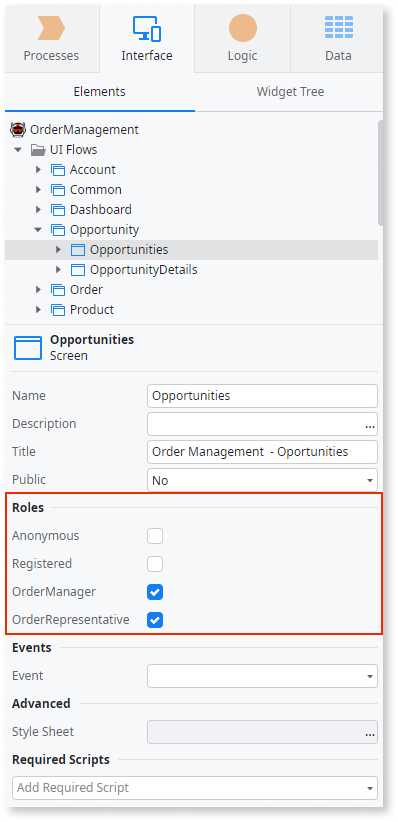

# Validate End User Permissions in the Application

If you need to restrict end user access to specific areas or operations of an app, you must validate their permissions using Roles to control access to screens, screen elements or actions.

To restrict access to a screen of an app, in the **Roles** property of the screen select the end user Roles that can view the screen.

To restrict access to screen elements or actions of a screen, use the **Check&lt;Role_name&gt;Role** action or function to determine if the end user has the necessary Role.
