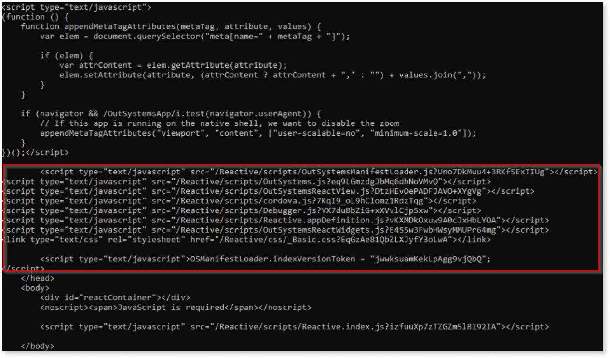

# Improve SEO of OutSystems reactive apps with prerendering

OutSystems’ reactive applications are Single Page Applications (SPAs). These are web apps that load a single page and update content dynamically. They offer benefits like dynamic content, smooth navigation, improved performance, offline capabilities, and development simplicity.
When a user accesses the app, the server returns a pretty bare HTML file and some JavaScript (JS) that executes on the client side to render the UI. This also allows fetching data asynchronously in parallel with page rendering.
However, when you have very complex logic or you retrieve a big amount of data, you might experience longer initial loading times due to reliance on client-side rendering (CSR). This can present SEO challenges as search engine bots need to render the page in order to index it. 

In these situations, you’ll benefit from using the pre-render technology.

In this article, we describe how you can integrate the OutSystems platform with a third-party pre-rendering solution called [prerender.io](https://prerender.io/). 

<div class="info" markdown="1">

There are other pre-render solutions in the market and you are free to choose a different one that fits your needs. OutSystems recommends [Prerender.io](https://prerender.io/) as one of your pre-rendering options due to its significant SEO improvements. 

</div>

<div class="info" markdown="1">

OutSystems is not affiliated with or sponsored by Prerender.io, and does not receive any economic or financial benefit from customers subscribing to their services. 

</div>

## Prerequisites

### Prerender.io account

To configure your pre-render solution, you need an account with Prerender.io. Select a [plan](https://prerender.io/pricing/) that meets your budget and requirements.

You may refer to [this article](prerender-io-usage-and-configuration.md) which describes the important criteria that you must consider when choosing a plan.

### CDN

Prerender.io offers several options to integrate with your application. The best way to integrate with the OutSystems platform is by using a CDN. In this article, we’ll describe how to use a CloudFront CDN, but you can choose the [CDN](https://docs.prerender.io/docs/integrations-1) that works best for you. 


<div class="info" markdown="1">

For more information on using CDN with OutSystems, see [Using a CDN with OutSystems](https://success.outsystems.com/documentation/11/setup_and_maintain_your_outsystems_infrastructure/setting_up_outsystems/using_a_cdn_with_outsystems/).

Note that this guidance is not applicable for OutSystems cloud customers. 

</div>

## Integrating prerender.io with CloudFront CDN

When a page is requested by a search engine or a social media bot, Prerender.io provides the response. If the requested page is already cached, a cached version is served. If not, Prerender.io fetches the page from your OutSystems app, renders its JavaScript, and serves the fully rendered page to the bot.

<div class="info" markdown="1">

This process is subject to change. For any updates and additional information, see [Prerender.io knowledge base](https://docs.prerender.io/v1/docs/cloudfront).

</div>

### Viewer/origin requests

Lambda@Edge lets you run Node.js and Python Lambda functions to customize content that CloudFront delivers, executing the functions in AWS locations closer to the viewer. The functions run in response to CloudFront events, without provisioning or managing servers. You can use Lambda functions to change CloudFront requests and responses at the following points:

* After CloudFront receives a request from a viewer (viewer request)
* Before CloudFront forwards the request to the origin (origin request)
* After CloudFront receives the response from the origin (origin response)
* Before CloudFront forwards the response to the viewer (viewer response)

For more information, see [Using AWS Lambda with CloudFront Lambda@Edge](https://docs.aws.amazon.com/lambda/latest/dg/lambda-edge.html). 

You need to intercept both the viewer and the origin requests:

* In the **viewer request**, your code checks if the request comes from a bot. If it does, it adds headers required by Prerender.io, including the user token.

* In the **origin request**, your code checks if the Prerender.io headers are in place. If it does, it forwards the request to Prerender.io servers that contains the prerendered copy of the site. If not, it sends the request to the actual server.

## CloudFront integration

Prerender.io provides [instructions](https://docs.prerender.io/v1/docs/cloudfront) on how to configure their product with a CloudFront CDN. The solution consists of executing a yaml file on your cloud formation, which creates both functions for you.
You can select which bots that are sent to the pre-rendered version of your pages. To select the bots, modify the yaml file. Look for the following line of code:

```
var prerender = /googlebot|adsbot\-google|Feedfetcher\-Google|bingbot|yandex|baiduspider|Facebot|facebookexternalhit|twitterbot|rogerbot|linkedinbot|embedly|quora link preview|showyoubot|outbrain|pinterest|slackbot|vkShare|W3C_Validator|redditbot|applebot|whatsapp|flipboard|tumblr|bitlybot|skypeuripreview|nuzzel|discordbot|google page speed|qwantify|pinterestbot|bitrix link preview|xing\-contenttabreceiver|chrome\-lighthouse|telegrambot/i.test(user_agent[0].value); 
```

Modify the regex leaving only the bots you care about. You can find more details on why this is important in [this article](prerender-io-usage-and-configuration.md).

## Testing your implementation

You can test your implementation using the Prerender.io dashboard and by using a curl command.

### Prerender dashboard

When logging in to the prerender.io dashboard for the first time, it shows a modal window to allow you to test your integration. Follow these steps:

1. Select other integrations.

1. Paste the url of your application (it has to be exposed to the world).

1. Click **Test**.

1. Go to the bottom of the dashboard and check the **Recent Crawler Visits** section. 

You can see all the websites that got redirected to the prerendered version of your application. 

### Using Curl command

You can mimic a request from a bot by using the curl command and compare it with a user request. Ensure that you target your CDN URL and not the actual site directly (in case they are not the same).

#### Prerendered version

Open cmd and type the following. Make sure you replace {yourserver.com} with your real server name and {YourReactiveApp} with the real name of your application:

`curl -A "googlebot" https://{yourserver.com}/{YourReactiveApp}/`

With this command you are mimicking the call of the crawler of Google to your website. If it works fine, you should see the full HTML for your rendered page, including all its content.

#### Live version

Run a similar command to the one you executed before, also replacing the placeholders with the right values.

`curl https://{yourserver.com}/{YourReactiveApp}/`

The result will look something like this:


Note that instead of showing the full HTML for your rendered page, you call different JavaScript files. These are the files that render the content of your application to the final users when they open it.

