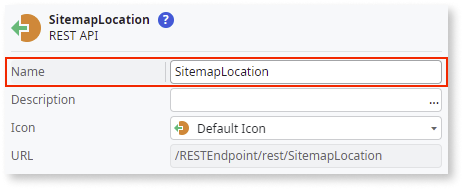
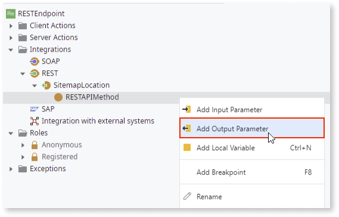

# Improved crawlability for Reactive Web apps  

While there are several strategies to improve the ranking of your domain in search results, SEO starts with indexing your pages. To do this, you need to ensure that your pages are crawler-friendly.  

Crawlers, similarly to humans, respond better to sites that have clear, structured, and readable data. Crawlers only spend a limited amount of time and resources per site. So, if your domain has incoherent site maps, broken links, or 404 errors, then it might not get indexed at all, thus making your app invisible to all of its potential users.  

At OutSystems, we recommend that you use sitemaps and robots to optimize crawlability. This should make your app discoverable and rank higher in search results.  

## Sitemap and Robot files

The sitemap.xml and robots.txt files let you control website crawlers and index the public pages in your apps. Use robots.txt rules to prevent crawling, and sitemap.xml to encourage crawling.

This diagram explains the connection between crawlers, sitemaps, and robots:


### Sitemap.xml 

A sitemap is a file where you provide information about the pages, videos, and other files on your site, and the relationships between them. Having a sitemap speeds up content discovery by enabling search engines to identify your website structure and crawl your site more efficiently. A sitemap informs the search engines about what pages and files you think are important on your site, and also provides valuable information about them. For example, the sitemap can provide information like the timepoint when the page was last updated and any alternate language versions of the page.

#### Sitemap.xml formatting 

<div class="info" markdown="1">

 Access additional information about XML formatting rules on this [Sitemaps XML format](https://www.sitemaps.org/protocol.html) webpage.  

</div>

A sitemap is valid if its location attribute (URL) is in an XML format that follows the formatting rules and can be parsed by crawlers. When an app is under frequent development, the sitemap becomes outdated. As a solution, because most addresses can be valid locations for a sitemap, use a REST API to create a sitemap for your applications. This REST API computes and returns a plan of your website following the XML formatting rules. 

#### Create a static sitemap.xml file

To create a static sitemap, follow these steps:  

**Prerequisite:** If you haven't already, consider [creating a site rule](seo-friendly-url-reactive.md#creating-a-site-rule) to make your module the root app of the domain.  

1. [Create a REST endpoint](#create-a-REST-endpoint) that lists URLs in your app.  
1. Create a local sitemap.xml file using a text editor of your choice.  
1. [Reference the created REST endpoint to your sitemap.xml](#expose-the-rest-api-endpoint).  
1. [Deploy the sitemap.xml as a static file](#adding-sitemapxml-to-the-root-directory-of-a-domain).  

##### Create a REST endpoint

<div class="info" markdown="1">

If you use [custom URLs](seo-friendly-url-reactive.md#custom-screen-urls) on any of the screens in your app, you must adapt the Assigns in the REST method to reflect the custom URL pattern.
</div>

<div class="info" markdown="1">

To see an example of an app with a REST endpoint implemented, you can download the [Sitemap-and-robots sample app](resources/sitemap-and-robots.oap). 

**Note**: The sample app is a reference only and is not to be used to generate a REST endpoint. You can copy and paste the REST logic and adapt it in your app.

</div>


1. In **Service Studio**, go to the **Logic** tab and expand the **Integrations** folder.

    

1. Right-click **REST** and select **Expose REST API**.

    

1. Enter a name for the API.

    

1. Add a method that returns the sitemap details. To do this, right-click the newly created REST API and select **Add REST API Method**.

    

1. Enter a name for the method. 

1. Add a text output parameter. 

    The output parameter is used to iteratively build the sitemap.

    

    The REST method’s output is an XML formatted list that includes all URL endpoints that are relevant for the search engine crawlers. 

    ###### **Example XML formatted list**

    ```
            <?xml version='1.0' encoding='UTF-8'?>
                <urlset xmlns='http://www.sitemaps.org/schemas/sitemap/0.9'>
                    <url>
                        <loc>https://example.com/Home</loc>
                    </url>
    	            <url>
                        <loc>https://example.com/Login</loc>
                    </url>
                </urlset>

    ```
     
    To achieve the XML formatted list that includes all URL endpoints, there must be a hostname that's the same for all URLs. Consider having a local variable to easily reuse this hostname across every screen.

1. Add URLs for screens without input parameters (static screens).

1. Compute and add URLs based on aggregate results for all screens that require input parameters (dynamic screens).

1. To validate the sitemap output, go to the method URL, right-click the REST API and select **Open documentation**. Then click **GET**, copy the **Request URL** and paste it in a new browser tab.

    A list of URLs for your app’s screens are displayed. Validate if new URLs appear in the REST endpoint, verify that the number of URLs doesn't exceed 50,000 and that the filesize of the generated xml is below 50 mb.

##### Add sitemap.xml to the root directory of a domain

<div class="warning" markdown="1">

 You must set up the site rule for your environment first. If you haven’t already, check the [Site Rules](seo-friendly-url-reactive.md#site-rules) section for instructions.

</div>

To add a sitemap.xml file to the root of a domain, follow these steps:  

1. In **Service Studio**, right-click **Resources** under **Data** and select **Import Resource**.  

1. Select the newly created **sitemap.xml** file.  

1. When the **sitemap.xml** file is present under the **Resources** section, set its **Deploy Action** to **Deploy to Target Directory**.  

As a result, the file is available under `MyApp/sitemap.xml`. You can publish your application and check it out.  

### Robots.txt

The robots.txt is a text file with instructions for search engine crawlers. It defines which areas of a website the crawlers are allowed to search.  

A robots.txt file consists of one or more rules. Each rule blocks or allows a crawler to access a specified file path on the domain or subdomain that hosts the robots.txt file. Using this text file, you can exclude domains, directories, subdirectories, or individual files from search engine crawling. The robots.txt file can also integrate a link to your sitemap, which gives search engine crawlers an overview of all URLs of your domain.  

The robots.txt is stored in the root directory of a domain. Thus it is the first document that crawlers should open when visiting your website.  

For search engine crawlers to find a robots.txt for your app, you need to make sure your app is available from the root of your website. This is possible through [site rules](seo-friendly-url-reactive.md#site-rules). When you set your app to live at the root of your website, whenever someone accesses your main endpoint, it will show the app right away. This means that the entry module for your app, ```<environment>/MyApp```, will now be the root of your site, ```example.com```. Since the robots.txt file is under ```<environment>/MyApp/robots.txt```, after setting a site rule for MyApp, the file will be accessible under ```example.com/robots.txt```, which is the first place the crawlers look for it.  

Robots.txt files follow the [Robots Exclusion Protocol](https://datatracker.ietf.org/doc/html/draft-koster-rep) and this is an example of how they look like: 

```
Sitemap: https://example.com/sitemap.xml

User-agent:*
Allow: /

User-agent: Adsbot-Google
Allow: /store

User-agent: Googlebot
Allow: /
Disallow: /profile
```

#### Create a static robots.txt file { #create-robots }

To create a static robots.txt file, follow these steps:  

1. Create a local robots.txt file using a text editor of your choice.  

1. In the robots.txt file, reference the sitemap.xml endpoint and other directives that you need, following the structure of the [Robots Exclusion Protocol](https://datatracker.ietf.org/doc/html/draft-koster-rep).  


#### Add robots.txt to the root directory of a domain

After [creating the robots.txt file](#create-robots), add it to the root of your domain:

<div class="warning" markdown="1">

If you haven't already, [create a site rule](seo-friendly-url-reactive.md#creating-a-site-rule) to make your module the root app of the domain, thus making this file the entry point on your domain for search engine crawlers.

</div> 

1. In **Service Studio**, go to the **Data** tab.  

1. Right-click the **Resources** folder and select **Import Resource**. 

    

    A dialog opens.  

1. Select your robots.txt file and then select **Open**.  

1. In the **Resources** folder, click the added robots.txt file to open its properties.  

1. Set the **Deploy Action** to ```Deploy to Target Directory```.

    

    This action makes the file available under ```MyApp/robots.txt```.  

1. Publish your module.  

    If the site rule for your environment is already set up, you should find the robots.txt file under the root of the website, ```example.com/robots.txt```.

### Generating a sitemap

#### Prerequisite

You must have an existing site rule to associate your domain root with the app for which you’re building the sitemap.


The **developer** and **deployer** collaborate to generate a sitemap.

1. In **Service Studio**, the developer:

	1. Creates a REST endpoint that lists URLs in the app.
        
    1. Asks the deployer to create the site rule.

        **Note:** The developer doesn’t have the permissions to create a site rule.

1. In **Service Center**, the deployer: 

    1. Creates the site rule. 

    1. Makes the module the root app of the domain.

1. In **Service Studio**, the developer: 

    1. Creates, imports, and deploys the sitemap.xml and robots.txt files.

        **Note**: Deploy the sitemap.xml and robots.txt as static files.
    
    1. Publishes and validates the app.

        To validate the app, go to the robots.txt file at the root of the domain (domain.com/robots.txt), follow the sitemap reference and ensure that it points to the expected sitemap.xml resource. Go to the REST method inside the sitemap.xml and ensure that it includes all the expected URL endpoints. 
        
        After all of these changes are deployed to the production environment, validation tools such as Google console can be used to identify any problems with the sitemap format or invalid screen endpoints.

        **Note**: You may need to validate the app again after site rule, application changes, and deployments are complete.

    1. After the developer validates the app, the deployer creates a deployment-to-production plan using this tools flow: **LifeTime** > **Service Center** > **LifeTime** > **Service Studio** > **LifeTime** > **Browser**.

1. In **LifeTime**, the deployer:

    1. Adds the app to deploy.

    1. Configures app settings.

    1. Reviews the deployment plan.

    1. Executes the deployment plan.

1. In **Service Center**, the deployer:

    1. Creates the site rule. 

        Usually, the site rule is created in the production environment only. However, they can also be created in the development  environment for validation purposes. If a site rule is set up for a development environment, upon deploying the application, the site rule is not automatically set up for the production environment as it is a configuration specific to the environment.

    1. Makes the module the root app of the domain.

1. From **LifeTime**, the deployer opens the app in **Service Studio**.

1. In **Service Studio**, the deployer:

    1. Opens the module. 

        **Note**: For multi-module apps, the deployer may need to open several modules to find the sitemap and robot files.

    1. Download the sitemap.xml and robots.txt files and update the URL to point to the Production environment.

    1. Updates the sitemap.xml and robots.txt files in the module.

    1. Publishes the module to Production.

1. In **LifeTime**, the deployer marks the hotfix as solved, and then submits the sitemap to search engines.

    **Note**: This occurs only when the changes are in the Production environment (must be a public facing environment).


