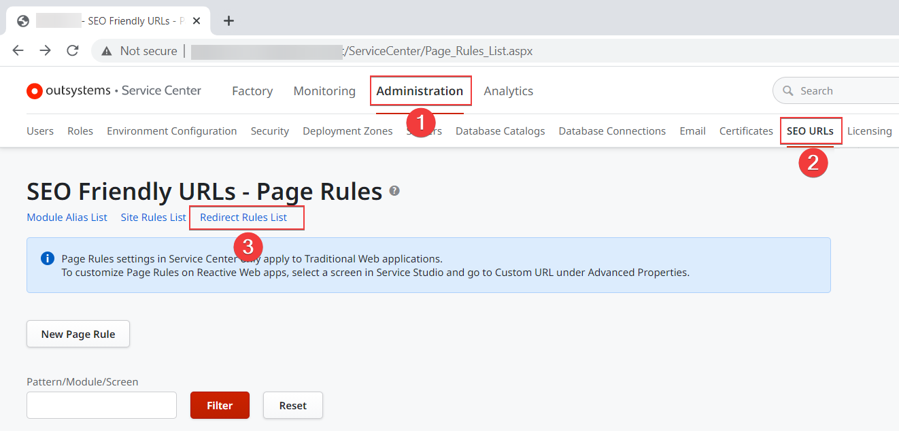

# SEO in Reactive Web Apps

As a best practice use **SEO-friendly URLs for Reactive Web Apps**. Friendly URLs provide both humans and machines an indication of the search-engine results. With Service Center you can create the SEO-friendly versions of the URLs, manage Site Rules and Redirects. Edit custom URLs in Service Studio, in the properties of each Screen.

## Prerequisites

**SEO-friendly URLs for Reactive Web Apps** requires the following:

* Platform Server 11.14.0 or later
* Service Studio 11.13.0 or later
* OutSystems enterprise cloud offer or a properly configured on-premises installation

For Platform Server versions between 11.12.0 and 11.14.0 you can enable the technical preview and use Service Studio 11.11 and later.
  

On-premises installations must have [ISAPI Filters](<https://success.outsystems.com/Support/Enterprise_Customers/Maintenance_and_Operations/Customize_or_redirect_the_application_URL#Installing_ISAPI_Filters_and_Logging>) active.

## Activating and deactivating the feature

* To **deactivate SEO-friendly URLs for Reactive Web Apps**, remove all Site Rules from Service Center.
* After you **activate or deactivate** the feature, publish your apps to apply the changes.

## Site rules

A Site rule maps the URL to a module in the environment. If users enter `www.example.com` in the browser, the platform loads the **MyMainModule** home screen.

The following table shows examples of Site rules:

| URL                             | To the module         |
| ------------------------------- | --------------------- |
| `www.example.com`               | MyMainModule          |
| `www.example.com/myapp`         | MyAppHomeModule       |
| `subdomain1.example.com`        | MyAppSubdomainModule  |
| `subdomain1.example.com/myapp1` | MyAppSubdomainModule2 |

See [Managing Site Rules](#managing-site-rules) for instructions.

## URL prioritization

Prioritization determines the order in which pages load in the browser. The platform uses the following priorities:

1. Static URLs have priority over dynamic URLs.

2. The priority for dynamic URLs is based on the number of parameters. Rules with fewer parameters have priority over rules with more parameters.

## Custom Screen URLs

A custom Screen URL works on the module level, letting you change how the URL of one screen shows in the browser. The Screen **ProductListSection** from your module can load from the URL /`Products` instead of `/ProductListSection`. Custom Screen URLs support having the parameters on the path instead of using the query string, so you can redirect users to the URL `/Products/1` without the custom URL `/Products?Id=1`.

The following table shows examples of custom Screen URLs:

| Original URL              | With **Path** | With **Query string**   |
| ------------------------- | ------------- | ----------------------- |
| `/ProductListSection`     | `/Products`   |                         |
| `/Products?Id=1`          | `/Item/1`     | `/Item?Id=1`            |
| `/Order?Id=1`             | `/Buy/1`      | `/Buy?Id=1`             |
| `/Order?Id=1&Quantity=10` | `/Buy/1/10`   | `/Buy?Id=1&Quantity=10` |

Make sure all Page Names are unique in the environment. Otherwise, some URLs may not work. See also: [Avoiding duplicated redirects](#avoiding-duplicated-redirects).

See [Managing custom Screen URLs](#managing-custom-screen-urls) for instructions.

## Redirects

Redirect rules let you redirect browser requests from the old domain or subdomain to the new URLs. OutSystems uses the **301 HTTP status code** for domain-level redirects.

The following table shows examples of redirects:

| Old URL               | New URL                 |
| --------------------- | ----------------------- |
| `example.com`         | `www.example.com`       |
| `about.example.com`   | `www.example.com/about` |
| `oldname.example.com` | `newname.example.com`   |

See [Managing redirects](#managing-redirects) for instructions.

## Managing URL rules and redirects

The following sections provide more technical details about managing Redirects, Site Rules, and custom Screen URLs.

### Managing Site Rules

To manage Site Rules you need:

* **Base URL**. The string to match the rule, for example `www.example.com/myapp`.
* **Root Application**. The module to which the platform redirects the requests, for example `MyMainModule`.

Go to **Service Center** > **Administration** > **SEO URLs** > **Site Rules List** to:

* Add a Site Rule
* Update a Site Rule
* Disable or delete a Site Rule

When working with Site Rules, remember:

* You can have only one Site Rule per root application for domains with sub-paths.
* Creating or editing a Site Rule can temporarily slow down the app because the platform needs to reload the setting files.

### Managing custom Screen URLs

You can add custom Screen URLs in Service Studio. Go to the properties of the Screen to which you want to set the name. Then, in the **Advanced** section, set the **Custom URL** to **Yes** and edit the URL structure.

If an app passes an empty string as a value for a required parameter, users see an error message. See [Empty string in a required parameter causes an error](https://success.outsystems.com/Support/Enterprise_Customers/Upgrading/Troubleshooting_and_known_issues_with_SEO-friendly_URLs_for_Reactive_Web_Apps#empty-string-in-a-required-parameter-causes-an-error) for more information.

Here are more details about the properties.

| Property          | Description                                                                                                                                                                                                             |
| ----------------- | ----------------------------------------------------------------------------------------------------------------------------------------------------------------------------------------------------------------------- |
| **Custom URL**    | If you set **Custom URL** to **Yes**, Service Studio activates custom Screen URLs and lets you edit the redirect settings.                                                                                                  |
| **Page Name**     | The name of the page to show in the URL. Use only alphabetical characters and numbers. You can use the following  special characters, but not at the beginning or at the end of the page name: `_`, `-`, `/` , and `~`. |
| **URL Structure** | Set to **Path** to pass the parameters separated by `/` in the URL (example: `/Product/1`). Set to **Query string** to pass the parameters as a string (example: `Products?Id=1`).                                      |
| **URL Pattern**   | Preview only. Shows the URL preview as you edit the settings.

#### Reserved strings

These are the reserved strings that you **cannot** use in the **Page Name** property:

* `screenservices`
* `moduleservices`
* `img`
* `Blocks`
* `rest`

The following strings aren't supported because you can't have `/` between them:

* `screenservices/list`
* `List/screenservices/List`
* `List/sreenservices`

#### Notes

These are additional notes about custom URLs.

* You can add custom URLs to all Screens **except** the Default Screen.
* When copying Screens with custom URLs from Reactive Web App module to Mobile App module, Service Studio removes the URL rules in the Mobile App module.

### Managing Redirect Rules

To manage Redirect Rules you need to know the following:

* **Base URL**. The string to match the rule, for `old.example.com`
* **Replace With**. The replacement string for the URL, for example `new.example.com`

Go to **Service Center** > **Administration** > **SEO URLs** > **Redirect Rules List** to:

* Add a Redirect Rule
* Update a Redirect Rule
* Disable or delete a Redirect Rule

## Dynamic page titles

Introduced in Platform Server 11.13.0 and Service Studio 11.12.0.

The page titles show in the browser tabs, bookmarks, and results from the search engines. Use expressions to set titles of Screens and change the page title dynamically. 

OutSystems strongly recommends that all team members update Service Studio before using dynamic page titles in a collaborative environment.    

To set the Screen names dynamically, do the following in Service Studio:

1. Locate the Screen where you want to set the title dynamically.
2. In the Screen properties, double-click the **Tile** property. Expression editor opens.
3. Enter an expression that sets the title value during runtime. For example, `"More about" + ProductTitle`.

    

## Errors

A list of errors related to  **SEO-friendly URLs for Reactive Web Apps**.

* [Duplicated Page Name](../../ref/errors-and-warnings/errors/duplicated-page-name.md)
* [Invalid Page Name](../../ref/errors-and-warnings/errors/invalid-page-name.md)
* [Invalid Format](../../ref/errors-and-warnings/errors/invalid-format-page-name.md)
* [Invalid Parameter Order](../../ref/errors-and-warnings/errors/invalid-parameter-order.md)
* [Reserved Page Name](../../ref/errors-and-warnings/errors/reserved-page-name.md)