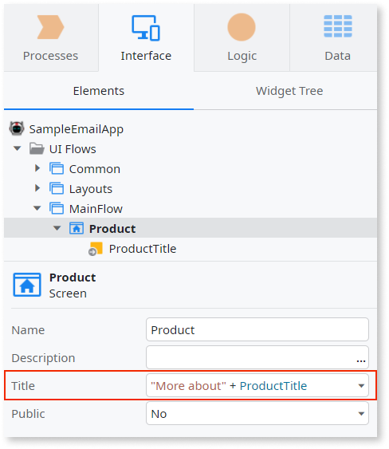

# SEO-friendly URLs for Reactive Web apps  

## Prerequisites  

SEO-friendly URLs for Reactive Web apps require the following: 

* Platform Server 11.14.0 or later.  

* Service Studio 11.13.0 or later.  

* OutSystems enterprise cloud offer or a self-managed installation with [ISAPI filters](seo-friendly-url-traditional.md#installing-isapi-filters-and-logging) activated. 

For **Platform Server** versions 11.12.0 to 11.14.0 enable the technical preview and use **Service Studio** 11.11 and later. Self-managed installations must have [ISAPI Filters](seo-friendly-url-traditional.md#installing-isapi-filters-and-logging) active.

  

Friendly URLs provide both humans and machines with an indication of the search engine results. 

There are many strategies for optimizing your Web app for search engines. At OutSystems, optimize your apps by doing the following:  

* Applying best practices for an effective URL structure. 
* Managing site rules.
* Customizing SEO-friendly URLs for your screens.
* Managing redirect rules.
* Identifying URL prioritization.
* Creating dynamic page titles. 

Different OutSystems tools enable you to complete different tasks. For example, use **Service Center** to create SEO-friendly versions of URLs, and manage site rules and redirects. Use **Service Studio** to edit custom URLs in the properties of each screen. 

  

## URL structure best practices  

To better manage your content and help users find it easily, you need to have an efficient standardized URL structure. Having this also helps search engines identify what content you think is important, as the website owner. For your OutSystems apps, this means creating an iterative chain of SEO rules that creates the structure you want.  

Simple URLs provide the best user experience. So, optimize URLs with descriptive keywords that give a clear understanding of what the page content is about. This helps search engines deliver relevant results to searchers, and searchers know exactly what they’ll find when they click a URL link.  

There’s no set rule for the best URL structure, and URLs can be different depending on your app use case. Nonetheless, a URL structure should be simple, logical, easy to remember, and contain clear descriptive keywords. OutSystems recommends that you create a URL structure that’s intuitive so that both users and search engines quickly and easily understand the connections between different screens on your app.  
 
Some best practices include:
* Using meaningful keywords
* Aiming for shorter URLs:  
    Most URLs automatically use the page or post title as the default URL, but sometimes the title can be an unnecessarily long string of characters. The shorter the URL, the better. Moreover, short URLs tend to rank higher.
* Using hyphens as word breaks:  
    SEO best practices use hyphens between words because this *tells* search engines and users where the breaks between words are and make it easier to read.

## Site rules

To create and manage site rules, go to **Service Center**.

  

A site rule is a configuration at the application level. Site rules enable you to customize the domain URL and app name using keywords that your audience might use to search in a browser. The domain is essential to an effective URL structure and impacts how users find and consume your app. 

For example, use site rules to map the apps in your production environment with the domain of your company or product, thus showcasing your own brand using OutSystems apps. 

Under the `production-environment.devexample.com` environment, map your `MyAppHomeModule` app to a new URL, such as `example.com/myapp`. So, when you enter `www.example.com/myapp` in the browser, the platform loads the `MyAppHomeModule` home screen.  

### Creating a site rule

To create a site rule, follow these steps:

1. Go to **Service Center** > **Administration** > **SEO URLs** > **Site Rules List**.  

      

1. Select **New Site Rule**.  

      

1. Enter the **Base URL** and the **Root Application**, and select **Create**.  

      

    As a result, you've enabled a new site rule.  
    You also have the option to select a site rule and edit, delete, or disable the **Base URL**.  

Consider the following when working with site rules:  
* You can have only one site rule per root application for domains with sub-paths.  
* Creating or editing a site rule can temporarily slow down the app because the platform needs to reload its configuration.  

  

## Custom screen URLs 

To create and manage site rules, go to **Service Studio**.

  

While site rules are specific to the domain and application level of your OutSystems apps, custom URLs are specific to each screen inside the application logic.  

Because these URLs display in search results, having simple URLs with friendly structures helps users easily find content within your apps.  

Use custom screen URLs to change the address of a screen inside your app. This enables you to choose how the URL of a screen shows in a browser, thus improving your URL structure. Custom screen URLs also enable you to map the input parameters in the URL path to better support your business needs, instead of using the query string. Note that, by default, all input parameters use query strings.  

For example, you can change a screen URL under `example.com/ChosenProduct?Id=1` to `example.com/Item/1` instead of `example.com/Item?Id=`.

The following table includes more examples of custom screen URLs:  

| Original URL              | With **Path** | With **Query string**   |
|---------------------------|---------------|-------------------------|
| `/ProductListSection`     | `/Products`   |                         |
| `/Products?Id=1`          | `/Item/1`     | `/Item?Id=1`            |
| `/Order?Id=1`             | `/Buy/1`      | `/Buy?Id=1`             |
| `/Order?Id=1&Quantity=10` | `/Buy/1/10`   | `/Buy?Id=1&Quantity=10` |

Consider the following when working with custom screen URLs:  
* You can add custom URLs to all screens except for the Default Screen.  
* When copying screens with custom URLs from a Reactive Web app module to a Mobile app module, **Service Studio** removes the custom URL configurations in the Mobile app module because SEO works differently for mobile apps.  
 

  

### Managing custom screen URLs  

To add a custom screen URL, follow these steps:  
1. Go to **Service Studio** and select the screen you want to rename. 
1. In the **Advanced** section of the screen properties, set the **Custom URL** to **Yes** and edit the URL structure.

 If an app passes an empty string as a value for a required parameter, you get an error message. To fix this, follow the instructions in this [SEO Troubleshooting](https://success.outsystems.com/Support/Enterprise_Customers/Upgrading/Troubleshooting_and_known_issues_with_SEO-friendly_URLs_for_Reactive_Web_Apps#empty-string-in-a-required-parameter-causes-an-error) article.

  

  

#### Screen properties  

Here is a list of considerations for the screen properties:  

**Custom URL**  
Set the **Custom URL** property to **Yes** to activate custom screen URLs and edit the redirect settings.  
 
**Page Name**  
Set the name of the page you want to show in the URL. Use only alphabetical characters and numbers. You have the option to use the following special characters, but not at the beginning or at the end of the page name: _, -, /, and ~.  

All page names must be unique. Otherwise, some URLs won't work.  

  

*Reserved strings*  

These are the reserved strings that you can’t use in the <b>Page Name</b> property:  
* `screenservices`  
* `moduleservices` 
* `img`  
* `Blocks`  
* `rest`  

The following strings aren't supported because of the / symbol:  
* `screenservices/list`  
* `List/screenservices/List`  
* `List/screenservices`  

**URL Structure**  
Set this property to **Path** to pass the parameters separated by / in the URL (for example, `/Product/1`). Set it to **Query string** to pass the parameters as a string (for example, `Products?Id=1`).  

**URL Pattern**  
Set this property to **Path** to pass the parameters separated by / in the URL (for example, `/Product/1`). Set it to **Query string** to pass the parameters as a string (for example, `Products?Id=1`).   

## Redirect rules  

To create and manage redirect rules, go to **Service Center**.

  

Use redirect rules to ensure users and crawlers don’t come across broken links. Redirect rules inform users and crawlers that a screen URL has changed and a new destination is available elsewhere.  

Choosing a redirect depends on how long you expect the redirect to be in place and what page you want the search engine to show in search results. So, you have the following options:  
* Permanent redirects, which show the new redirect target in search results.  
* Temporary redirects, which show the source page in search results.  

To use a redirect rule, you should consider the following redirect rules used by the OutSystems platform:  
1. HTTP 301 (permanent):  

    A 301 redirect signals a permanent redirect from one URL to another, meaning all users who request an old URL are automatically sent to a new URL. A 301 redirect passes all ranking power from the old URL to the new URL, and is most commonly used when a page has been permanently moved or removed from a website. While a 301 redirect can load the new URL faster on the next visit, if you want to revert this redirect, it may take months for the search engines to recognize the changes.   

1. HTTP 302 (temporary):  

    A 302 redirect ensures that changes to a forwarding address are quick, so traffic moves to your new location rapidly. The original page remains indexed in the search engine and no value is transferred to the new URL because the search engine knows this is just temporary. Temporary redirects are useful when you want to perform tests, for example.  

### Managing redirect rules  

To manage redirect rules you need to know the following:  
* **Base URL**, which is the string to match the rule (for example, `old.example.com`).
* **Replace With**, which is the replacement string for the URL (for example, `new.example.com`).

To create, edit, delete, or disable redirect rules go to **Service Center** > **Administration** > **SEO URLs** > **Redirect Rules List**.  

  

## URL prioritization  

Prioritization determines the order in which pages load in a browser. Search engines use this information when selecting between URLs on the same site, so use URL prioritization to increase the likelihood that your most important pages are present in a search index.  

Here are some considerations for URL prioritization:  
* Static URLs have priority over dynamic URLs.  
* The priority for dynamic URLs is based on the number of parameters. Rules with fewer parameters have priority over rules with more parameters.  

## Dynamic page titles  

To create and manage dynamic page titles, go to **Service Studio**. OutSystems introduced dynamic page titles in **Platform Server 11.13.0** and **Service Studio 11.12.0**. OutSystems strongly recommends that you update **Service Studio** before using dynamic page titles, otherwise you won't be able to open modules that use dynamic page titles.

  

The purpose of a page title is to make people visit that page, visit your app, and read your content or buy your product. Using effective keywords in page titles may help improve SEO ranking and engagement.

Ensure that your page title reflects the content of your page. Page titles show in the browser tabs, bookmarks, and results from the search engines. Use expressions in **Service Studio** to set the titles of screens and change the page title dynamically.  

### Creating dynamic page titles  

To create a dynamic title for a screen, follow these steps:  
1. Go to **Service Studio** and identify the screen that you want to create a dynamic title for. 
1. In the screen properties, double-click the **Title** property. 
1. In the opened **Expression** editor, enter an expression that sets the title value during runtime. For example, `"More about" + ProductTitle`.  

  
