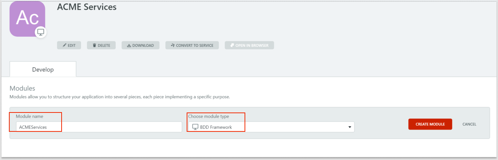
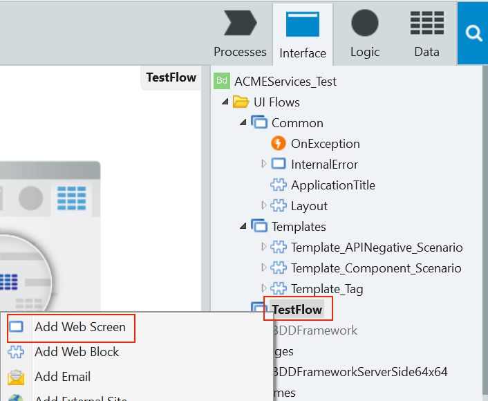
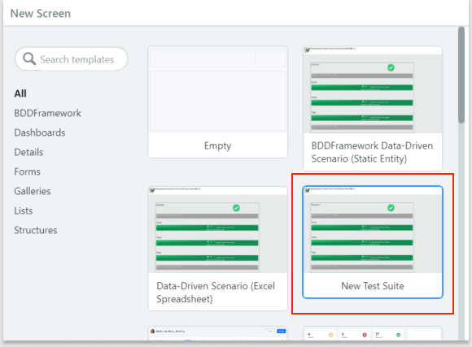

# Component testing with BDDFramework tools
 
This article describes how to install and start using the BDDFramework tools to implement automated and structured component testing. Component testing in OutSystems covers testing **Actions** and exposed **Services** that make up an application's logic. 

Component testing in OutSystems includes the following standard test types:
* Unit Tests, which developers maintain, focus on individual units of code or components that are owned by a single team
* Integration Tests, which test whether two or more components work together; these touch a broader application scope than unit testing and the tested code usually belongs to two or more teams
* API Tests, which verify the contract between consumer and provider and the behavior of your application's existing API endpoints

 Separate BDDFramework tools exist for server-side and client-side testing. 

* [BDDFramework](https://www.outsystems.com/forge/Component_Documentation.aspx?ProjectId=1201&ProjectName=bddframework) - Allows you to test public Server Actions
* [BDDFramework for Client-Side](https://www.outsystems.com/forge/component-overview/10917/bddframework-client-side) - Allows you to test public Client Actions

Both tools provide a similar user experience and the following features:
* Tests use Gherkin-like syntax and offer a visual representation of test execution
* You create the test structure using Web Blocks that the tool provides
* Test code is implemented through actions that are bound to each used Web Block
* Test Web Blocks are organized into normal screens called Test Suites

## Installing the BDDFramework
You can install both BDDFramework tools in your OutSystems infrastructure, just as you would other Forge components. You can also install them directly through Service Studio (the OutSystems IDE) or from the online [Forge portal](https://www.outsystems.com/forge/).

1. To install the BDDFramework, log in to **Service Studio**.
2. Click the **Forge** tab in the top left of Service Studio.
3. In the search box, type BDDFramework. You should see both the server-side and client-side tools.
4. Select **BDDFramework** from the results, which brings you to the sever-side tool's page.
5. Click **Install**. If you see a confirmation request, confirm the installation.
6. Repeat these steps to install the client-side tool.

Once you complete the installation, it's time to start implementing tests.

## Getting started 

Suppose you have an OutSystems application named **ACME Services** that you want to test. The following tasks walk you through creating a test application for ACME Services.

### Create a test application and module
1. In Service Studio on the Development tab, click **New Application**.
2. Select **Start from scratch**, and click **Next**.
3. Select **BDD Framework** as the application type, and click **Next**.
4. Type **ACME Services Tests** as the application name and click **Next**.
5. On the **ACME Service** page, change the module name to **ACMEServices_Tests**, and leave the module type as **BDDFramework**.

6. Click **Create module**. The module imports all the building blocks you need.

## Add a test to your test module
1. On the **Interface** tab menu on the right, go to **ACMEServices_Test** > **UI Flows** > **TestFlow**.  

2. Right-click **TestFlow** and select **Add Web Screen**.
    

3. You may see a message that new templates are loading. When loading completes, click **Refresh** to update the list of templates. New templates for the BDDFramework appear in the list.

4. Select **New Test Suite**, type **MyFirst_TestSuite** in the name field, and click **Create Screen.**
 
     

    The screen contains a test structure that's added to the UI Flow.

12. Start implementing the code for your test. See [Your Complete Guide to BDD Testing in OutSystems] for more information on creating specific tests.

## Learn more about component testing

If you're interested in learning more about component testing and about best practices, see the following resources. These pages provide information to help you master the art of automated testing.

* [Component Testing Best Practices video](https://www.outsystems.com/training/courses/180/component-testing/?LearningPathId=10) -- A video detailing best practices for structuring and organizing test code for component tests.
* [Your Complete Guide to BDD Testing in OutSystems](https://www.outsystems.com/blog/posts/bdd-testing/) -- A thorough how-to guide on implementing your first test case with the BDDFramework 
* [BDDFramework documentation page](https://www.outsystems.com/forge/Component_Documentation.aspx?ProjectId=1201&ProjectName=bddframework) -- A summary of the latest changes and features for the server-side tool
* [BDDFramework for Client-Side documentation page]( https://www.outsystems.com/forge/Component_Documentation.aspx?ProjectId=10917&ProjectName=bddframework-client-side) -- A summary of the latest changes and features for the client-side tool

