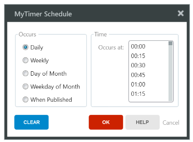
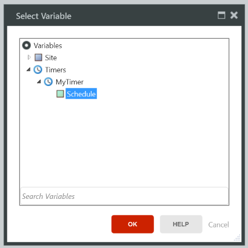
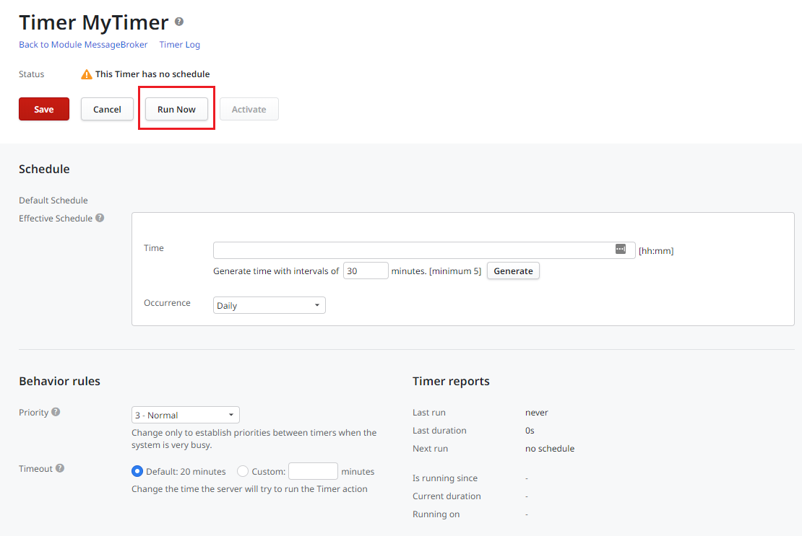

# Create and Run Timers

In this page you will learn how to create **Timers** at design time and set their running schedule at design or runtime.

To better understand how Timers are handled in OutSystems, check [Use Timers](intro.md).

## Create the Timer

To create a Timer in your module, do the following:

1. In the module tree, under the **Process tab**, right-click on the **Timer folder** and select Add Timer.
1. Choose the action to execute when the timer runs or select (New Server Action) to create a new action.

If the Action you specify has input parameters, when creating the Timer you need to specify the values that are passed as parameters when the Timer wakes. However, if the action has output parameters, there is no way of accessing them after the action is finished executing.

You can set a schedule to run the Timer automatically or you can explicitly run the Timer. 

## Set the Timer Schedule

You can set the schedule of a Timer in one of the following ways:

* **Setting the `Schedule` property of the Timer at design time**: You can define a recurrent schedule, such as daily or weekly, or define the Timer to run each time the module is published, for example to execute configurations or bootstrap data.

    

* **Setting the Timer schedule at runtime in Service Center**: In cases when you need to customize the Timer schedule when deploying an application to another environment, there is no need to change the application. The effective Timer schedule is set in Service Center, which uses the default settings in every environment unless specifically modified.

* **Implement logic that changes the Timer schedule at runtime**: Assign the `Schedule` runtime property of the Timer with a specific schedule within your logic. Make sure to use the [correct time format](../../ref/lang/auto/Class.Timer.final.md#runtime-properties).  

    

When you define a schedule for your Timer, the Timer will run at the predefined time.

## Run the Timer Explicitly

There are two ways of explicitly run a Timer:

* Using the `Wake<Timer Name>` built-in action
* Running the Timer in Service Center

Neither of these options changes the timer schedule, so the Timer will continue to run as normally. Also, since the same Timer does not run twice simultaneously, if you run a Timer that is already running, the second execution only starts after the first one has finished.

### Use the WakeTimer Built-in Action

When you create a new Timer, a built-in action is provided to allow you to programmatic run the timer. This action is called `Wake<Timer Name>` and can be used in your application logic.

When the `Wake<Timer Name>` action is executed, the `NextRun` property of that Timer is updated to the present time. The timer will then be handled by the Scheduler Server and executed according to its priorities.

The `Wake<Timer Name>` action does not receive any input parameters and does not return any output parameters.

To use the `Wake<Timer Name>` built-in action in your logic, do the following:

1. In the Process tab, expand the Timer element.
1. Drag the `Wake<Timer Name>` action and use it in your logic.

### Run a Timer in Service Center

To explicitly run a Timer in Service Center, do the following:

1. In the **Factory** tab, choose **Modules** and find your module.
1. In the module's detail page, choose the **Timers** tab.
1. Click on the Timer you want to run.
1. Click the **Run Now** button.

