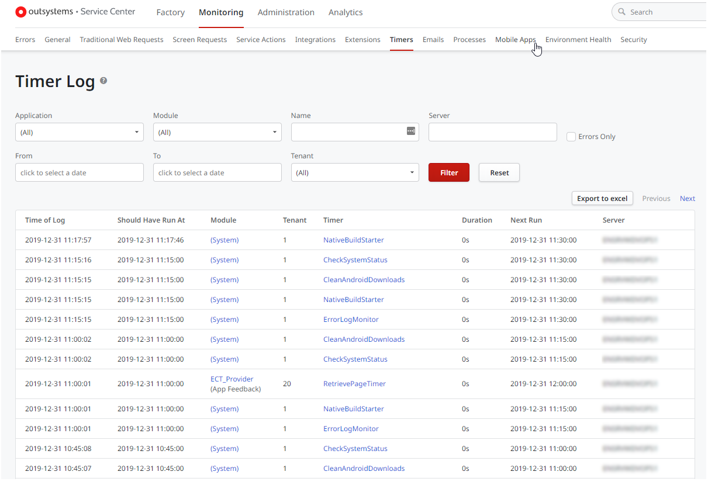

# Monitor Timers

OutSystems logs Timers information so that you can see their past executions, and when they are scheduled to run. These operations are available at Service Center.

You can only view the logs and information of Timers if you have permissions over the corresponding modules:

* **If using LifeTime**: you must have at least the **List** security level for the application. If necessary, contact your administrator to grant you the required permissions.

* **If not using LifeTime**: you must at least the **Read Only** permission for the module. If necessary, contact your Service Center administrator to grant you the required permissions.

To check the Timer's past activity, for example if there was any error during its execution, proceed as follows:

1. Go to **Service Center**.
1. In the **Monitoring** tab, click **Timers**.
1. Use the filters to find the Timer you want.

To better understand how Timers are handled in OutSystems, check [Use Timers](intro.md).
