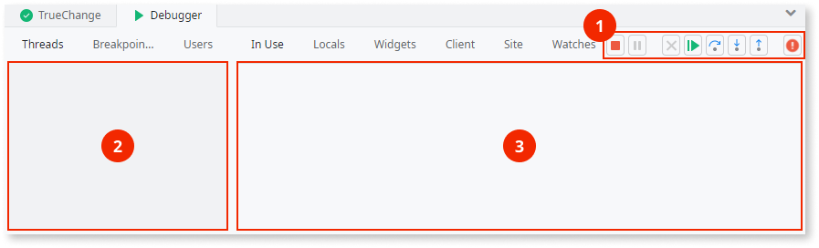
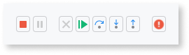

# Debugger Tab Reference

The Debugger Tab is located in the lower pane of Service Studio and allows you to track all threads being debugged and examine module elements and runtime values. This tab is automatically shown when the debugger is active and the execution flow hits a breakpoint.

The Debugger Tab contains three main areas:

* The [Debugger Toolbar](<#debugger-toolbar>) **(1)**
* The [debugging context area](<#debugging-context-area>) **(2)**
* The [scope tabs area](<#scope-tabs-area>) **(3)**

## Debugger Toolbar { #debugger-toolbar }

It's located in the top right section of the Debugger Tab and provides you with a set of debugging commands to trace the execution of the thread being debugged. The toolbar buttons (except for the Break on All Exceptions button) are only available during a debug session.

The available buttons in the toolbar are the following:

Icon | Name | Shortcut | Description
:---:|------|:--------:|------------
     | Stop Debugging | | Stops the debugger and resumes the execution of all of the suspended threads.
  | Suspend Running Server Threads | | Suspends the execution of all current server threads in the Platform Server.
    | Abort Running Server Threads | | Aborts the execution of the current server threads in the Platform Server.
 | Continue | `F9` | Resumes the execution.
| Step Over | `F10` | Steps the execution trace to the next element in the same flow or, when in a web application, screen "level".
| Step Into | `F11` | Steps the execution trace to the first element "inside" elements like:   &#8212; Execute Process elements  &#8212; Execute Client Action (or Execute Server Action) elements which execute user-defined actions of the same module  &#8212; User functions of the same module  &#8212; Assignments of Assign elements  Trying to step into any other element is the same as doing a  Step Over operation.
 | Step Out | `Shift+F11` | Continues the execution trace to the next element in the outer "level" of the flow or screen, i.e. it "gets out" of the current flow or screen.
 | Break On All Exceptions | | When active, this toggle button forces the debugger to suspend the execution of threads whenever handled or unhandled exceptions occur.

 

While debugging **web applications** you can also define breakpoints in widgets. The step commands mentioned above ( Step Over,  Step Into and  Step Out) have a particular behavior on widgets:

* They don't stop on widgets unless the widget has a breakpoint, or is designed using elements that are evaluated at runtime as, for example, widgets designed using user-defined functions.

* The order that step commands follow widgets on the screen is the same by which they are rendered and not the order the widgets are displayed on the screen.

## Debugging Context Area { #debugging-context-area }

Located on the left-hand side of the Debugger Tab, this area contains several tabs containing information about the debugger execution. 

You can double-click on elements listed in these tabs to show them on the canvas. However, if the module element being debugged does not belong to your module (e.g. a module reference, an action in a producer module, etc.), it cannot be visualized on the canvas, and will only be displayed in the Threads Tab with its name followed by its module name between brackets.

Threads Tab
:   This tab shows the current debugging context. It lists all the threads being debugged and their debugging context: module element (if applicable), event, UI flow, screen or block, and client/server action(s) that make up the call stack. The action executed last is listed at the bottom of each thread entry.

Breakpoints Tab
:   Lists all breakpoints defined in the module.

Users Tab
:   Lists all the other users that are also debugging server threads in your module. You may expand each user to see the list of threads being debugged by him.

### Unpublished Changes

If there are any unpublished changes to the module you're currently debugging, the modified module elements will have the following visual cues in the Threads Tab:

*  **Missing element**: the element is no longer present in the module but it still exists in the published version of the module. The missing element will still be debugged, but it will not have visual feedback on the canvas.

*  **Modified element**: the element is different from the one that was published. The element that is going to be debugged is the published one, not the modified one.

### Switching to Another Thread

The thread being debugged, i.e. the active thread, is identified by a  blue arrow in this tab, as well as the module element being debugged on canvas. Every other thread that may also be suspended (but inactive, as they're not being debugged) is marked with a  grey arrow, as well as their module element on the canvas (if visible).  

To switch to another thread, double-click on the thread you want to debug in the Threads Tab; Service Studio updates the contents of the Debugger Tab with the debug information for that thread.

Learn more about threads in the [Threads](<threads.md>) topic.

## Scope Tabs Area { #scope-tabs-area }

Located on the right-hand side of the Debugger Tab, this area contains several **scope tabs** displaying module elements and runtime values for you to examine while the execution is suspended during a debug session.

All elements shown in scope tabs are listed in alphabetical order in the tabs. Some elements can be expanded to examine inner elements value, e.g., the `Name` in a `Customer` Record. Values presented in red are the ones that have changed since the last debug step. 

If a value of an element is too long to be displayed in the tab or if the value is of List data type, you can double-click on the element to open a window displaying its value.

Debug Setup Tab
:   Allows to set the entry point, the target for debugging (in mobile apps only) and start a new debug session. This tab is only visible when the debugger is not running. 

    Use the "Entry Module:" combo box to select the entry point where the user interaction begins. This is useful when [debugging producer modules](<debug-producer-modules.md>).
    
    In **mobile apps** you must choose the target where you want to debug your module: emulate using Google Chrome browser on your PC or debug in an iOS/Android device connected to your PC. If you choose the Google Chrome browser target, Service Studio will open a special Google Chrome instance where the user must perform user interactions with the app.

    
    
    In **Traditional web applications** you can check the "Open in new browser window" option to also open a browser when starting the debugger. If the option is unchecked, you will have to enter the application URL in a browser or click on the "Open in Browser" button in Service Studio.

    
    
In Use Tab
:   Lists all elements from the scope tree relevant for immediate examination regarding the module element currently being debugged.

Locals Tab
:   Lists all elements in the local scope of the module element being debugged.

Widgets Tab
:   Lists all widgets in scope of the module element currently being debugged.

Session Tab
:   Only available for Traditional web applications. Lists all session variables of the module.

Client Tab
:   Only available for Mobile and Reactive web applications. Lists all client variables of the module.

Site Tab
:   Lists all site properties of the module.

Watches Tab
:   Lists all variables explicitly marked as watched.
