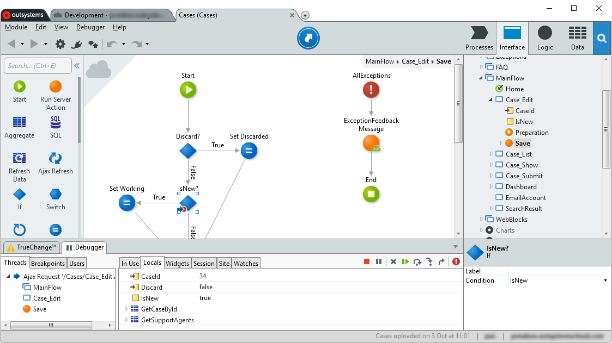

# Debugging Applications

You can debug your application logic by suspending the execution at specific points in a module (called [breakpoints](<breakpoints.md>)) and proceeding with the execution step-by-step inside Service Studio, so you can find any issues in your logic design.

In the [Debugger Tab](<debugger-ui-reference.md>) you can find relevant data like variable and runtime values while the execution is suspended, as well as the current debugging context (current [thread](<threads.md>), event name, UI flow, screen and action, when applicable).

To command the debugger use the debugger commands available both in the Debugger Toolbar and in the Debugger menu.

The debugging process can be outlined in the following steps:

1. The developer does a "1-Click Publish" to save the latest changes in the module before debugging. 

1. The developer sets one or more [breakpoints](<breakpoints.md>) in the module to be debugged.

1. Before debugging a **mobile app**, the developer must choose a debugging target in the [Debugger Tab](<debugger-ui-reference.md>): Android, iOS, or Google Chrome which emulates a device. The section [Mobile Debugging Scenarios](<#mobile-debugging-scenarios>) includes further details about the different targets.

    

1. The developer starts the debugger by clicking on the "Start Debugging" button available in the [Debugger Tab](<debugger-ui-reference.md>) or by selecting "Debug in the Public Area" in the Debugger menu. When debugging mobile apps using the Google Chrome target, Service Studio opens a special Chrome browser instance that must be used for debugging.

    *Note:* To also open a browser when starting a debug session on a **web application**, check the "Open in new browser window" option in the Debug Setup tab.

    

1. The developer performs one or more tasks in the module being debugged up to a point when the execution is suspended when it runs into a breakpoint.

1. When the developer switches to the Service Studio window, the flow or screen containing the element with the breakpoint is displayed on the canvas. The element with the breakpoint is selected and marked with the  debug icon.

1. The execution context is displayed in the Threads Tab of the Debugger Tab marked with the  current thread icon, showing the current execution stack of module elements. The rest of the Debugger Tab is filled in with debug information on module elements and runtime values.

1. After analyzing the runtime values at that execution point, the developer can proceed with the execution in one of the following manners:

    * Selecting one of the commands available for advancing the execution of the application logic:  Continue,  Step Over,  Step Into or  Step Out. The execution point will advance according to the selected command behavior.

    * Right-clicking on an element on the canvas (or in the module tree) and selecting the Continue To Here option in the pop-up menu. The execution will continue until it reaches that element on the canvas.

In some scenarios you might need to [debug some functionality exposed by another module](<debug-producer-modules.md>) (called a producer module).

While developing **Traditional Web apps** you can also [debug modules in your Personal Area](<public-personal-areas.md>). This allows you to test your changes separately from other developer's changes in the same module.

## Mobile Debugging Scenarios { #mobile-debugging-scenarios }

There are different ways of debugging and troubleshooting a mobile app in OutSystems that help you discover, understand and fix issues. You can debug your mobile app in one of the following ways:

Emulate the mobile app using the Google Chrome browser in your PC
:   Use the Chrome browser in your PC to debug your mobile app if you don't need to execute native plugins, since they will not be available. This option is very convenient to test the logic of the app. However, to check the performance or experience of the mobile app, we recommend you to test it on a real device.
    Also consider this scenario if all the native plugins in the mobile app have action wrappers defined that return mock data when the plugin is not available. For more information, check the Best Practices topic on [creating wrapper actions for native plugins](<https://success.outsystems.com/Documentation/Best_Practices/OutSystems_Mobile_Best_Practices#Define_Fallbacks_for_Your_Native_Plugins>).

Use OutSystems Now (Android only)
:   Debug your mobile app in a device without installing it by using OutSystems Now. Connect the device to the computer, choose Android as the debugger target and start the debugger. This is a good way to test the experience of the app on a real device. Note however that only [supported plugins](<../../../extensibility-and-integration/mobile-plugins/intro.md#Supported_Plugins>) are available in OutSystems Now.

Install the Mobile App on a Device
:   Test the mobile app directly on a device as your users would run it. It is the best place to test the performance and experience of your app. You can do it in an iOS or Android device. Simply generate the native app package for your app in Service Studio using the `Debug` (Android) or `Development` (iOS) build type, install it in the device and follow the steps below according to your mobile device platform.

    To test a mobile app on an iOS device:

    1. In your **PC** install [iTunes](<https://www.apple.com/itunes/download/>).
    1. In your **device** turn the "Web Inspector" option **on** (detailed instructions in [Troubleshoot Debugger Connection Issues](<troubleshoot-debugger-connection.md#web-inspector-is-not-enabled-on-your-device>)).
    1. Connect your mobile device to the PC through a USB cable.
    1. In your **device** allow PC for debugging on the device.

    To test a mobile app on an Android device:

    1. In your **device** turn [USB debugging ON](<https://developer.android.com/studio/debug/dev-options.html#enable>).
    1. Connect your mobile device to the PC through a USB cable.
    1. In your **device** allow PC for debugging on the device.

    For more help, check [Troubleshoot Debugger Connection Issues](<troubleshoot-debugger-connection.md>).

If you need to troubleshoot application crashes, a plugin or check the native code of applications, you can debug your apps using the mobile platform's native tools (Android Studio for Android and Xcode for iOS). Before debugging using the native tools you must generate a mobile package with `Debug` (Android) or `Development` (iOS) build type.

Along with the debugging and troubleshooting tools, take into account the recommendations presented in [Solve Common Mobile App Development Issues](<../solve-common-mobile-app-development-issues.md>) and [Best Practices](<https://success.outsystems.com/Documentation/Best_Practices/OutSystems_Mobile_Best_Practices>). Following these patterns and recommendations will definitely save you some troubleshooting time.

