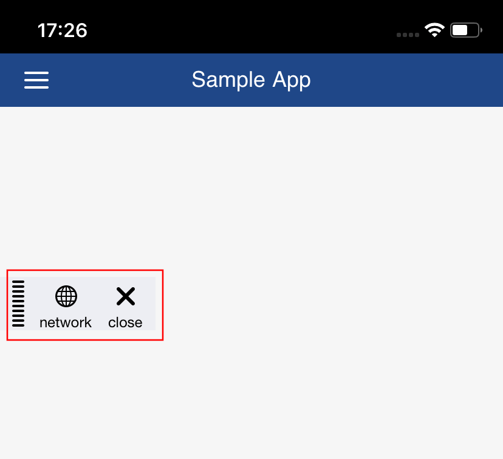
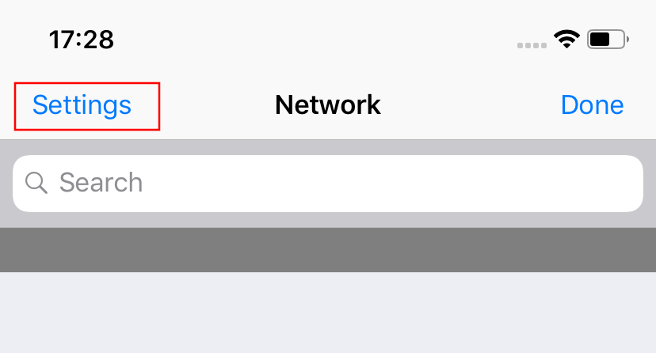
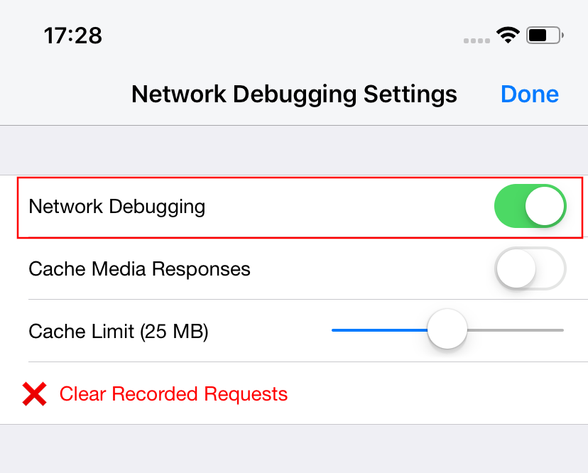
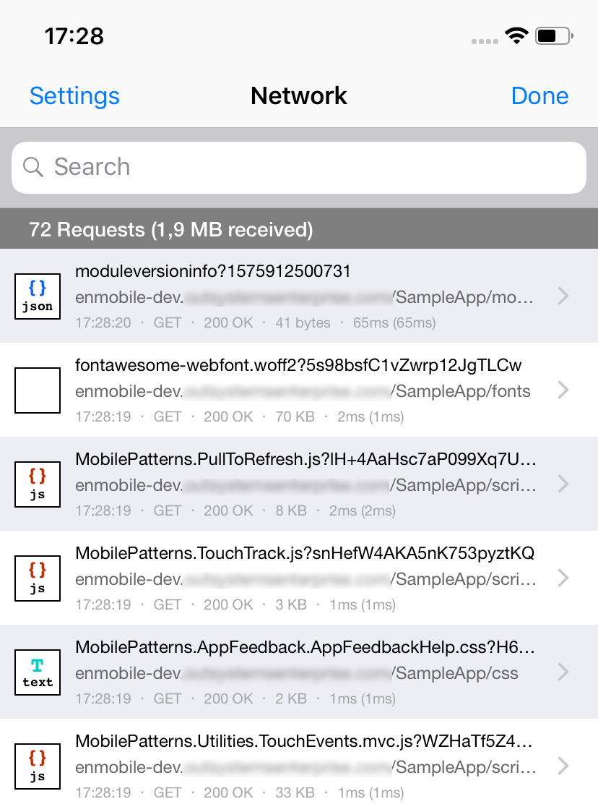

# Inspect the HTTP requests in Mobile Apps for iOS

Applies only to Mobile Apps.

Use the network inspector to see the network activity of your iOS app. The user interface of the network inspector consists of a toolbar and a button that opens the screen with the network traffic details. 

The network inspector is available in the debug builds created with MABS 6.0 and later. For apps built with the earlier versions of MABS, use Web Inspector in Safari.

## Enabling and opening the network inspection on iOS

Here is how you can activate and open the network inspection screen on the iOS devices.

1. Start the app. A permission dialog shows.

1. Tap **Allow** in "App would like to send you notifications".

1. Hold three fingers on the screen for about half of a second. You can perform this gesture anywhere in the app at any time.

    

1. The network toolbar shows. Tap **Network**.

    

1. The network debugging is disabled by default on iOS, and you need to enable it. Tap the **Settings** button and activate **Network Debugging** option. Tap **Done** when you finish.

    The settings button:

    

    The debugging settings:

    

1. Finally, tap the **Network** button to show all requests. Tap a request to see the details.

    

You only need to grant the notification permission and enable the network debugging once. After that, you can use the three-finger gesture to show the toolbar.

## Notes

* The network inspector feature is available in the **development build** for iOS.
* The requests are only added to the list after the **Network Debugging** option is enabled. If you see an empty list or only a few requests, restart the app and open the network requests screen again.
* Enabling the feature is only valid for that app in that particular device. A fresh install of the app requires that you set the permissions again and turn on the network debugging.
* Dismissing the notification prompt can affect the behavior of the app if it uses notifications for other purposes.