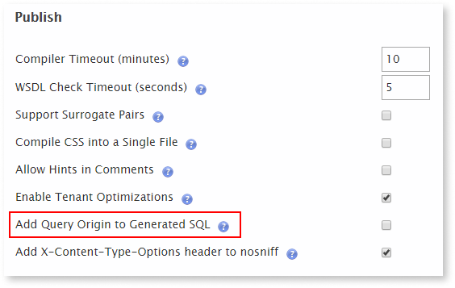

# Trace Executed Queries Back to Your OutSystems Applications

When your Database Administrator (DBA) is troubleshooting performance issues in a query generated by OutSystems, it might be challenging to pinpoint the exact origin of the query, namely the exact OutSystems module and action/screen. 

OutSystems allows you to add information about the query origin to the SQL query statement, making this information visible in the database tools that your DBA already uses. This way, the DBA can inform OutSystems developers of the exact location of an underperforming query.

This information is available for platform-generated queries of both Aggregates and SQL elements. You can [activate this feature](#enable-feature) using the Factory Configuration component.

The comment mentioning the query origin contains the following information: 

`<module_name>.<action/screen/other>.<aggregate/sql_element>`

For example:

```sql
/* EmployeeManager.EmployeeFlow.EmployeeList.Preparation.GetEmployees */
SELECT TOP (51) NULL o0, [ENEMPLOYEE].[NAME] o1
FROM [OUTSYSTEMS].DBO.[OSUSR_0UL_EMPLOYEE] [ENEMPLOYEE] 
ORDER BY [ENEMPLOYEE].[NAME] ASC 
```

From the information in the comment (first line of the example), you know that this query is generated in the "EmployeeManager" module, in the "EmployeeFlow" UI flow, in the "EmployeeList" screen, in the screen preparation, and from the "GetEmployees" entity action.

**Note:** Activating this feature doesn't have an impact on query performance. However, the query plan might need to be recalculated, which means that there might be an initial performance penalty until the query plan stabilizes.

## Enable the query origin information in generated SQL { #enable-feature }

You can enable this feature in [Factory Configuration](https://www.outsystems.com/forge/component-overview/25/factory-configuration). Make sure you install this Forge component before proceeding.

Do the following:

1. Go to the Factory Configuration application (`https://<environment_name>/FactoryConfiguration`).

1. Enable the **Add Query Origin to Generated SQL** setting under "Publish".
    
    

1. Click **Apply**.

1. Publish the modules where you wish to have query origin information. Alternatively, [publish a solution containing all modules](https://success.outsystems.com/Documentation/How-to_Guides/DevOps/Creating_and_using_an_All_Components_solution) using Service Center, so that this change is applied to all modules in the environment.
