# Login with Google Accelerator

This guide presents a detailed list of all the necessary steps to use the Login with Google accelerator. There are two main steps to implement this accelerator:

1. Configuring OAuth 2.0 on the Google API Console

1. Using the Login with Google accelerator in your app

This accelerator uses Google’s [OAuth 2.0 protocol](https://tools.ietf.org/html/rfc6749) for authentication and authorization, for which it is necessary to configure OAuth 2.0 client credentials and the consent screen.

## Configuring OAuth 2.0 on the Google API Console

**Note**: This guide assumes you do not have any existing projects nor made any configurations on the Google API Console. 

### Creating a project

1. Go to the [Google API Console](https://console.developers.google.com/) and click **CREATE PROJECT** .

    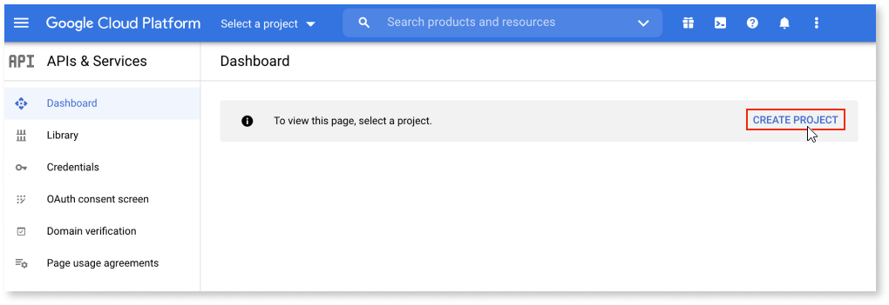

1. Enter a **Project name** and a **Location**, then click **CREATE**. 

    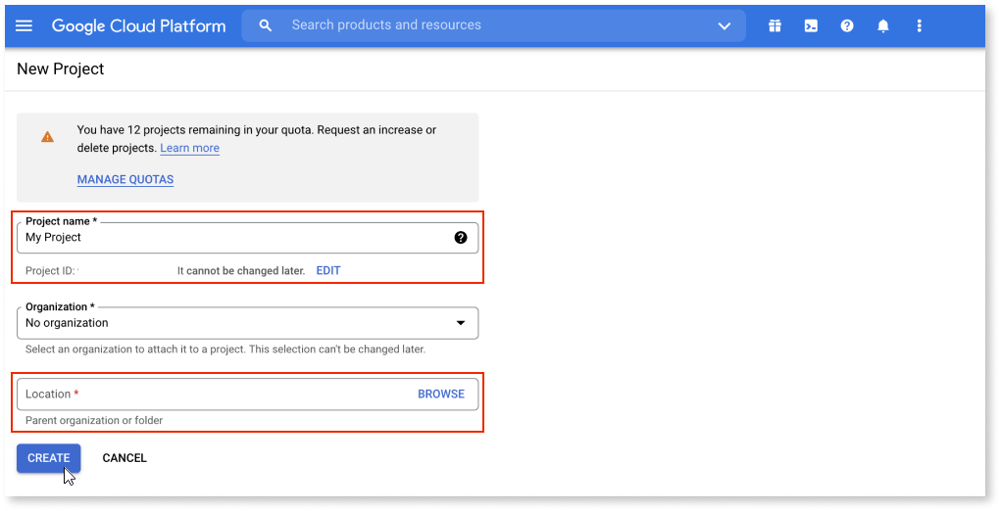

    For the location, if you don’t have an organization to associate with the project, choose **No organization**. 
    
    **Note**: This is the assumption for this guide. 

After creating the project, you are redirected to the dashboard and your newly created project is pre-selected and displayed.

### Configuring the OAuth consent screen

1. From the navigation menu, click **OAuth consent screen**.

    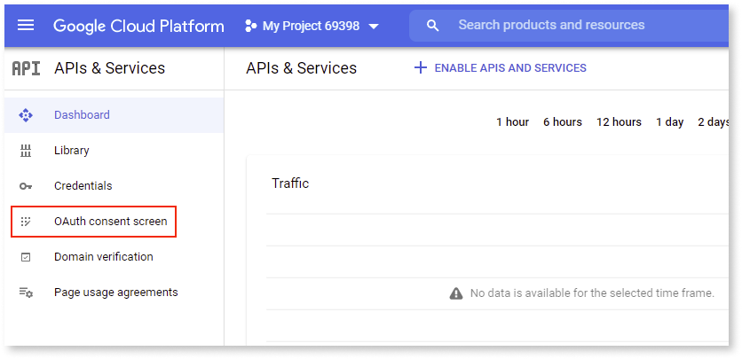

1. On the **OAuth consent screen**, select the **External** radio button and click **CREATE**.

    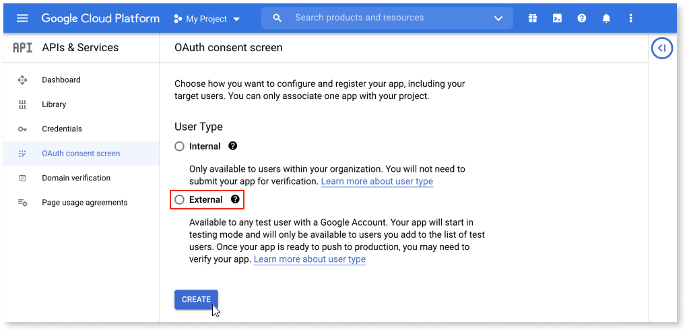

    When using the OAuth 2.0 protocol for authentication, your end-users are authenticated after they agree to terms on a user [consent screen](https://support.google.com/cloud/answer/10311615?hl=en&ref_topic=3473162). If you're a Google Workspace user, and have linked an organization to your project (step 2), then you have the option to choose between **Internal** and **External** for the **User Type**. If not, you only have the **External** option available. For the purpose of this guide, the **External** option is used. 

1. For the **OAuth consent screen** step of the **Edit app registration** wizard, complete the mandatory fields (**App name**, **User support email**, and **Developer contact information / Email addresses**) and click **SAVE AND CONTINUE**.

    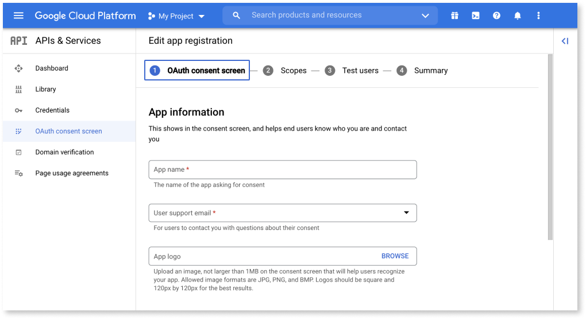

1. For the **Scopes** step, click **SAVE AND CONTINUE**.

    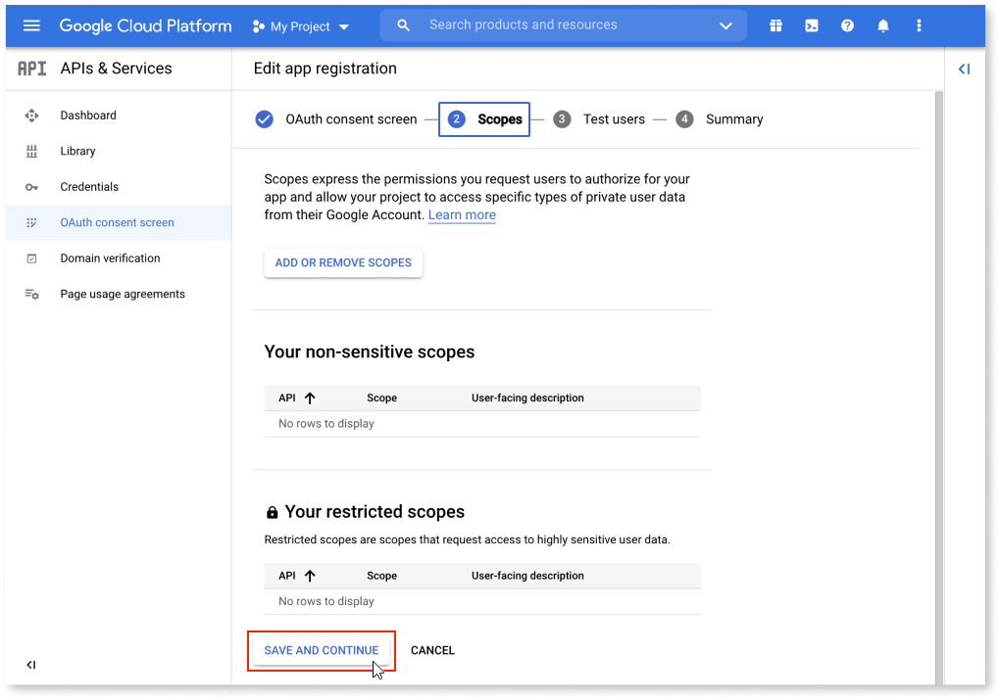

    The **Scopes** step is where you define the permissions you request the end-users to authorize for your app and allow your project to access specific types of private user data from their Google Account.

    **Note**: None of this information is mandatory, and for the sole purpose of authenticating the end-user, this information is not necessary. Also, it can always be revisited at any moment in the future. For that reason, the **Scopes** step is skipped in this guide. 

1. For the **Test users** step, click **SAVE AND CONTINUE**. (This step is not mandatory.)

    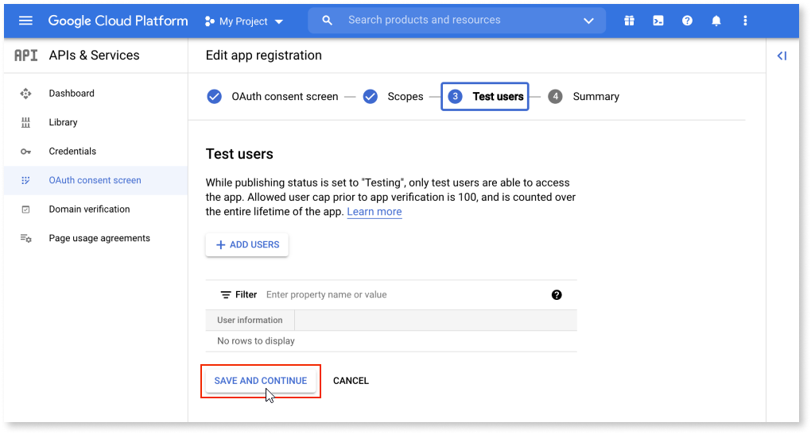

1. For the **Summary** step of the wizard, review all information, and if everything is correct, click **BACK TO DASHBOARD**.

    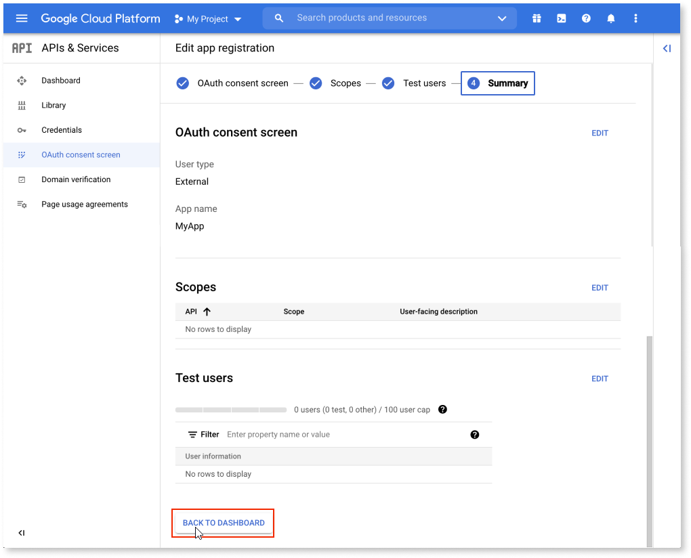

At this point, the **OAuth consent screen** is fully created and its main configurations are displayed.

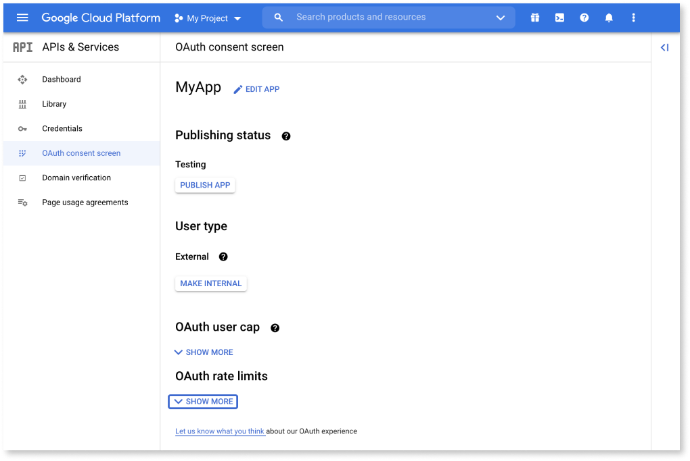

From this screen, you can do the following (optional):

* Publish the app by clicking **PUBLISH APP**. 
* Add test users by clicking **+ ADD USERS**.
* Make changes to the information entered during the **Edit app registration** wizard process by clicking **EDIT APP**.

This concludes the **OAuth consent screen** configuration.

### Creating credentials

For the accelerator to work on your app, you must have a **ClientID** key. For that, you must create credentials. 

**Note**: You can only create credentials after you have configured the **OAuth Consent screen**.

1. From the navigation menu, choose **Credentials**.

    The **Credentials** page displays the different types of Google Credentials - **API Keys**, **OAuth 2.0 Client IDs**, and **Service Accounts**.

    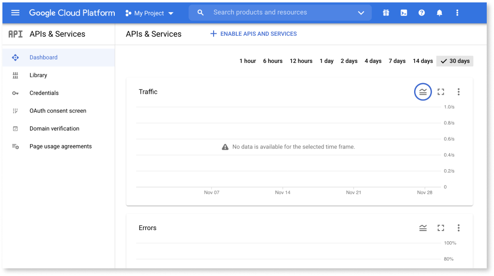

    **Note**: This guide pertains to **OAuth 2.0 Client IDs**.

1. Click **+ CREATE CREDENTIALS** and from the dropdown, select **OAuth client ID**.

    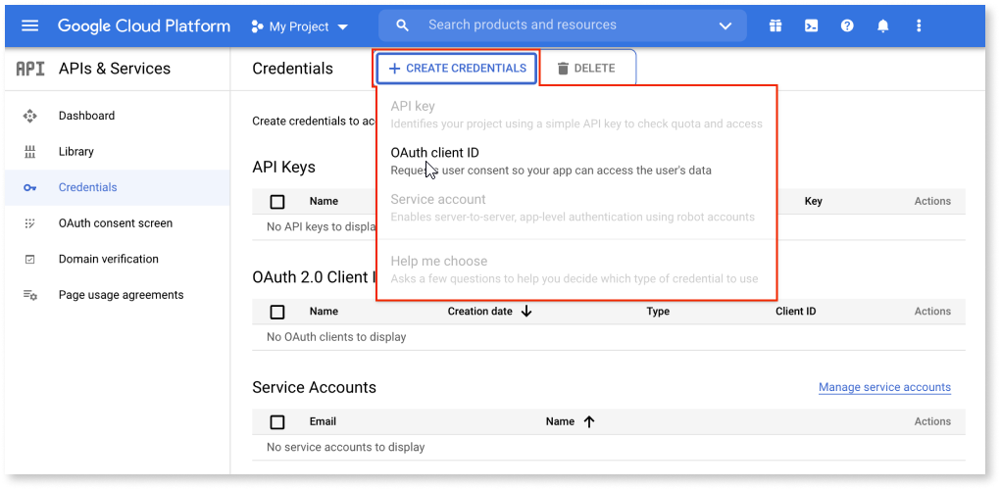

1. On the **Create OAuth client ID** screen, from the **Application type** dropdown, select **Web application**.

    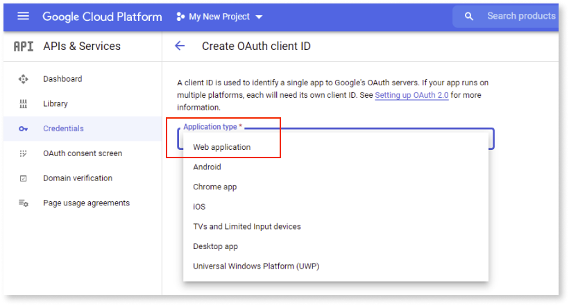

    After selecting **Web application**, new fields appear.

1. Enter a **Name** for your OAuth client ID, and in the **Authorized JavaScript origins** section, click **+ ADD URI**. 

    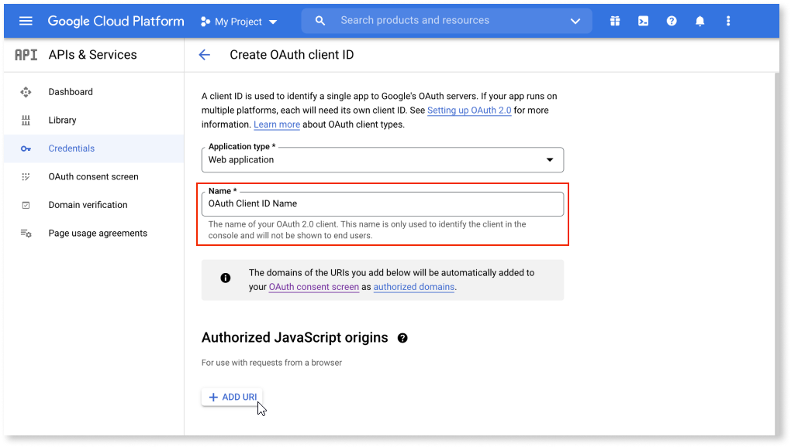

1. Enter the OutSystems environment domain that you’re targeting (`https://<your_environment>`) and click **CREATE**.

    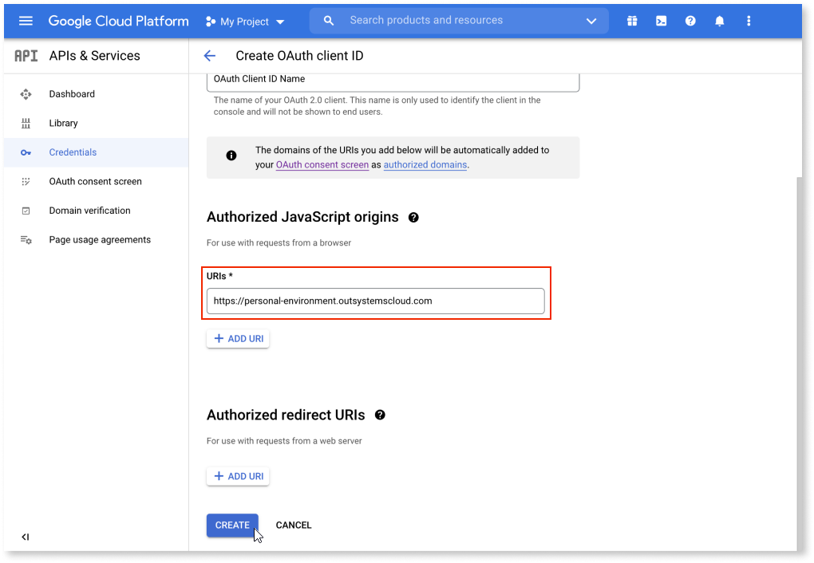

    You can find your environment domain on the bottom right of your Service Studio screen.

    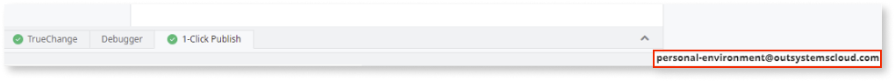

    Depending on the way the application being built performs its requests for Google authentication, either from a browser or a web server, the developer must fill in the Authorized JavaScript origins or the Authorized redirect URIs, respectively. In this example, the Login with Google accelerator performs its requests from the browser, using JavaScript, and so, the URI is added to the Authorized JavaScript origins section. 

The **OAuth 2.0 Client ID** credential is now created and your **Client ID** and **Client Secret** are displayed.

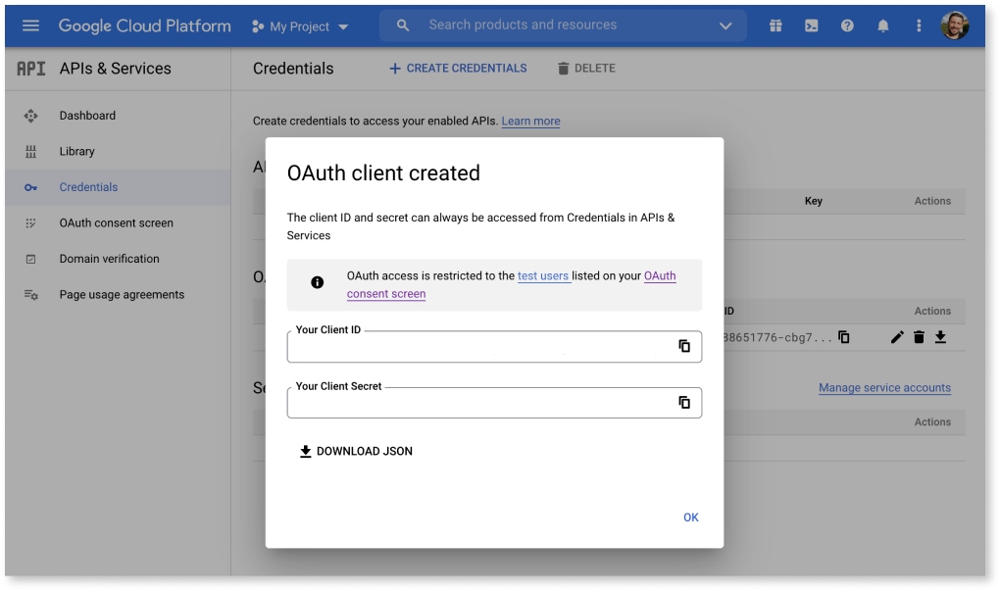

For the **Login with Google** accelerator to work, only the **Client ID** is necessary. 

**Note:** Copy the **Client ID** for later use. 

## Using the Login with Google accelerator in your app 

Now that you’ve created and configured the Google project with an OAuth 2.0 Client ID credential, it’s time to implement the accelerator in your OutSystems app.

1. In Service Studio, drag and drop the **Login with Google** accelerator onto your app.

    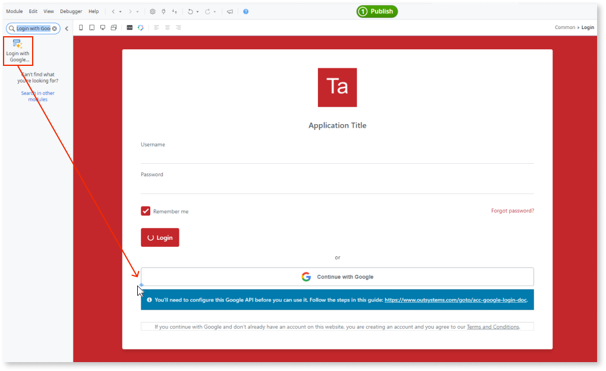

1. Go to Service Center (`http://<your_environment>/ServiceCenter`), go to **Factory** -> **Modules**, and enter **Sample_GoogleSignIn_IS** in the **Name** field and click **Filter**.

    **Note:** If you are using a older version than 1.5.0, use the **OSAcc_GoogleSignIn_IS** module.

    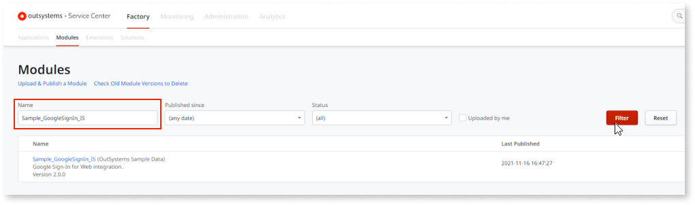

1. Click the **Sample_GoogleSignIn_IS** module.

1. Select the **Site Properties** tab, and click the **Google_ClientId** site property.

    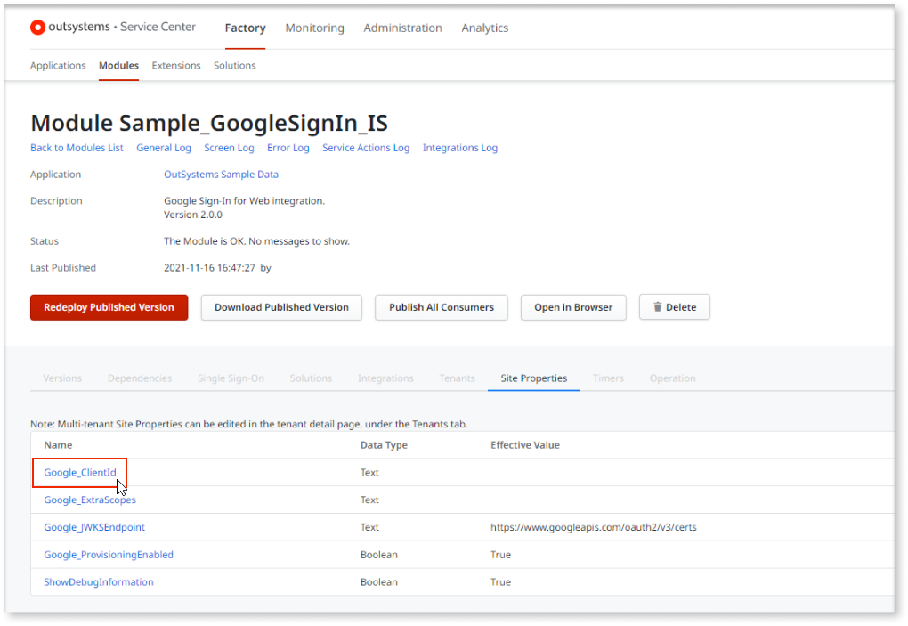

1. Paste the **Client ID**, previously copied from the Google API Console, into the **Effective Value** text box and click **Apply**.

    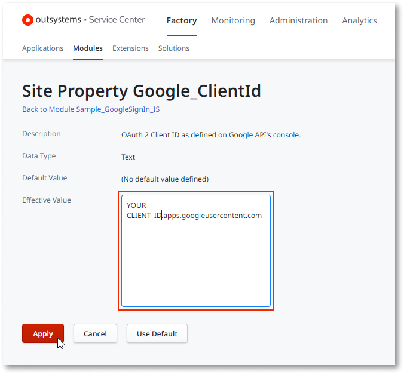

And that’s it! If you publish your app (1-Click Publish) in Service Studio, you’ll now be able to log into it using Google Accounts by clicking the **Continue with Google** button.

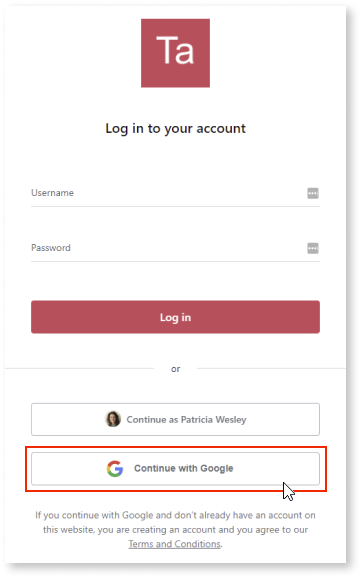
