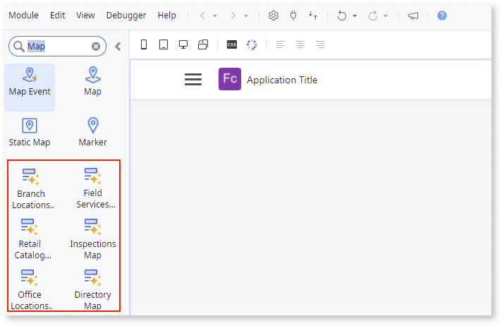
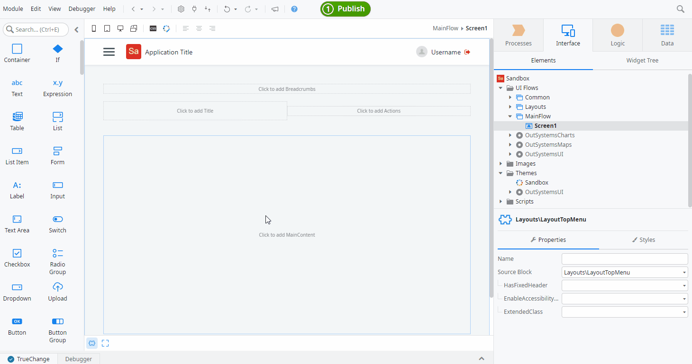
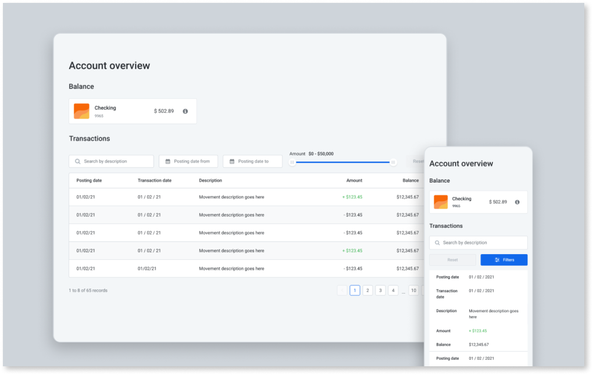

# Accelerators

OutSystems Accelerators allow you to develop Reactive web and Mobile apps faster. Each Accelerator contains screen building blocks that you can add to your apps and modify.

All the accelerators are represented by the accelerator icon in the widget toolbox:

## How to use Accelerators

In Service Studio, open a Screen for editing and follow these steps:

1. Browse or search for Accelerators in the widgets toolbox, for example, the Employees List.

1. Drag and drop the Accelerator to your Screen.

1. Publish your app and preview the screen.

Once you've published your app, you can customize it by, for example, [replacing sample data with your own data](#replace-sample-data-with-real-data) and [adapting the UI and logic](#adapt-the-UI-and-logic) to match the user experience you want to achieve. You can also use the [Map](../patterns/mobile/interaction/map/map.md) and [Login with Google](accelerator-google.md) accelerators in your app.

### Replace sample data with real data

Some accelerators are prepopulated with sample data so that you can publish and preview the app in runtime without any required changes.

However, you can replace this sample data by dragging and dropping your entities onto the UI which automatically replaces the sample data with your data. Depending on the difference in data structures, there may be errors left to solve. For more information, see [Replace sample data](../screen-templates-use/replace-data.md).

### Adapt the UI and logic

You can change and adapt the UI and logic to suit your app. To help you with this, OutSystems provide you with plenty of different UI patterns in Service Studio. You can find an overview of all available patterns on the [OutSystems UI website](https://www.outsystems.com/OutSystemsUIWebsite/PatternOverview).

### Screen templates

Most of the **List** accelerators have a matching **Details** screen template. These templates have the same look and feel and they are connected to the same sample data. There are multiple industry use cases available to choose from.

