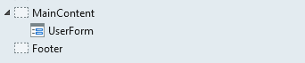
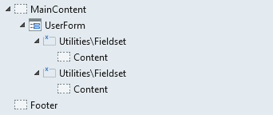
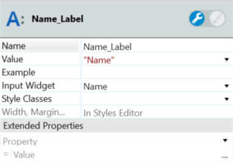
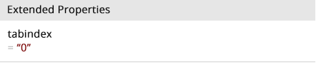

# Accessibility in OutSystems Traditional Web Applications

<div class="info" markdown="1">

Applies only to Traditional Web Apps

</div>

OutSystems is committed to allowing the development of enterprise-grade applications that meet the highest accessibility standards and guidelines. You also have full freedom to extend the language and create the custom rich, accessible patterns and interfaces you need, by editing HTML markup and ARIA Roles using pure low code or traditional HTML and CSS.

While the accessibility of any application built with OutSystems ultimately depends on the developers and how they implement images, links, forms, headings and all other instances of content, this article shows you some best practices and guidelines you can follow as well as how you can leverage the accessible development accelerators OutSystems provides.

To learn more about accessibility, see [Web Accessibility Perspectives Video (YouTube)](https://www.youtube.com/watch?v=3f31oufqFSM) or read [Accessibility Fundamentals](https://www.w3.org/WAI/fundamentals/accessibility-intro/). This document helps you implement accessibility in your OutSystems applications by adhering to the rules in [WCAG 2.0](https://www.w3.org/TR/WCAG20) to reach the different [levels of accessibility](http://www.w3.org/TR/UNDERSTANDING-WCAG20/conformance.html%23uc-levels-head).

## Guidelines for implementing accessibility

The following set of guidelines along with the [standards and best practices guide](http://accessibility.arl.org/standards-best-practices/) by Web Accessibility Toolkit will help you in developing more accessible applications.

### Have readable text with the correct contrast

Font-size, text-color and background-color have huge impact on applications if they do not follow the [WCAG guidelines for contrast accessibility](https://www.w3.org/TR/UNDERSTANDING-WCAG20/visual-audio-contrast-contrast.html). When [starting a style guide](https://www.outsystems.com/learn/courses/71/style-guide-architectures/) or building stylesheet rules for a pattern, make sure that:

  * Text under 24px should have a **minimum** color contrast ratio of 4.5:1
  * Text 24px or higher should have a **minimum** color contrast ratio of 3:1

To have WCAG compliant color contrast ratio of text in your OutSystems application:

1. Select the element and go to its Styles Editor.

    

1. In the Font section, set the Size and Color.

1. In the Layout section, set the Color to change the color of that element's background. 

1. Use a [color contrast checker tool](https://contrast-ratio.com/) to check if the contrast ratio is acceptable.

Learn more about [accessible colors](http://accessible-colors.com/) or generate a color palette based only on background color and level of accessibility in [Color Safe Website](http://colorsafe.co/).

**WCAG rules achieved:** 

1.4.1 - Use of Color (Level A) 

1.4.3 - Contrast (Minimum) (Level AA)

### Use heading elements correctly

Use headings correctly to organize the structure of your content and allow effective navigation through information.

Convert a container or placeholder to a heading using the tag "OSTagName" in the Extended Properties.


For example, use the condition `OSTagName = "h1"` in the Extended Properties of the Title placeholder of a webscreen.

Learn more about [heading markup](https://www.w3.org/WAI/tutorials/page-structure/headings/).

**WCAG rules achieved:** 

1.3.1 - Info and Relationships(Level A) 

2.4.1 - Bypass Blocks (Level A)

2.4.6 - Headings and Labels (Level AA) 

2.4.10 - Section Headings (Level AAA)

### Provide alternative text to images

In the Label property of the image, add a descriptive alternative text to make it accessible.


The resultant HTML is as follows:

```html

```
If an image is only present for decorative purposes, hide it from screen readers by leaving the Label property empty.

The resultant HTML is as follows:

```html

```

To use images inside a link or as buttons, set the alternative text to describe the link's destination or the button's purpose.

Learn more about [making images accessible](https://www.w3.org/WAI/tutorials/images/).

**WCAG rules achieved:** 

1.1 - Text Alternatives (Level A) 

1.4.5 - Images of Text (Level AA)  

1.4.9 - Images of Text (No Exception) (Level AAA)

### Group widgets inside forms

To group and organize widgets in forms, use the Fieldset pattern from OutSystems UI. 

1. Drag the Form widget to the screen.

    

1. Add as many Fieldset patterns as required.

    

1. Add the required Input widgets in the Fieldset patterns and name them.

1. Add Label widgets next to the Input widgets.

1. To associate an input with a label, select the required input in the Input Widget property.

    

1. Publish and test.


You can learn more about [concepts to make forms fully accessible](https://www.w3.org/WAI/tutorials/forms/).

**WCAG rules achieved:** 

1.3.1 - Info and Relationships (Level A)

2.4.6 - Headings and Labels (Level AA) 

3.3.2 - Labels or Instructions (Level A)

4.1.2 - Name, Role, Value (Level A)

### Check that the outline of the link in focus is visible

Removing the outline using `:focus { outline: none; }` violates accessibility rules. If you must remove the outline, always provide alternative styling. 

To style the outline of a link in focus:

1. Click the CSS button in the Main Editor toolbar.

1. Select the tab with the application name.

1. Add the required style. The following CSS snippet has several options that you can use to provide alternative styling. 

```css
:focus { outline: thin dotted; } /* Style the outline */
:focus { background: #FFFF00; } /* Give it a background colour */
:focus { color: #FF6600; } /* Change the text colour */
:focus { outline: #FF0000 dotted medium; } /* Provide a custom outline */
:focus { color: #FFFFFF; background: #FF0000; } /* Go high visibility */
```

Learn more about [outline: none](http://www.outlinenone.com/).

**WCAG rules achieved:** 

2.1.2 - No Keyboard Trap (Level A)

2.4.7 - Focus Visible (Level AA)

### Have accessible layouts

The two types of default application templates in OutSystems—the TopMenu and the SideMenu—have layouts that are accessible, making sure they are interpretable by the browser and the screen reader.


HTML Semantics used:
`<header>, <nav>, <aside>, <main>, <footer>`

ARIA Roles used: 
`role="banner"` (header), `role="navigation"` (nav), `role="complementary"` (aside), `role="main"` (main), `role="contentinfo"` (footer)

### Have accessible keyboard interaction

One important aspect of accessibility is keyboard accessibility. It is essential for people with disabilities and useful for all. 

OutSystems UI implements accessible keyboard interaction in the UI Web Patterns. The keycodes used in the OutSystems UI Web Patterns are Space(32), Enter(13), ArrowLeft(37), ArrowTop(38), ArrowRight(39), ArrowDown(40) and Escape(27).

For custom interactive elements, you can implement accessible keyboard interaction as follows.

1. Add `keydown` or `keyup` event listeners to the interactive elements.

        element.addEventListener('keydown', myKeyboardInteractionFunction);
        element.addEventListener('keyup', myKeyboardInteractionFunction);


1. Set the `keycodes` to enable interaction.

        // if the user presses the Space key (keyCode: 32) or the Enter key (keyCode: 13)
        if (e.keyCode == "32" || e.keyCode == "13") {
            //code here

            e.preventDefault();
            e.stopPropagation();
        }

        //if the user presses the Escape key (keyCode: 27)
        if (e.keyCode == "27") {
            //code here

            e.preventDefault();
            e.stopPropagation();
        }
    
**WCAG rules achieved:** 

2.1.1 - Keyboard (Level A)

2.1.2 - No Keyboard Trap (Level A)

2.1.3 - Keyboard (No Exception)(Level AAA)

### Have accessible expandable and collapsible elements

Patterns with hidden and collapsible elements must be handled using a custom script so that the change of view states are accessible.

OutSystems UI Web Patterns implement accessible expandable and collapsible elements.

**Commonly used ARIA states:** aria-hidden, aria-expanded, aria-controls, aria-labeledby, aria-label, aria-valuenow, aria-valuemin, aria-valuemax

**Patterns:** Accordion, Tabs, Alert, Tooltip, Dropdown, FloatingActions, NavigationBar, FlipContent

For custom expandable or collapsible elements, you can change or set Aria states. To do so, add the following code snippet to the JavaScript associated with the custom web block.

```javascript
// Set visibility through ARIA states

var setAriaState = function(element, ariaAttribute, ariaValue) {
     element.setAttribute(ariaAttribute, ariaValue);
};

// Call the function to change ARIA to specific elements

setAriaState(elementWrapper, 'aria-expanded', 'true');
setAriaState(elementItem, 'aria-hidden', false);
```

### Set the tabindex for accessible navigation

You can use the **Tab** key to navigate across elements in a web page. The tabindex attribute specifies the tab order or the navigation order of the elements.

You should fix the navigation order in the HTML code instead of using positive tabindex values. But there may be instances when the default tab order is misleading. If reordering elements and/or changing the stylesheet cannot alter it, you can set specific tabindex values. Note that using tabindex to compensate for poorly organized source code is considered to be bad practice. 

If you have to set the navigation order using the tabindex, set the tabindex in the Extended Properties of the required element.



Learn more about accessible [usage of tabindex](https://webaim.org/techniques/keyboard/tabindex).

**WCAG rules achieved:** 

2.1.1 - Keyboard (Level A)

2.4.3 - Focus Order (Level A)

### Extend Containers and Placeholders to implement accessibility

These widgets are powerful elements for developers to implement accessibility in their applications. You can make containers and placeholders work as HTML tags. To do this, add `OSTagName = "<html_tag>"` as an Extended Property.


You can also extend these elements to receive ARIA roles, ARIA states, ARIA properties, tabindex or change things based on variables on your screen.


## Web accessibility tools and references

You can use the following tools and references to check if your OutSystems applications comply with accessibility guidelines.

### WCAG guidelines

WCAG 2.0 and WCAG 2.1 are sets of stable guidelines that developers need to follow to make their content accessible to everyone (with and without disabilities).

* [WCAG 2.0 Guidelines](https://www.w3.org/TR/WCAG20) (published on December 11, 2008)
* [WCAG 2.1 Guidelines](https://www.w3.org/TR/WCAG21) (published on June 5, 2018)


### HTML and ARIA extensions

The use of non-semantic elements such as `<div>` and `<span>` with a class attribute are not understandable by accessibility tools. Using HTML semantics clearly describes the meaning to browsers, developers and screen readers, and guarantees the accessibility of the content.


These are a few examples of HTML semantics: 

`<aside>, <figure>, <figcaption>, <footer>, <header>, <main>, <nav> , <section>, <h1>, <h2>, <h3>, <h4>, <h5>, <h6>`

See the [HTML Semantics cheat sheet](https://learn-the-web.algonquindesign.ca/topics/html-semantics-cheat-sheet/) to learn more.

To have a readable structure that is accessibility compliant, implement HTML semantics whenever possible. When not possible, use [ARIA](https://developer.mozilla.org/en-US/docs/Web/Accessibility/ARIA) as an extension of HTML so that it is fully accessible.

WAI-ARIA (Web Accessibility Initiative's Accessible Rich Internet Applications) has roles, states, and properties to help developers describe the meaning of content and works as an extension of HTML. It allows developers to add specific attributes to HTML tags (such as alert or slider).


See the [ARIA roles](https://developer.mozilla.org/en-US/docs/Web/Accessibility/ARIA/ARIA_Techniques#Roles), [ARIA states & properties](https://developer.mozilla.org/en-US/docs/Web/Accessibility/ARIA/ARIA_Techniques#States_and_properties) and [ARIA Landmarks](https://www.w3.org/TR/2017/NOTE-wai-aria-practices-1.1-20171214/examples/landmarks/HTML5.html) to learn more.

### Accessibility for teams

The following links act as a 'quick-start' guide for embedding accessibility and accessible design practices into your team’s workflow.

* [Product Management](https://accessibility.digital.gov/product/getting-started/)
* [Content Design](https://accessibility.digital.gov/content-design/getting-started/)
* [UX Design](https://accessibility.digital.gov/ux/getting-started/)
* [Visual Design](https://accessibility.digital.gov/visual-design/getting-started/)
* [Front-End Developement](https://accessibility.digital.gov/front-end/getting-started/)

### Evaluation tools

You can evaluate the accessibility of your content using the following tools.

* [A11Y Compliance Platform](http://www.boia.org/?wc3)
* [AChecker](https://achecker.ca/checker/index.php)
* [Accessibility Developer Tools](https://chrome.google.com/webstore/detail/accessibility-developer-t/fpkknkljclfencbdbgkenhalefipecmb?hl=en)
* [WAVE](http://wave.webaim.org/)
* [Web Accessibility](https://www.webaccessibility.com/)

### Screen readers

You can test if your application is completely readable using these test screen readers.

* [ChromeVox](https://chrome.google.com/webstore/detail/chromevox/kgejglhpjiefppelpmljglcjbhoiplfn?hl=pt-PT) for Google Chrome
* [NVDA](https://www.nvaccess.org/) and [JAWS](http://www.freedomscientific.com/Products/software/JAWS/) for Windows
* [Apple VoiceOver](https://www.apple.com/accessibility/mac/vision/) for macOS
* [ORCA](https://help.gnome.org/users/orca/stable/), [BRLTTY](http://mielke.cc/brltty/) and [Emacspeak](http://emacspeak.sourceforge.net/) for Linux

### Color and contrast checkers

WCAG has guidelines for [contrast accessibility](https://www.w3.org/TR/UNDERSTANDING-WCAG20/visual-audio-contrast-contrast.html) to help UI / UX designers and developers to achieve different [levels of accessibility](http://www.w3.org/TR/UNDERSTANDING-WCAG20/conformance.html#uc-levels-head). You can use the following checkers to validate the implementation of those guidelines in your applications.

* [Contrast Ratio](https://contrast-ratio.com/)
* [Accessible Colors](http://accessible-colors.com/)
* [Color Safe](http://colorsafe.co/)
* [Contrast-Finder](http://contrast-finder.tanaguru.com/)

For more accessibility tools, check out [the W3 evaluation tools list](https://www.w3.org/WAI/ER/tools/) and this [collection of web accessibility tools](https://github.com/collections/web-accessibility).

