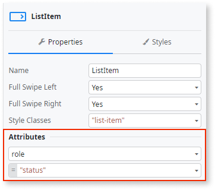
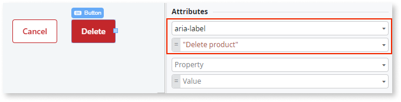
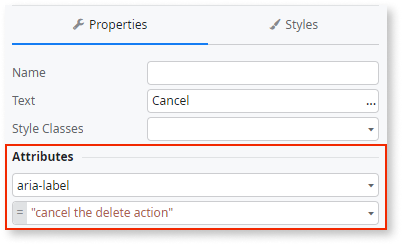

# Accessible Rich Internet Applications roles and attributes

 
The instructions in this document focus on the Accessibility features for the **Reactive Web Apps**.
 

Accessible Rich Internet Applications (ARIA) is a set of accessibility standards. ARIA defines elements to use on top of HTML and OutSystems UI to provide additional information to assistive technology tools. ARIA doesn't change how the page looks. There are ARIA roles, states, and properties. ARIA states and properties are also known as ARIA attributes.

Use ARIA when you need to handle dynamic content or complex page structures. For example, you may have several sections on a page, and setting a **role=main** tells the screen readers where the main content is. If you have a block that takes some time to load, inform the screen readers by setting **aria-busy=true**. A button that opens a popup window can warn users by **aria-haspopup=true**.

Adding ARIA attributes and roles requires familiarity with the concepts of ARIA and how ARIA works with HTML. An important thing to keep in mind is that **you shouldn't use ARIA to override the meaning that the HTML tags and the pages produced by the OutSystems UI provide by default**. Inspect the pages before deciding to add an ARIA role or attribute. OutSystems UI adds some ARIA attributes by default, for example in actions that handle menu visibility.

When developing OutSystems apps, add ARIA roles, states, and properties by editing the **Attribute** property of the widgets. There are also some actions that handle specific ARIA properties, such as **SetAriaHidden** or **SetAccessibilityRole**.

## Set ARIA as a static property

This ARIA property doesn't change when the app runs. To add the ARIA roles or attributes, select the widget, go to the **Properties** tab, and add the role or attribute in the **Attributes** section.

Similarly, you can set an ARIA role.

## Set ARIA dynamically

This ARIA property changes when the app runs, depending on a condition. To set an ARIA role or attribute dynamically, use the **If** keyword in the expression of the **Attribute** field. For example, the value of **aria-invalid** in the expression **aria-invalid=If(Form1.Valid, "false", "true")** changes depending on whether the **Form1.Valid** is true or false.

If the form is invalid, because one of the required fields is missing or a value isn't correct for a field, the form is marked with **aria-invalid="true"**. This is a signal to the screen readers to alert the users.

## The built-in ARIA actions

These are the built-in actions that support setting ARIA attributes. Use them to set the ARIA properties in your logic flows.

### Hide elements with SetAriaHidden

Use the **SetAriaHidden** action to hide an element and all content inside it from the assistive technology tools. It's equivalent to setting **aria-hidden="true"** explicitly for an element.

To find the **SetAriaHidden** action, go to the **Logic** tab > **OutSystemsUI** > **Accessibility.** 

### Change the role of the Alert pattern

To change the ARIA role of the Alert pattern, use the **SetAccessibilityRole** action. 
To find the **SetAccessibilityRole** action, go to the **Logic** tab > **OutSystemsUI** > **Accessibility** 
For more information, see the [Alert pattern](https://success.outsystems.com/Documentation/11/Developing_an_Application/Design_UI/Accessibility#Alert_pattern) section in this document.

 
The **SetAccessibilityRole** actions is designed to work with the Alert pattern. Alternatively, you can test using SetAccessibilityRole for a child element of widgets.
 

## Examples of ARIA

This section shows some examples of how you can use ARIA to extend the functionality of the OutSystems UI.

### Status message

Status messages are pieces of text that assistive tools can read and inform the users about the state of each action. Enabling these messages lets screen readers tell the users about the status of the current action.

To enable the status message, proceed with the following steps:

1. Select the UI Pattern.

2. On the **Properties** tab, go to the **Attributes** section.

3. Create a **role** attribute.

4. In the value field of the new **role** attribute, enter the status message.

5. The procedure is complete.

The following figure shows an example of a status message:

### Creating readable labels

This section describes how to create readable labels on UI Patterns, such as a button or a link.

To create a label, proceed with the following steps:

1. Select the UI element on the screen.

2. On the **Properties** tab, go to the **Attributes** section.

3. Create a new **aria-label** attribute.

4. In the value field of the new **aria-label** attribute, enter the descriptive label.

5. Select the button label text, for example, **Cancel**.

6. On the **Properties** tab, create a new **aria-label** attribute.

7. Provide the descriptive text you want screen readers to say.

The following figure shows an example of a readable label on a **Delete** button. In this example, when the user selects this button, the screen reader says "Delete product".

### Hiding text in buttons or links

This section describes how to hide text from the screen readers. If you have a link with a readable text description, for example, "View product in store", you can hide a portion of the text. All text set as hidden is invisible on the screen, but screen readers are able to read the full description.

The following steps describe how to hide text in links:

1. In your application screen, select the Link you want to edit.

2. Select the portion of the link text you want to hide, for example, "product" in “View product in store”

3. [Add a CSS class](https://success.outsystems.com/Documentation/11/Developing_an_Application/Design_UI/Look_and_Feel/Cascading_Style_Sheets_(CSS)) that makes that part of the link invisible.

    

4. The procedure is complete.

### Adding detailed descriptions for short labels

You can define what you want screen readers to say when you have short labels in buttons or links. For example, a **Cancel** button.

The following steps describe how to add an **aria-label** to describe the purpose of your button or link. By doing this, you are enabling screen readers to say full descriptions.

1. Select the button label text, for example, **Cancel**.

2. On the **Properties** tab, create a new **aria-label**attribute.

3. Enter the descriptive text you want screen readers to say.

    

4. The procedure is complete.

