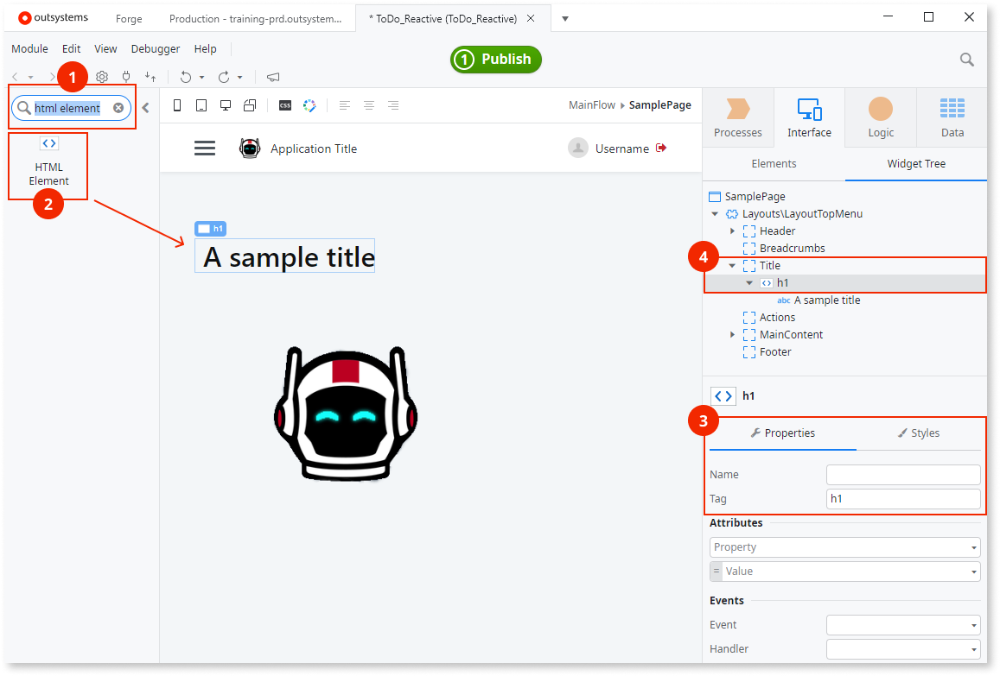
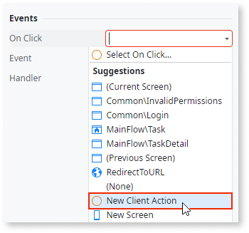

# Accessibility

Having accessible apps, apps that all people can use, is important for ethical, practical, and often legal reasons. You can build apps conformant with the [Web Content Accessibility Guidelines](https://www.w3.org/TR/WCAG21) (WCAG) thanks to the user interface (UI) features OutSystems created with accessibility in mind. You can also customize the UI and the app logic to accommodate the criteria you want to achieve.

A general recommendation is to start thinking about accessibility **early in the development phase**, test often, identify the issues, and fix the issues or provide workarounds. In this document, you can find some techniques for meeting your accessibility level.

Take into consideration the following guidelines:

1. Ensure that your app meets the basic accessibility requirements. See the section [Enabling the built-in accessibility features](https://success.outsystems.com/Documentation/11/Developing_an_Application/Design_UI/Accessibility#Enabling_the_built-in_accessibility_features).

2. Early in development, test your app against the accessibility success criteria for the level you are targeting and fix the issues. See the section [Testing and fixing accessibility issues](testing-fixing-accessibility-issues.md).

3. Keep an eye on complex interactions and dynamic content. Fix the critical issues immediately. You may need to provide more information to the assistive technology tools and improve the structure of your pages. You can do that with ARIA. See the section [ARIA roles and attributes](aria-roles-and-attributes.md).

4. See [UI Patterns accessibility reference](ui-patterns-accessibility-reference.md) for special notes about patterns you may be using on a page.

 

## Prerequisites

Before you proceed with developing accessible apps according to the instructions and recommendations in this document, ensure you have installed:

* OutSystems UI version 2.5.0 or later

* Service Studio, the latest version

 
OutSystems UI is often updated to support more accessibility features. For more information, refer to the OutSystems UI release notes in Forge.
 

## Enabling the built-in accessibility features

OutSystems has a lot of built-in accessibility features, such as creating applications with the right contrast ratio, focus, and skip to content settings. To start developing accessible apps, you need to activate the accessibility feature in Service Studio. If your app uses complex interactions or design, you may need specific customization and development, covered in [ARIA roles and attributes](aria-roles-and-attributes.md) and [UI Patterns accessibility reference](ui-patterns-accessibility-reference.md).

To enable the built-in accessibility features in Service Studio, perform the following steps:

1. Go to **UI Flows** and click on **Layouts**
1. Expand the layout you're using.
1. Select the **EnableAccessibilityFeatures** input parameter.
1. On the parameter properties, set the **Default Value** to **True**.

    

    By setting the **EnableAccessibilityFeatures** set to true, you activate the following features for all screens using the layout:

    * **Focus states** - allows you to set and highlight the focus on the current element.

    * **Skip to content** - allow the user to skip the navigation elements on the screen, and tab directly to the content.

    * **Accessible links** - gives links a higher color contrast.

    * **Enhanced contrast** - allows displaying the content on the screen using a contrast ratio perceivable to people with visual impairments.
1. The procedure is complete.

### Page title

Screen readers use page titles to tell the users the name of the page they're on. To define the page titles for accessibility, perform the following steps:

1. On the **Interface** tab, go to **UI Flows**
1. Select the screen to add the title from the list of screens
1. On the **Properties**, enter the screen title (for example, "Main page") in the **Title** field.
1. The procedure is complete.

 
The default page title of the log-in page is blank. Navigate to **UI Flows** > **Common** > **Login** and enter the title.
 

### Page language settings for screen readers

The language of a page allows screen readers to switch language profiles which provides the correct accent and pronunciation.
To set the page language, perform the following steps:

1. Go to **UI Flows** and click on **Layouts**.
1. Expand the layout you're using.
1. Double-click the **OnReady** action to open it.
1. On the **Logic** tab, expand **Client Actions** > **OutSystemsUI** > **Accessibility**.
1. Select the **SetLang** action in the logic, and drag it into the **OnReady** action, as shown in the figure below.
1. On the **Properties**, enter an [ISO language code](https://tools.ietf.org/html/bcp47) (for example, "en-EN") in the **Lang** field.

    

After following these steps for each of the used layouts and published the module, you can test the page language.

 
Remember to set the language of the log-in page too, as it isn't defined. Navigate to **UI Flows** > **Common** > **Login** to supply the language identifier by using the **SetLang** action as described.
 

### Image text alternatives

Image text alternatives, also known as alt text or alternative text, is a string of text that describes what's in the image. Adding image text alternatives allows screen readers to read the description of the images.

To set an alternative text to an image, execute the following steps:

1. Select your image, and go to the  **Properties**.
1. In the **Attributes** section, create an **alt**.
1. Enter the description. When an image is for decorative purposes, set **alt=""**.

    

After following these steps, for each of the used images, and published the module, you can test the image text alternatives by using a screen reader.

### Text headings

Text headings are useful for users to understand the structure of a page visually. Having different text sizes, larger than normal text, helps the visual guidance on the page, and is quite helpful for users with cognitive disabilities. Also, text readers use headings to help users to navigate a trough a page.

To ensure you have a proper content organization in your app, set up the heading structure. Add [a heading element](https://www.w3.org/WAI/tutorials/page-structure/headings/), for example, **h1**, by enclosing the text in the HTML widget and specifying **h1** as the tag.

To set the text headings, perform the following steps:

1. On the toolbox, search for the **HTML Element** widget (1)
1. Drag it to the screen (2).
1. To add an **h1** element to the screen, go to the **HTML Element** widget properties, and in the **Tag** field (3), enter **h1**.
1. Enter some text into the HTML Element.
1. Check the widget structure to verify that the text is within the **h1** element (4).

    

After following these steps, for each of the headings, and published the module, you can test them using a screen reader.

### Text color contrast

By default, OutSystems UI provides the correct text contrast ratio to comply with the color contrast accessibility requirements. The built-in accessibility features, once turned on, improve the contrast. If you edit the colors in your app, make sure the contrast is still valid, by referring to the [minimum contrast criteria](https://www.w3.org/WAI/WCAG21/Understanding/contrast-minimum).

### Text spacing

Improve the text rea<dability by letting the users increase the text spacing in your application. To enable this, create an action that runs the accessibility **ToggleTextSpacing** action, by performing the following steps:

1. In your app screen, select the page element that triggers the increased text spacing. For example, a button.

1. To create a new client action, in the **Events** section of the **Properties**, go to the **OnClick** event and select **(new client action)**.

1. Set the action name as **TextSpacing**, for example.

    

   1. On the **Logic** tab, click on **OutSystemsUI**
1. Click on the **Accessibility** Client Actions folder.
1. Drag the **ToggleTextSpacing** action into the flow.

    

1. The procedure is complete.

### Form labels

Labels provide captions to the input fields, describing the information requested from the user. You have to bound the Label widget to inputs in forms to allow screen readers to read each input field caption.

To bind labels with the Forms fields they refer to, perform the following steps:

1. Select the **Label** widget in the preview (1)
1. On the **Properties**, go to the **Input Widget** drop-down, and select the widget to associate the label (2).
1. To see a demo of a form, create a screen based on a **Detail** Screen Template.

After following these steps for each input field and published the module, you can test reading the inputs captions using a screen reader.

### Form validation on screen readers

To learn how to validate the input fields of a form, refer to [Validate the fields of a form](https://success.outsystems.com/Documentation/11/Developing_an_Application/Design_UI/Forms/Validate_the_fields_of_a_form#Examples_of_the_client-side_validation_with_accelerators).

To learn how to signal to screen readers and users that the form isn't valid, check the example in [Set ARIA dynamically](https://success.outsystems.com/Documentation/11/Developing_an_Application/Design_UI/Accessibility/Accessible_Rich_Internet_Applications_roles_and_attributes#Set_ARIA_dynamically).

### Highlighting selected elements

Turning on the built-in accessibility features allows you to get a visual highlight on the selectable items on the page. When the user navigates between different selectable items with the tab key, the selected element highlights.

#### Selecting an element with the SetFocus action

You can explicitly select an element by using the **SetFocus** action. For example, to highlight an input field when a user enters a page that contains a form.

To explicitly select an element on a screen, perform the following steps:

1. On the **Interface** tab, select the screen that contains the widget you want to highlight and open it.
1. On the screen **Properties**, go to **Events**, and select the **OnReady** action from the drop-down menu. The **OnReady** action logic opens.
1. On the **Logic** tab, click on **OutSystemsUI** and open the **Accessibility** Client Actions folder.
1. Select the **SetFocus** action and drag it into the logic, as shown in the figure below.
1. On the **Properties**, go to **WidgetId** and select the Id of the widget you want to highlight.

After following these steps and published the module, you can test the highlighting of the element.

### Skipping to specific content on a page

By default, text readers skip repetitive elements, such as headers and menus, and jump to the main content of a page for reading it. You might want text readers to skip to a specific section of the page, other than the main content. To do this, perform the following steps:

To change the default main container, perform the following steps:

1. On the **Interface** tab, go to **UI Flows** and expand the **Layouts**.
1. Select and expand the layout you're using.
1. Double-click the **SkipToContentOnClick** action.
1. Select the **SkipToContent** node in the flow and edit the **TargetId** in the action properties.

 
You must enter the name in the widget properties before you can use that widget in the **SkipToContent** action. For example, if you name your element **MainContent**, the identifier is **MainContent.Id**.
 

The default content Container is the **MainContentWrapper**. To find it, go to **UI Flows** > **Layouts**, and click on the layout you use in your app.

To find the  **SkipToContent** action, go to **Logic** > **OutSystemsUI** > **Accessibility**.
