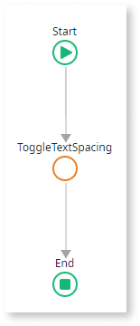
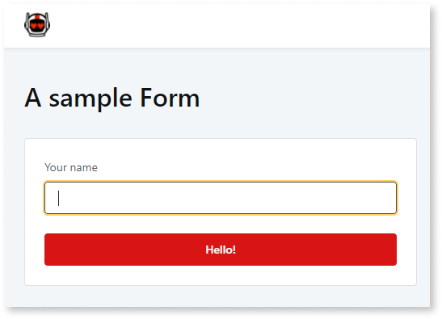

# Accessibility

 
The instructions in this document focus on the Accessibility features for the **Reactive Web Apps**.
 

Having accessible apps, apps that all people can use, is important for ethical, practical, and often legal reasons. You can build apps conformant with the [Web Content Accessibility Guidelines](https://www.w3.org/TR/WCAG21) (WCAG) thanks to the user interface (UI) features OutSystems created with accessibility in mind. You can also customize the UI and the app logic to accommodate the criteria you want to achieve.

A general recommendation is to start thinking about accessibility **early in the development phase**, test often, identify the issues, and fix the issues or provide workarounds. In this document, you can find some techniques for meeting your accessibility level.

Take into consideration the following guidelines:

1. Ensure that your app meets the basic accessibility requirements. See the section [Basic accessibility settings](https://success.outsystems.com/Documentation/11/Developing_an_Application/Design_UI/Accessibility#Basic_accessibility_settings).

2. Early in development, test your app against the accessibility success criteria for the level you are targeting and fix the issues. See the section [Testing and fixing accessibility issues](testing-fixing-accessibility-issues.md).

3. Keep an eye on complex interactions and dynamic content. Fix the critical issues immediately. You may need to provide more information to the assistive technology tools and improve the structure of your pages. You can do that with ARIA. See the section [ARIA roles and attributes](aria-roles-and-attributes.md).

4. See [UI Patterns accessibility reference](ui-patterns-accessibility-reference.md) for special notes about patterns you may be using in a page.

 

## Prerequisites

Before you proceed with developing accessible apps according to the instructions and recommendations in this document, ensure you have installed:

* OutSystems UI version 2.5.0 or later

* Service Studio, the latest version

 
OutSystems UI is often updated to support more accessibility features. For more information, refer to the OutSystems UI release notes in Forge.
 

## Basic accessibility settings

OutSystems allows you to turn on the basic accessibility settings, such as contrast ratio, focus, and skip to content, by activating the built-in accessibility features in Service Studio. Other accessibility settings need development or content work.

## Enabling the built-in accessibility features

To enable the built-in accessibility features in Service Studio, perform the following steps:

1. Go to **UI Flows** and click on **Layouts**
1. Expand the layout you're using.
1. Select the **EnableAccessibilityFeatures** input parameter.
1. On the parameter properties, set the **Default Value** to **True**.

    

    By setting the **EnableAccessibilityFeatures** set to true, you activate the following features for all screens using the layout:

    * **Focus states** - allows you to set and highlight the focus on the current element.

    * **Skip to content** - allow the user to skip the navigation elements on the screen, and tab directly to the content.

    * **Accessible links** - gives links a higher color contrast.

    * **Enhanced contrast** - allows displaying the content on the screen using a contrast ratio perceivable to people with visual impairments.
1. The procedure is complete.

### Page title

Enter the page title in **Screen**> **Title.**

 
The default page title of the log-in page is blank. Navigate to **UI Flows** > **Common** > **Login** and enter the title.
 

### Page language

The HTML Lang attribute allows screen readers to switch language profiles which provides the correct accent and pronunciation. 
o set the page language, perform the following steps:

1. Go to **UI Flows** and click on **Layouts**.
1. Expand the layout you're using.
1. Double-click the **OnReady** action to open it.
1. Select **SetLang** action in the logic.
1. On the Properties tab, enter an [ISO language code](https://tools.ietf.org/html/bcp47) (for example, "en-EN") in the **Lang** field.

    

1. The procedure is complete.

 
The language of the log-in page isn't defined. Navigate to **UI Flows** > **Common** > **Login** to supply the language identifier by using the **SetLang** action.
 

### Image text alternatives

Image text alternatives, also known as alt text or alternative text, is a string of text that describes what's in the image.
To set an alternative text to an image, execute the following steps:

1. Select your image, and go to the  **Properties** tab.
1. In the **Attributes** section, create an **alt**.
1. Enter the description. When an image is for decorative purposes, set **alt=""**.
1. The procedure is complete.

    

### Text headings

You must organize your content and set up the heading structure. Add a heading element, for example, h1, by enclosing the text in the HTML widget and specifying **h1** as the tag.

To set the text headings, perform the following steps:

1. Search for the **HTML Element** widget (1) to add a **h1** element to the screen.
1. Drag it to the screen (2).
1. On the **HTML Element** widget properties, in the **Tag** field (3), enter **h1**.
1. Enter some text into the HTML Element.
1. Check the widget structure to verify that the text is within the **h1** element (4).

    

1. The procedure is complete.

### Text color contrast

By default, the OutSystems UI provides the correct text contrast ratio. The built-in accessibility features, once turned on, improve the contrast. If you edit the colors in your app, make sure the contrast is still valid.

### Text spacing

Improve the text readability by letting the users increase the text spacing. To enable this, create an action that runs the accessibility **ToggleTextSpacing** action, by performing the following steps:

1. In your app screen, select the component that triggers the increased text spacing. For example, a button.

1. To create a new client action, in the **Events** section of the **Properties** tab, go to the **OnClick** event and select **(new client action)**.

1. Set the action name as **TextSpacing**, for example.

    

    The new client action flow is displayed.

1. On the **Logic** tab, click on **OutSystemsUI**
1. Click on the **Accessibility** Client Actions folder.
1. Drag the **ToggleTextSpacing** action into the flow.

    

1. The procedure is complete.

### Form labels

You should always associate labels with the forms fields they refer to. Select the **Label** widget in the preview (1), go to **Properties**, and in the **Input Widget** list select the widget to associate the label (2). To see a demo of a form, create a screen based on a **Detail** Screen Template.

### Form validation

To understand how to validate the input fields of a form, see [Validate the fields of a form](https://success.outsystems.com/Documentation/11/Developing_an_Application/Design_UI/Forms/Validate_the_fields_of_a_form#Examples_of_the_client-side_validation_with_accelerators). To learn how to signal to screen readers and users that the form isn't valid, check the example in [Set ARIA dynamically](https://success.outsystems.com/Documentation/11/Developing_an_Application/Design_UI/Accessibility#Set_ARIA_dynamically).

### Focus highlight

To get the visual focus on the page, turn on the built-in accessibility features. When the user navigates to the page with the tab button, the highlight focuses on the selected element on the page.

### Element in focus

You can explicitly set the focus to an element by using the **SetFocus** action in **Logic** > **OutSystemsUI** > **Accessibility**. For example, use it if you want to set the focus back to a trigger button, after closing the sidebar.

### Main content

To change the default main container, perform the following steps:

1. In the **Interface** tab, go to **UI Flows** > **Layouts**.
1. Expand the layout you're using.
1. Double-click the **SkipToContentOnClick** action.
1. Select the **SkipToContent** node in the flow and edit the **TargetId** in the action properties.

 
You must enter the name in the widget properties before you can use that widget in the **SkipToContent** action. For example, if you name your element **MainContent**, the identifier is **MainContent.Id**.
 

The default content Container is the **MainContentWrapper**. To find it, go to **UI Flows** > **Layouts**, and click on the layout you use in your app.

To find the  **SkipToContent** action, go to **Logic** > **OutSystemsUI** > **Accessibility**.
