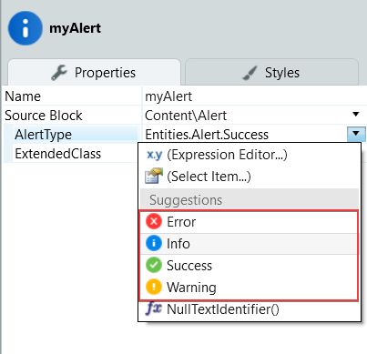
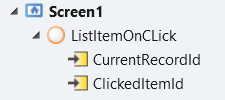
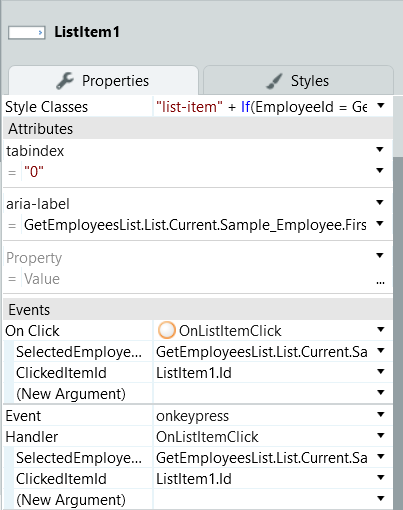
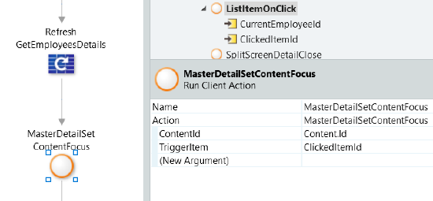
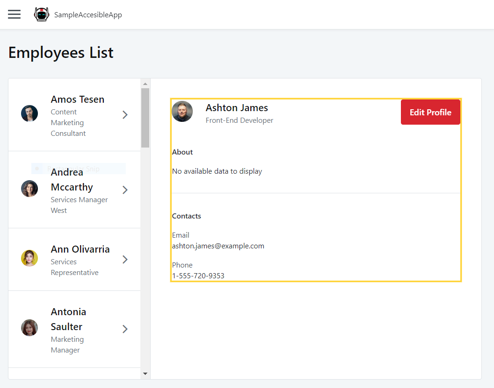

# **UI Patterns accessibility reference**

The OutSystems UI is designed with the WCAG 2.1 in mind. However, the UI patterns can introduce complex UI interactions in the app. These interactions may not be obvious to the users of assistive technologies. Refer to this section for more information about accessibility related to the UI patterns you may be using.

## **Alert pattern**

The Alert UI pattern lets you provide important information on the screen to get the users' attention. The alert pattern has different built-in ARIA roles, depending on the alert type:

* The ARIA role is **alert** when you set the **AlertType** property to **Entities.Alert.Error** or **Entities.Alert.Warning**.

* The ARIA role is **status** when you set the **AlertType** property to **Entities.Alert.Success** or **Entities.Alert.Info**.

    

The Alert pattern further supports changing the ARIA role with the **SetAccessibilityRole** action. Here's an example of how to set the ARIA role "status".

1. Select the Alert pattern, and on the **Properties** tab, in the **Name** field, enter **myAlert**. This is now the element identifier.

2. Open the logic flow that's relevant to the Alert showing on the screen.

3. Locate **Logic** > **OutSystemsUI** > **Accessibility** > **SetAccessibilityRole.** Drag the **SetAccessibilityRole** action to the flow.

4. In the **SetAccessibilityRole** action properties set **WidgetId** to **myAlert.Id** and enter **"status"** in the **Role** field.

When toggling the visibility of the Alert, you must update the **aria-hidden** attribute to guarantee the alert complies with the Accessibility guidelines. You can do this by using the **SetAriaHidden** client action.

## **MasterDetail pattern**

The **Master Detail** UI pattern splits the screen vertically into two panels. Clicking an item in the list pane opens the details pane.

### Configure the correct keyboard interaction

The Master Detail UI Pattern requires you to be careful with how the tab key behaves on the page. You should set **tabindex="0"** to the list section of the pattern, so the focus isn't lost somewhere else on the page. When the item in the list doesn't have text (you're using images), or the text isn't descriptive (you're using short text), use **aria-label** to provide more information to screen readers.

### Configure the correct switch of the focus

Make sure that the focus switches to the detail pane of the pattern. Use the action **MasterDetailSetContentFocus** available in **Logic** > **OutSystemsUI** > **Accessibility** to switch the focus, preferably after you populate the details pane with the data.

### Configuration instructions

To configure the Mater Detail pattern for accessibility, proceed with the following steps:

1. Open the **ListItem** pattern you are using.

1. Create an action on ListItem click, for example, **ListItemOnClick** with two input parameters:

    **CurrentRecordId** - to identify the current record

    **ClickedItemId** - to identify the Id of the clicked ListItem

    

1. On the **Properties** tab, add a **tabindex** attribute and set it to "**0**”.

1. Create an **aria-label** attribute, and add a descriptive text about the action after the aggregate, for example, **YourAggregate + " list item, click to open the detail".** You should also add an **onkeypress** event to  ensure keyboard navigation on the list item.

    

1. On the **ListItemOnClick** action, add the **MasterDetailSetContentFocus** action. You need this for accessibility compliance, as it allows to change the focus between the detail and the next **listitem**, with parameters mapped from the **ListItemOnClick**:

    1. **ContentID** (text) - Id of the content to focus on.

    2. **TriggerItem** (text) - Id of the clicked item.

    

6. The procedure is complete.

### Demo

OutSystems recommends that you create a sample screen from the **Master Detail** Screen Template and check the accessibility settings in a working example.

# **Accessibility in Traditional Web Apps**

For an accessibility overview for Traditional Web Apps, see [Accessibility in Traditional Web Applications](https://success.outsystems.com/Support/Enterprise_Customers/Accessibility/Accessibility_in_OutSystems_Web_Applications). 

# **Links to additional resources**

A section with links to additional information.

## **Introductory resources**

* [WAVE Web Accessibility Evaluation Tool](https://wave.webaim.org/) 

* [Easy Checks – A First Review of Web Accessibility](https://www.w3.org/WAI/test-evaluate/preliminary/)

* [How to Meet WCAG (Quickref Reference)](https://www.w3.org/WAI/WCAG21/quickref/)

* [Getting started with ARIA](https://a11yproject.com/posts/getting-started-aria/) 

 

## **Evaluation tools**

To evaluate the accessibility of your content, you can use the following tools:

* [WAVE Web Accessibility Evaluation Tool](https://wave.webaim.org/)

* [A11Y Compliance Platform](http://www.boia.org/?wc3)

* [AChecker](https://achecker.ca/checker/index.php)

* [Accessibility Developer Tools](https://chrome.google.com/webstore/detail/accessibility-developer-t/fpkknkljclfencbdbgkenhalefipecmb?hl=en)

* [Web Accessibility](https://www.webaccessibility.com/)

 

## **Screen readers**

To test if your application is completely readable, you can use the following test screen readers:

* [ChromeVox](https://chrome.google.com/webstore/detail/chromevox/kgejglhpjiefppelpmljglcjbhoiplfn?hl=pt-PT) for Google Chrome

* [NVDA](https://www.nvaccess.org/) and [JAWS](http://www.freedomscientific.com/Products/software/JAWS/) for Windows

* [Apple VoiceOver](https://www.apple.com/accessibility/mac/vision/) for macOS

* [ORCA](https://help.gnome.org/users/orca/stable/), [BRLTTY](http://mielke.cc/brltty/), and [Emacspeak](http://emacspeak.sourceforge.net/) for Linux

 

## **Color and contrast checkers**

WCAG has guidelines for [contrast accessibility](https://www.w3.org/TR/UNDERSTANDING-WCAG20/visual-audio-contrast-contrast.html) to help UI / UX designers and developers to achieve different [levels of accessibility](http://www.w3.org/TR/UNDERSTANDING-WCAG20/conformance.html#uc-levels-head). You can use the following checkers to validate the implementation of those guidelines in your applications.

* [Contrast Ratio](https://contrast-ratio.com/)

* [Accessible Colors](http://accessible-colors.com/)

* [Color Safe](http://colorsafe.co/)

* [Contrast-Finder](http://contrast-finder.tanaguru.com/)

For more accessibility tools, check out [the W3 evaluation tools list](https://www.w3.org/WAI/ER/tools/) and this [collection of web accessibility tools](https://github.com/collections/web-accessibility).

## **Teamwork and accessibility practices**

The following links act as a 'quick-start' guide for embedding accessibility and accessible design practices into your team’s workflow.

* [Product Management](https://accessibility.digital.gov/product/getting-started/)

* [Content Design](https://accessibility.digital.gov/content-design/getting-started/)

* [UX Design](https://accessibility.digital.gov/ux/getting-started/)

* [Visual Design](https://accessibility.digital.gov/visual-design/getting-started/)

* [Front-End Development](https://accessibility.digital.gov/front-end/getting-started/)

