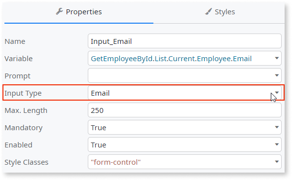
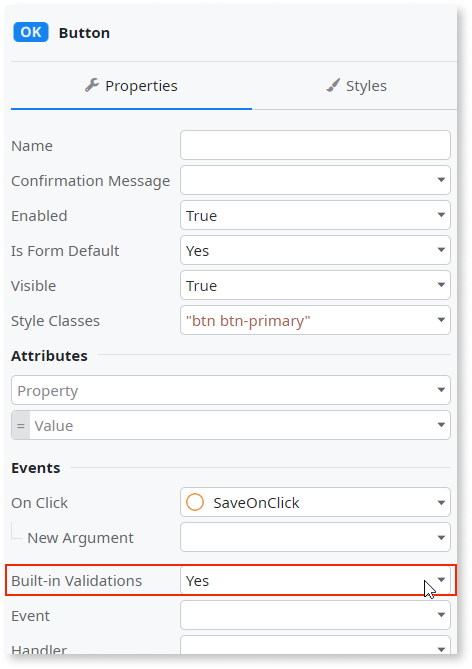
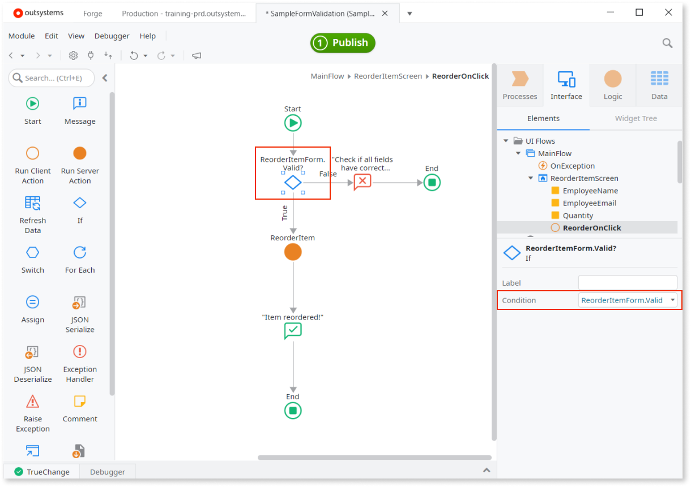
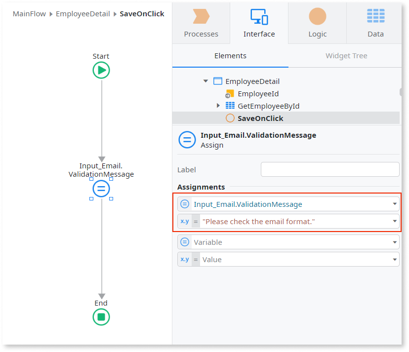
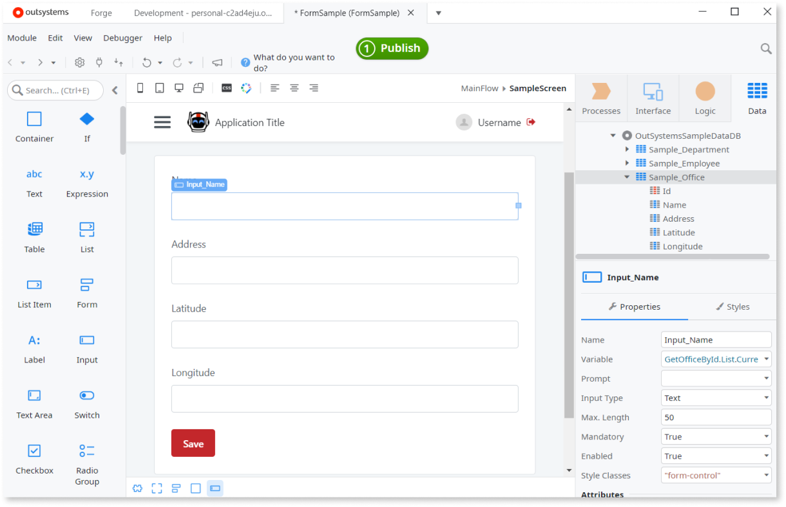
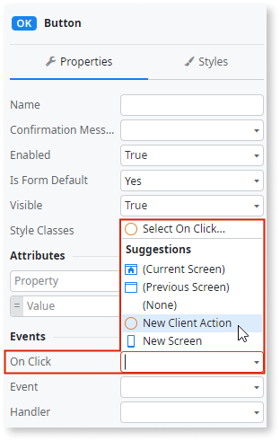
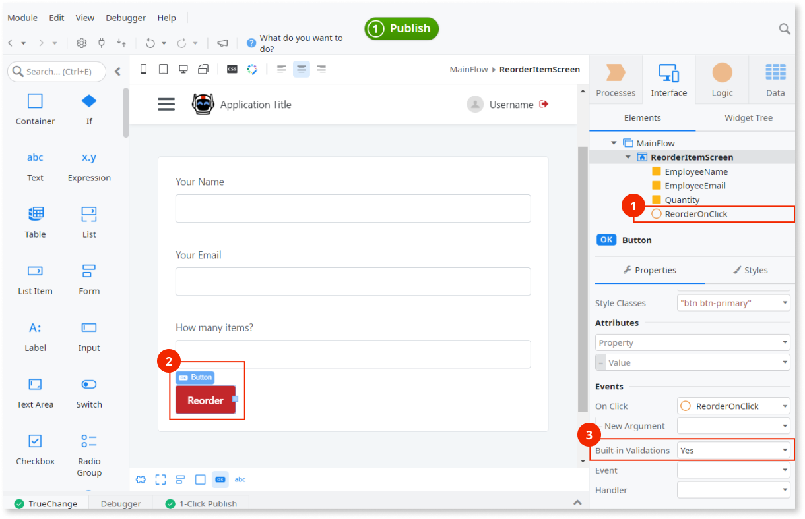
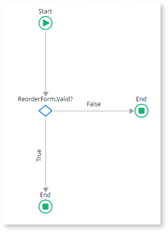
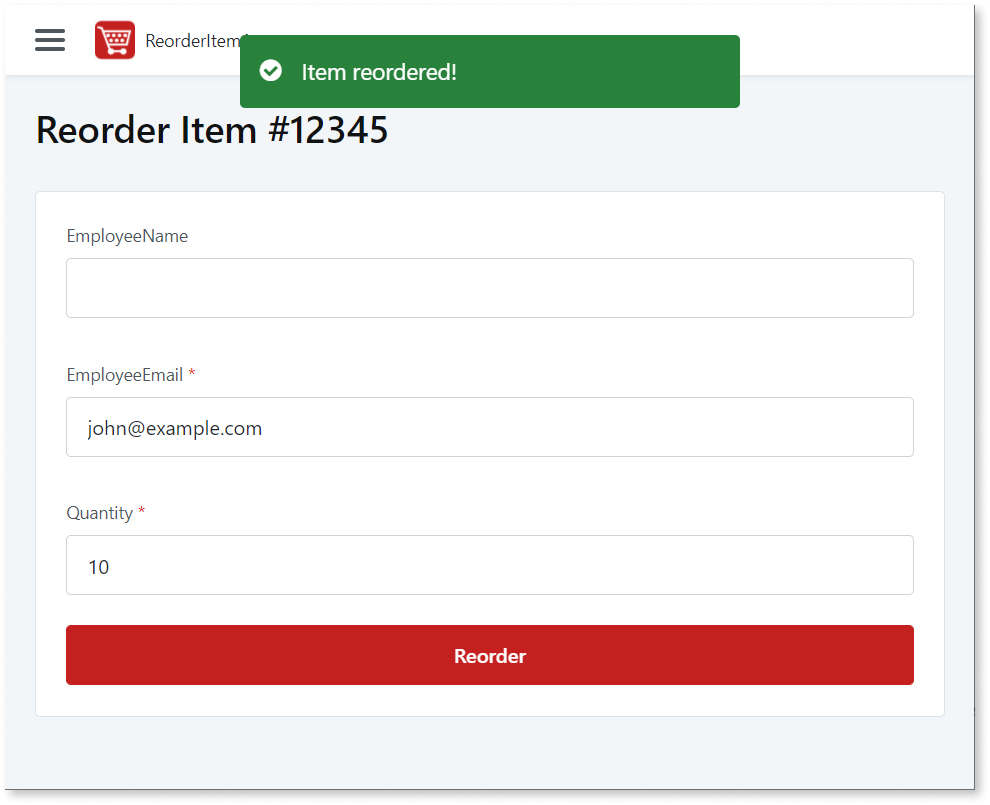

# Validate the fields of a form

When users enter data in a form and click a submit button, check if the data is valid. If the data seems valid, the app can continue. If not, you should tell the users which fields contain the errors and how to fix them.

For example, if your users need to enter their emails in the field, and they enter their name instead — that information isn't valid. You can use the built-in capabilities of the app to show the error message and ask the users to retry.

The client-side validation improves the user experience because it's quick feedback about information users enter in the form. However, **you should always check the data that comes from the client side before you save that data to the database**.

Most of this document applies to Reactive Web App and Mobile App. For Traditional Web App, see [Validation in Traditional Web](#validation-in-traditional-web).

## Using accelerators to create initial validation flow

In OutSystems low-code approach, the **automatic client-side form validation is provided by default for the supported data types**. To use the built-in validations, you need to:

1. Set the data types of the values in the form. You can do this manually or [scaffold the form fields from Entity](#generate-form-fields).
2. Set the fields as mandatory, if required.
3. Trigger an accelerator to create a new Client Action with initial validation flow. To automatically create the logic, select the **New Client Action** from the Event list of the element that submits the data inside the form. Check [this example step to create a new Action](#step-new-action) for a Button.

### Set an input field as mandatory

The field is mandatory if users must enter a value in that field. To set a field as mandatory, select the widget and in the **Properties** pane set the **Mandatory** property to **True**. Widgets have the **Mandatory** field, for example, **Input Widget** or **ButtonGroup Widget**, if their common use case requires it.

### Set the data type of a form field

To automatically check whether the value user enters is valid, you first need to tell the app which value you expect. Select the data type from the **Input Type** list in the properties of the widget. There are several Data Types you can choose from, such as Integer, Currency, Date, Time, Email.

### Enable or disable the built-in validation

To activate the built-in client-side validation, set the **Built-In Validations** property of the **Event** that submits the data to **Yes**. For example, **On Click** Event of a Button Widget or a Link Widget that calls a Client Action.

### Validate the data in a Client Action

With the built-in validation enabled, you can access the boolean **Valid** property of the Form Widget in the Client Action that submits the form. For example, if you have a form ReorderItemForm, and a user submits correct data, the value of `ReorderItemForm.Valid` is True. If a check for any of the fields fails, the value of `ReorderItemForm.Valid` is False.

In this example, an **If** node has `ReorderItemForm.Valid` in the **Condition**. If the value of `Valid` is False, the validation fails and the **False** branch of the **If** flow runs.

The app validates only the fields you set as mandatory. The app skips the fields that you don't set as mandatory, as those fields are then optional.

## Customizing validation error and warning messages

Here are some ways to edit the validation messages.

### Editing the default validation messages

You can edit the default validation messages on the module level. Go to the module properties by clicking the module name (1) in any of the main Service Studio tabs (**Process**, **Interface**, **Logic**, or **Data**). Then, edit the messages in the **Validation Messages** section (2).

### Changing the field validation messages programmatically

You can change the validation messages for fields during the execution of the app. You do that by assigning a text value to the **ValidationMessage** of the widget. Keep in mind that the message only shows after the validation fails, when the value of **Field.Valid** is **False**.

## Examples of the client-side validation with accelerators

There are two examples of the client-side validation in this section.

### Auto-creation of form fields with predefined data types

Insert fields in forms using a low-code accelerator, which can help you be more efficient when you're using Entity as the data source. Follow the steps below.

1. Drag a Form Widget to the Screen.
2. Drag an Entity to the Form Widget. The fields of the form populate automatically.
3. Go through the fields and set **Mandatory** to **Yes** for all fields that aren't optional.
4. Select the **Save** button. In the button properties, in the **Events** section, from the **On Click** list select **New Client Action**. A new Action opens, with a default validation logic.
5. Add different logic when **Form.Valid** is **True** or **False**.

You can create the form, fields, and the save button, as in this Screen, by dragging an Entity to a Form.

### Step by step example

Service Studio creates the initial logic for validation automatically, which can speed up your work significantly. Here is a step by step example of creating validation logic. There is a Screen in the app, where users can reorder an item after entering the following information:

* Name — string, optional
* Email — email address, mandatory
* Quantity — integer, mandatory

Here are the steps to create the UI and basic logic.

1. Create a new app and add a Screen. Name the Screen "ReorderItemScreen".
2. Create three Local Variables, and set their properties like this:
    
    | Name          | Data Type |
    | ------------- | --------- |
    | EmployeeName  | Text      |
    | EmployeeEmail | Email     |
    | Quantity      | Integer   |

    It should look like this, with the Local Variables (1) and entered **Name** (2) and **Data Type** (3) properties.

    
    
3. Drag a **Form Widget** to the Screen and name it "ReorderItemForm".
4. Drag three **Input Widgets** to the "ReorderItemForm", and set the properties like this:

    | Name                | Variable      | Mandatory |
    | ------------------- | ------------- | --------- |
    | Input_EmployeeName  | EmployeeName  | No        |
    | Input_EmployeeEmail | EmployeeEmail | Yes       |
    | Input_Quantity      | Quantity      | Yes       |

    Notice how the **Input Type** property changes automatically to match the Variable data type.

5. Drag a Button Widget to the form, below the input fields. Set the label of the button as "Reorder". At the end of this step you should have something like this:

    
    
    There is a form (1), and in it the input fields (2) with the properties (3). The button (4) needs to be inside the form.

    Add labels on top of the input fields by dragging a Label Widget above the Input Widget.

6. Select the button, go to the properties, find the **Event** section, and in it **On Click**. Open the **On Click** list and select **New Client Action**. New action triggers an accelerator to create a Client Action with an initial validation flow.

    

    If you go back to the Screen, you can see that Service Studio created the "ReorderOnClick" Client Action (1). Select the "Reorder" button (2) and confirm that the **Built-In Validation** property in the **Events** section has the value **Yes** (3).

    

7. Finally, edit the flow to show an error message if the user enters invalid data, and a success message when the data is valid. Open the ReorderOnClick and it should look something like this: 

    

    Drag a **Message** node from the toolbox to the **False** branch of the **If** node. Enter `"Check if all fields have the correct information and then retry."` in the **Message** property of the Message node, and in the **Type** list select **Error** (1). Drag another **Message** node from the toolbox, this time to the **True** branch. Enter `""Item reordered!""` and in the **Type** list select **Success** (2).

    

8. Publish and run the app. If you enter valid data, you now get the success message:

    

    However, if you enter an email in an unsupported format, or a float instead of an integer, you get the error message:

    

    Note that the name field is optional.

## Creating custom validation logic

The built-in validation for supported data types works automatically as long as you provide information about the expected data type.

If you need to extend the validation mechanism for more complex scenarios, create your validation logic and set the **Valid** variables of the widget fields. If you invalidate any of the fields in the form, that invalidates the entire form (the value of **Form.Valid** is False).

### Example of custom validation

In this example, the form contains a field to enter a date for a shipment. The validation logic checks if the date is in the past (1), and if it is, the app marks the field as not valid (2) by setting `Input_Date.Valid=False`. For better user experience, set a custom message in `Input_Date.ValidationMessage`, telling users that the date can't be in the past (2).

Invalidating the date field invalidates the entire form (3), and shows the custom message next to the field. Also, there's an extra feedback message on top of the screen (4), before the end of the flow. If the validation logic passes successfully, the app calls the Server Action to finalize the request by the user (5).

Here is the custom validation message in the app running in a browser, with a custom validation message (1) and the feedback message after the form validation failed (2).

## Validation in Traditional Web

This section applies to the Traditional Web Apps, where validation runs on the server side.

To implement the form validations, use server action that the app calls after submitting the form data. Add all validations at the beginning of the flow:

1. For each validation:    
    1. Add the logic to validate the input value. 
    1. If the validation fails, assign the input's runtime properties as follows:    
        * `Input.Valid = False`
        * `Input.ValidationMessage = "<your error message>"`
1. Check the value of **Form.Valid** after all input validations. If an inputs isn't valid, the form is also not valid:     
    1. Add an If element with the following condition: `Form.Valid`
    1. If `True`, continue the action flow. 
    1. If `False`, end the action flow. The form displays validation messages next to all inputs that aren't valid. 

The **Valid** property of the form is  `False` when: 

* Built-in validation for any field fails
* You assign `False` to the **Valid** property of any field of the form
  
The validation messages show next to all fields with invalid inputs.
