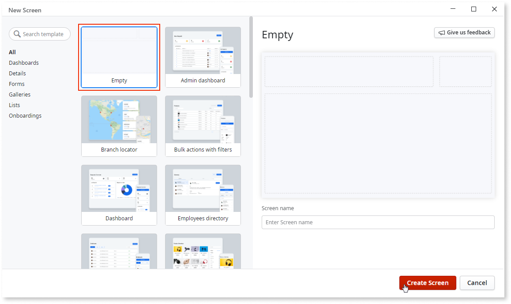
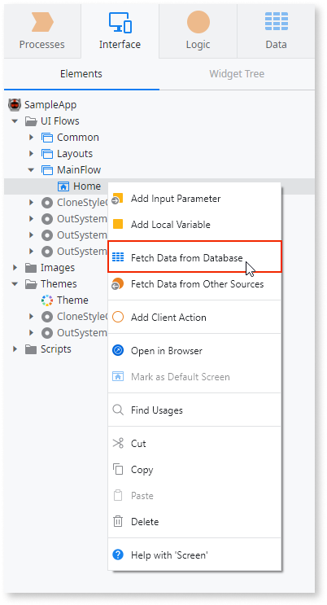
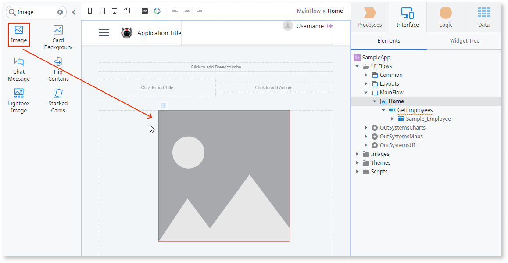
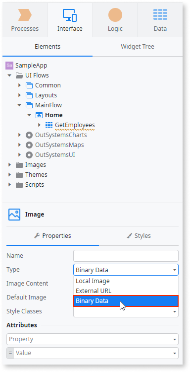
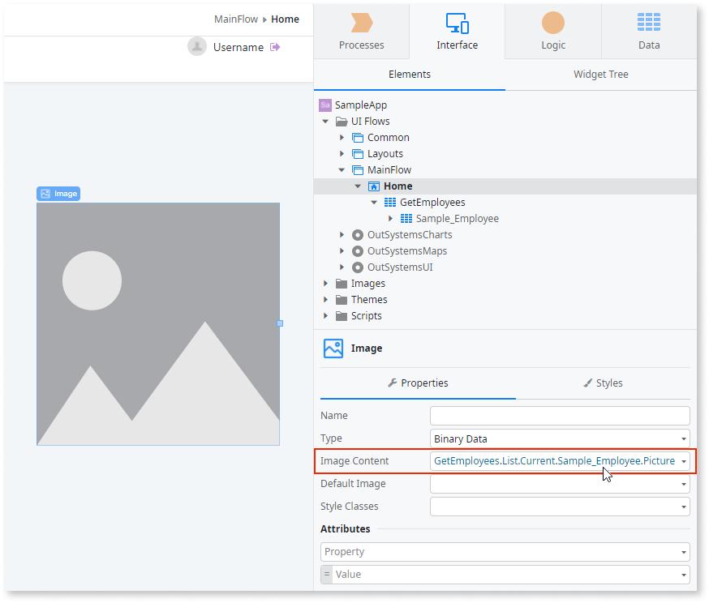

# Display an Image Stored in the Database

You can display different types of images in your applications such as static images, external images fetched from URLs, and images stored in the database.

## In Reactive Web and Mobile

To display a database image in Reactive Web and Mobile:

1. Open the screen where you want to display the image. 

    

1. Check if there is an aggregate fetching the image from the database. Add the aggregate if needed. 

    

1. Drag the Image widget from the toolbox to the screen. 

    

     

1. Set the property Type to `Binary Data`. 

    

     

1. Set the property Image Content to the entity attribute that stores the image.

    
