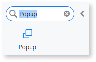
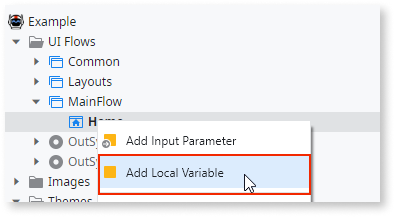
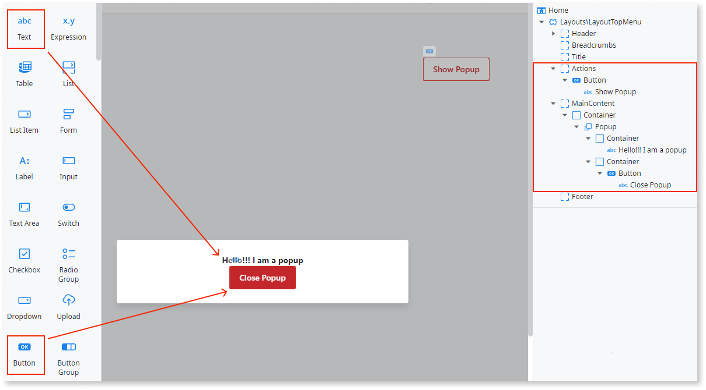

# Create and use a Popup

You can use a popup to show information to users or ask them to enter information. Correctly used popups help you create a good user experience, because the users remain on the same page.

## Reactive Web and Mobile

To create and use a popup in Reactive Web and Mobile Apps:

1. In Service Studio, in the Toolbox, search for `Popup`.

    The Popup widget is displayed. 

    

1. Drag the Popup widget into the Main Content area of your screen. 
    
    

1. Add a variable of boolean data type to the screen by right-clicking on your screen name and selecting **Add Local Variable**. In this example, we call the variable **ShowPopup**.
        
    

    

1. Select the Popup widget, and on the **Properties** tab, enter the new variable for the **Show Popup** property. This toggles the popup according to the variable value. 

    

1. Add your content to the popup.

    In this example, we add some text and a Close Popup button. We also add a Show popup button to the Actions area of the screen.

    

1. Define the Close Popup button action by selecting the button, and from the **OnClick** dropdown, select **Create New Client Action**.

    

1. Drag an Assign onto the client action, and set the ShowPopup variable to False. 

    

    Clicking the Close Popup button sets the ShowPopup variable to False and closes the popup.

1. Repeat step 7 for the Open Popup button, substituting the variable value to True. Clicking the Open Popup button sets the ShowPopup variable to True and opens the popup.

After following these steps and publishing the module, you can test the pattern in your app.

Here's a [video tutorial about using Popup in Reactive Web and Mobile App](https://www.youtube.com/watch?v=RrMARHvJBXU).

## Traditional Web

To create and use a popup in Traditional Web Apps:

1. In Service Studio, in the Toolbox, search for and drag the Link widget into the Actions area of your screen.

    

1. Enter a name and some text for the link. In this example we enter ``PopupLink`` for the link name and ``Show Popup`` as the link text.

    

1. Create a new screen for the popup. Select the Widget Tree, and from the **Source Web Block** dropdown, select **Layouts\LayoutPopup**. 

    

1. Delete everything from the screen except until you are left with the Main Content only.

    

1. Enter the popup content. In this example, we enter some text.

    

1. Select your main screen again, and from the **Properties** tab, set the link’s **Destination** property to the popup screen you just created.

    

1. From the Toolbox, search for and drag the Popup Editor widget into the Main Content area of your screen.

    

1. On the **Properties** tab, from the  **LinkOnButtonWidgetId** dropdown, select the Link widget Id. 

    

    You can also create a screen action for the Popup Editor widget by selecting **New Screen Action** from the **Destination** dropdown. In this example, we select New Screen Action, but leave the flow of the action empty.

After following these steps and publishing the module, you can test the pattern in your app.

Here is a [video tutorial about using Popup in Traditional Web App](https://www.youtube.com/watch?v=ShOCxc3g91M).

