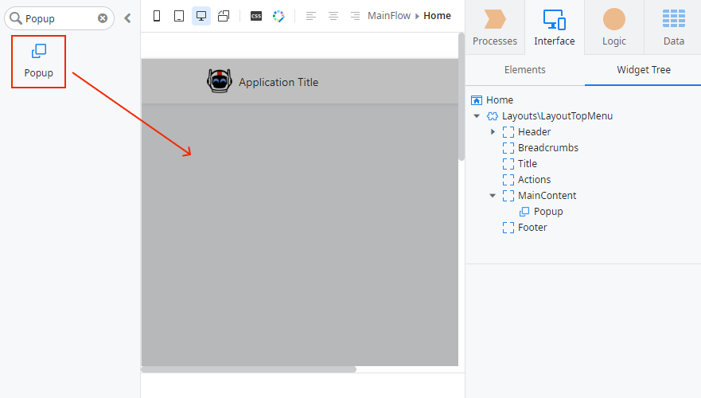
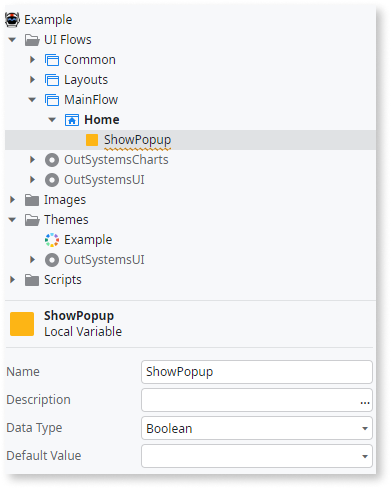
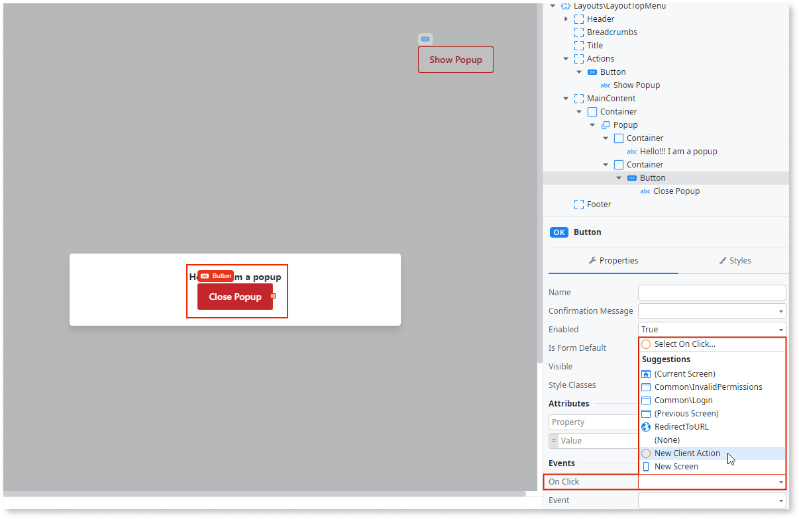
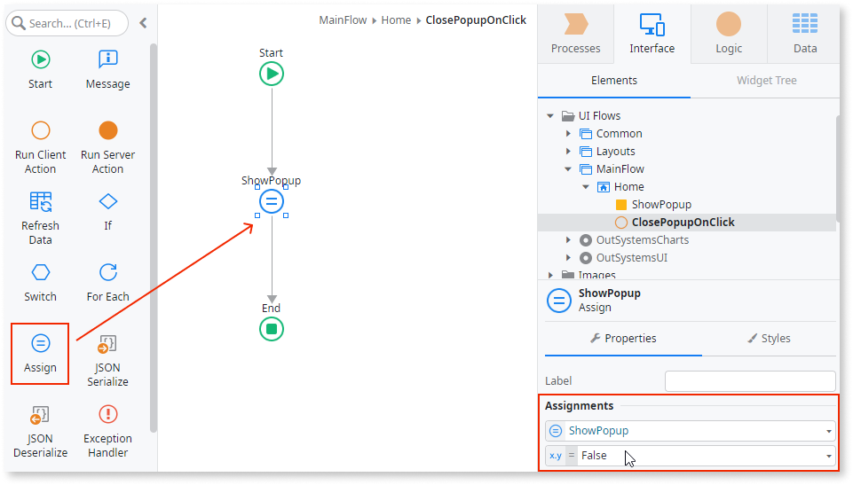

# Create and use a Popup

You can use a popup to show information to users or ask them to enter information. Correctly used popups help you create a good user experience, because the users remain on the same page.

## Reactive Web and Mobile

To create and use a popup in Reactive Web and Mobile Apps:

1. In Service Studio, in the Toolbox, search for `Popup`.

    The **Popup** widget is displayed.

    

1. Drag the **Popup** widget into the **Main Content** area of your screen. 

    

1. Add a variable of boolean data type to the screen by right-clicking on your screen name (located in the element tree) and selecting **Add Local Variable**. In this example, we call the variable `ShowPopup`.

    

    

1. Select the Popup widget, and on the **Properties** tab, enter the new variable for the **Show Popup** property. This toggles the popup according to the variable value.

    

1. Add your content to the popup.

    In this example, we add some text and a **Close Popup** button. We also add a **Show Popup** button to the **Actions** screen area.

    

1. Select the **Close Popup** button, and from the **On Click** dropdown, select **New Client Action**.

    

1. Drag an **Assign** onto the client action, and set the **ShowPopup** variable to **False**.

    

    Clicking the **Close Popup** button sets the **ShowPopup** variable to **False** and closes the popup.

1. Repeat steps 6 and 7 for the Open Popup button, substituting the variable value to True. Clicking the **Open Popup** button sets the ShowPopup variable to **True** and opens the popup.

After following these steps and publishing the module, you can test the pattern in your app.

Here's a [video tutorial about using Popup in Reactive Web and Mobile App](https://www.youtube.com/watch?v=RrMARHvJBXU).

## Traditional Web

To create and use a popup in Traditional Web Apps:

1. In Service Studio, in the Toolbox, search for and drag the **Link** widget into the **Actions** placeholder of your screen.

    

1. Enter a name and some text for the link. In this example we enter `PopupLink` for the link name and ``Show Popup`` as the link text. Ensure the **Method** property is set to **Navigate**.

    

1. Create a new screen for the popup. Select the **Widget Tree**, and from the **Source Web Block** dropdown, select **Layouts\LayoutPopup**.

    

1. Delete the **Center**, **Left**, and **Right** placeholders from the screen until you are left with only the **MainContent** placeholder.

    

1. Add the popup content. In this example, we add some text.

    

1. Select your main screen again, and from the **Properties** tab, set the link's **On Click** destination property to the popup screen you just created.

    

1. From the Toolbox, search for and drag the **Popup Editor** widget into the **Main Content** area of your screen.

    

1. On the **Properties** tab, from the  **LinkOnButtonWidgetId** dropdown, select the Link widget Id (in this example, PopupLink.Id).

    

    You can also create a screen action for the Popup Editor widget by selecting **New Screen Action** from the **Destination** dropdown. In this example, we select **New Screen Action**, but leave the flow of the action empty.

After following these steps and publishing the module, you can test the pattern in your app.

Here is a [video tutorial about using Popup in Traditional Web App](https://www.youtube.com/watch?v=ShOCxc3g91M).

### Notes

Here are some additional notes about the Popup widget.

#### Showing a Confirmation Message for a Link that navigates to a Popup

When a Link widget has a Confirmation Message with the destination **RichWidgets\Popup_Upload**, the app doesn't show the Confirmation Message. To show the message, first navigate to a hidden Link that can then navigate to a RichWidgets\Popup_Upload:

1. Add a **Link** widget and enter the message in the property **Confirmation Message**.

1. Set the Link **Destination** to **Server Action** that uses **RichWidgets\Widget_Click** and select the **id** of the second Link widget.

1. Set the second Link **Visibility** property as **False** and its **Destination** as **RichWidgets\Popup_Upload**.
