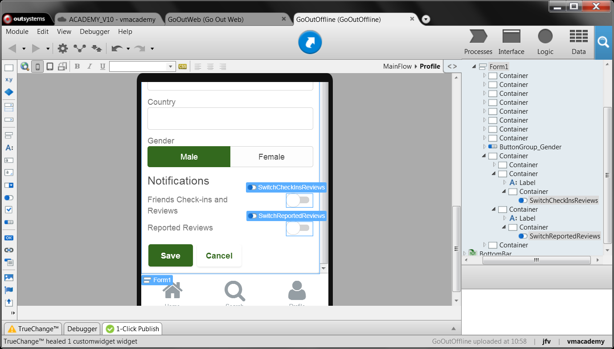
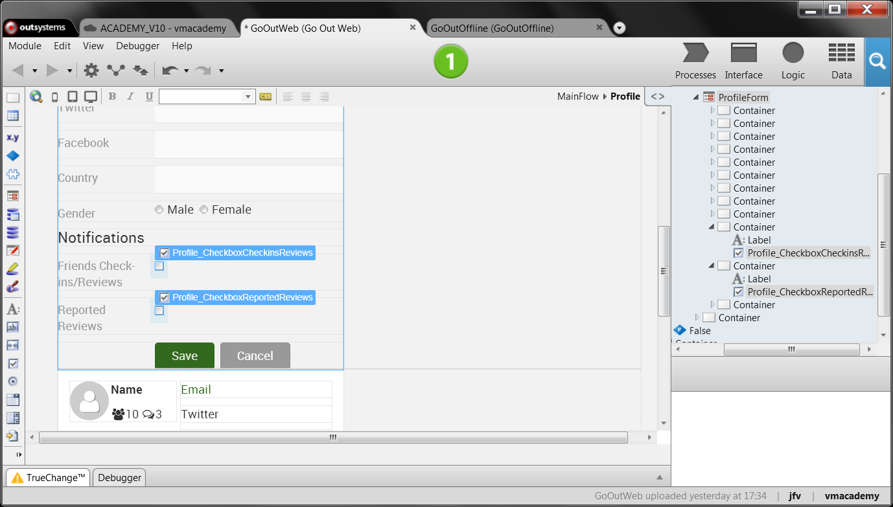

# Switch or Toggle a Boolean Value

To gather end user input for a boolean value in a form, OutSystems provides two types of widgets:

*  Check Box
*  Switch (for Reactive Web and Mobile only)

To use these widgets, do the following:

1. Drag the Check Box or Switch widget from the toolbar into the Form.
1. Bind the boolean variable to the widget in the Variable property. 

These widgets are provided by default in the Widgets Toolbox, but you can use other system widgets provided by OutSystemsUI (in Reactive Web and Mobile) and RichWidgets (in Traditional Web).

You can also find in the Forge, other widgets developed by the OutSystems community.

## Using Switch in Reactive Web and Mobile

In the GoOut mobile app, to find, review, and rate places, end users can receive two kinds of notifications by email. One to inform that a friend did something in a place, either checked in or wrote a new review. The other is to alert end users that someone reported one of their reviews as having some problem.

What we want to do is allow end users to configure which notifications they want to receive.

There's already a Profile screen in the GoOut application with a form to enter data:

1. Add a Switch widget at the end of the the form. 
1. Set property Variable to: `GetLocalProfiles.List.Current.LocalProfile.NotifyCheckInsReviews`
1. Add a Label text before the widget with "Friends Check-ins and Reviews".
1. Repeat steps 1. to 3. to add another Switch, now with the following values: `GetLocalProfiles.List.Current.LocalProfile.NotifyReportedReview` and "Friends Check-ins and Reviews".
1. Add a heading text with 'Notifications' at top of the two configurations. 
1. Publish and test. 

## Using a Checkbox in Traditional Web

In the GoOutWeb app, the Traditional Web version of the GoOut app, we want to also allow end users to configure their notifications. 

There's already a Profile screen in the GoOutWeb application with a form to enter data:

1. Add a Checkbox widget at the end of the the form. 
1. Set property Variable to: `ProfileForm.Record.Profile.NotifyCheckInsReviews`.
1. Add a Label text before the widget with "Friends Check-ins and Reviews".
1. Repeat steps 1 to 3 to add another Switch, now with the following values: `ProfileForm.Record.Profile.NotifyReportedReview` and "Friends Check-ins and Reviews".
1. Add a heading text with "Notifications" at top of the two configurations.
1. Publish and test. 

