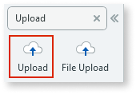
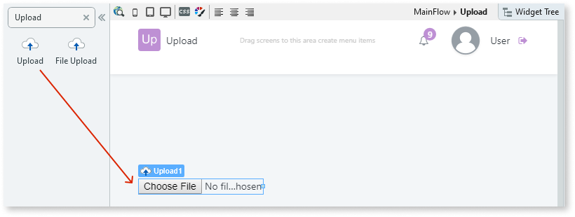

# Enable End Users to Upload Files

Use the Upload widget to add files, such as photos to your application.

## Reactive Web and Mobile

To upload a file in Reactive Web and Mobile apps:

1. In Service Studio, in the Toolbox, search for `Upload`.

    The Upload widget is displayed. 

    

1. Drag the Upload widget into the Main Content area of your screen. 
    
    

    By default, the Upload widget contains an icon and text placeholder.

1. To hold the file content, create a local variable by right-clicking on your screen name and selecting **Add Local Variable**. Enter a name for the variable and set the data type to binary data. 

    

1. Repeat step 3 to hold the file name, but in this case, select Text as the data type.

    

1. Select the Upload widget, and on the **Properties** tab, set the **File Content** property to the local variable you just created to hold the file content and the **File Property** property to the local variable you created to hold the file name.

    

**Note:** To save the uploaded file, you can use a Client Action to call a Server Action to send the file to the server. To do this:
* Create a Button or Link, and inside the associated Client Action, call the Server Action. 
* The Server Action should have an input parameter to accept the contents of the BinaryDataVar variable. 
 * Inside the Server Action, create the logic to process or store the uploaded file.

After following these steps and publishing the module, you can test the pattern in your app.

## Traditional Web

To upload a file in a Traditional Web app:

1. In Service Studio, in the Toolbox, search for `Upload`.

    The Upload widget is displayed. 

    

1. Drag the Upload widget into the Main Content area of your screen. 
    
    

**Note:** You can add a Button to the screen that executes and saves the file in a Screen Action. Inside the Screen Action flow, use the Runtime Properties of the Upload widget:

* `Upload.Content`: The file content 
* `Upload.Filename`: The file name 
* `Upload.Type`: The file type 

After following these steps and publishing the module, you can test the pattern in your app.