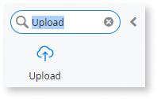
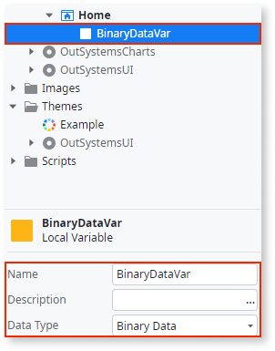
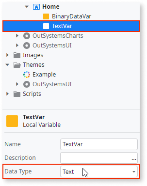
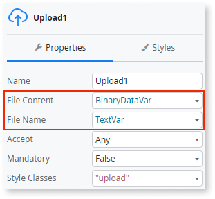

# Enable End Users to Upload Files

Use the Upload widget to allow users to upload files, such as photos to your application.

## Reactive Web and Mobile

To upload a file in Reactive Web and Mobile apps:

1. In Service Studio, in the Toolbox, search for `Upload`.

    The Upload widget is displayed.

    

1. Drag the Upload widget into the Main Content area of your screen.

    

    By default, the Upload widget contains an icon and text placeholder.

1. To hold the file content, create a local variable by right-clicking on your screen name and selecting **Add Local Variable**. Enter a name for the variable and set the data type to Binary Data.

    

1. Repeat step 3 to create a local variable to hold the file name, but in this case, select Text as the data type.

    

1. Select the Upload widget, and on the **Properties** tab, set the **File Content** property to the local variable you created (BinaryDataVar) to hold the file content and set the **File Name** property to the local variable you created (TextVar) to hold the file name.

    

### Save the uploaded file

There are several ways to save the uploaded file. For example,  you can use a Client Action to call a Server Action to send the file to the server. To do this:

1. Create a Button or Link, and inside the associated Client Action, call the Server Action.

1. Ensure the Server Action has an input parameter to accept the contents of the BinaryDataVar variable.

1. Inside the Server Action, create the logic to process or store the uploaded file.

After following these steps and publishing the module, you can test the pattern in your app.
