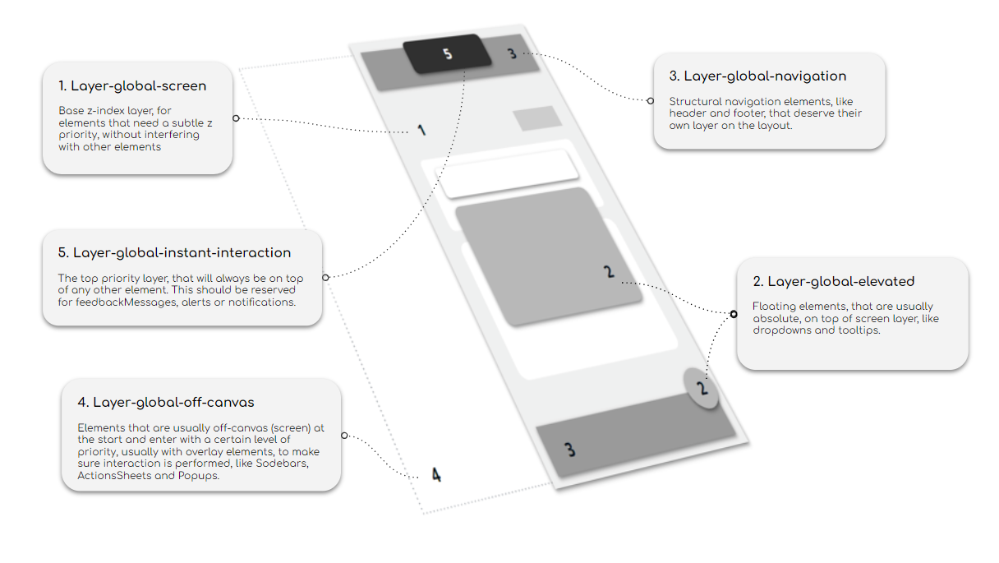

# OutSystems UI Layer System

<div class="info" markdown="1">

Applies to Mobile Apps and Reactive Web Apps only.

</div>

On version 2.16.0 of OutSystems UI, we released a new way to manage z-index values across all the UI Patterns, which offers better maintainability and easier customization.


## The Layer System

There are four main categories of variables that compose the new Layer System:

### Modifiers:

* **layer-scale:** 5
* **layer-above:** 5
  * This defines both the scale being used, but also helps in making the CSS calc() more human-readable (as you can see on the code snippet below and how the global variables are set). A scale of 5 is used, as a compromise between keeping the overall values low, while giving space to exceptions, if needed, between levels, by using the local-layers.
* **layer-below:** -5
  * Negative modifier, opposed to layer-above.

### Global Layers

Main global layers define the patterns hierarchy in the main Stacking Context. The top value used is 20 (for accessibility and overall values management, it’s important to keep them as low as possible).

1. **layer-global-screen:** 0;
2. **layer-global-elevated:** 5
3. **layer-global-navigation:** 10
4. **layer-global-off-canvas:** 15
5. **layer-global-instant-interaction:** 20


 

### Auxiliary

Auxiliary values are meant to be used in very specific situations.

* **layer-global-negative:** -1
* **layer-global-auto:** auto


### Local Layers

Local values are supposed to be used on child elements of Global Layers. As the elements with the global layers will already have their own stacking context, these values can start from 1. There's no need to be incremented on top of the global value (unless it’s a non-static element).

* **layer-local-tier-1:** 1;
* **layer-local-tier-2:** 2;
* **layer-local-tier-3:** 3;
* **layer-local-tier-4:** 4;
* **layer-local-tier-5:** 5;


## Using the Layer System

All these are mapped to CSS Variables on the **:root** of the **OutSystems UI.css**. If you want to take a closer look at the code, check it on [OutSystems UI public repository](https://github.com/OutSystems/outsystems-ui/blob/dev/src/scss/01-foundations/_root.scss).


If you want to incorporate your element/Pattern into the Layer System, here’re some suggestions:

The usage of the Global Layers should always be prioritized first. By using the description above and the visual aid, check the best layer where it would fit. 

```
.my-custom-dropdown {
    z-index: var(--layer-global-elevated);
}
```

In case the element needs a more specific value, use the CSS calc() together with the appropriate Local Layer (again, the lowest layer possible should be prioritized, starting with the layer-local-tier-1). For example:

```
.my-custom-pattern {
    z-index: calc(var(--layer-global-elevated) + var(--layer-local-tier-1));
}
```

The combined usage of Global Layers and Local Tiers, should be enough for all the exceptions. However, If you feel the scale is too low, and you would like a bigger one, to give more room for exceptions, you can simply add this to your Theme. For example, increasing the scale for interval to 10:

```
:root {
    --layer-system-scale: 10
}
```

All the Global Layer will now adapt to this new value, and be separated on intervals of 10.


## Impact and Mitigation

<div class="info" markdown="1">
    
This section only applies, if you have custom CSS or custom patterns, that use z-index. If not, the new layer system won't impact your applications.

</div>

This new system meant changing the values of all z-index on the framework, which might have an impact on your custom CSS or custom pattern, which uses custom z-index values. This might result in unexpected behaviors, as now the values coming from OutSystems UI are much lower (the top value used is 20).

In this situation, you might want to review those values, considering where they might fit better in the new Layers.

If you prefer to keep using the old values, you can add the following CSS on your theme, or keep it as a separate Theme, on top of the OutSystems UI. This theme simply overrides all the new values with the old ones: **[legacy-z-index.min.css](resources/legacy-z-index.min.css).**

