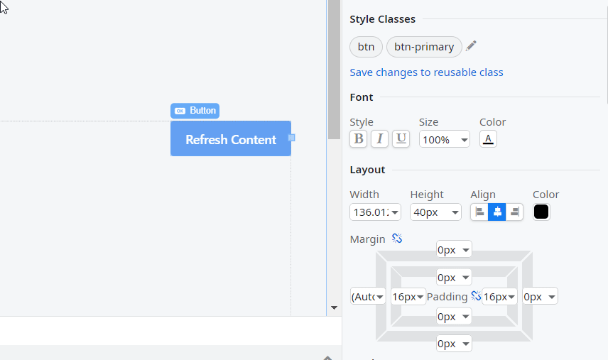

# Change the look of widgets with Styles Editor

Styles Editor is a panel for editing basic visual properties. Use it to change, for example, font color, margins or border thickness. In the **Interface** tab, open a screen or block, select an element and click the **Styles** tab in the properties pane. Styles Editor panel is also available in **Style Sheet Editor**, where you can use the editor to modify saved styles.

To style a widget use the options in **Font**, **Layout** and **Borders**. Here is an overview of what you can change by using Styles Editor:

Font
:   Style (bold, italic, underline), size and color.

Layout
:     Width, height, alignment (left, center, right) and the background color. Margins and padding. When applicable to the selected element, **Width** and **Margin Left** properties have column count for the grid.

Borders
:   Thickness and color of the borders. Roundness of corners. 

**Margins** and **Borders** have icons to indicate how edits apply to the widget.

| Icon  | Meaning  |
|---|---|
| | The value applies to all other related properties. |
| | The value applies to the current property only. |

All changes apply to the current widget only.

If you want to use the same style on other widgets, save the style as a set of properties (a class). Then, add classes to widgets you want to style in their **Style Classes** section of the Styles Editor. To promote a style to a class, your module needs to have a local theme.

The expandable section **Styles Properties Applied** lists all styles in the widget. Click a style to open Style Sheet Editor at the style definition.

You can edit [CSS](<css.md>) directly in the module [Theme](<themes.md>) for a greater control of the visual elements.

Note that Styles Editor edits can be overridden by the `style` value of the **Extended Properties**, according to the [CSS specificity](<css.md#css-specificity>) rules. Additionally, any class added in `class` extended property isn't visible in the editor.

# Examples of use

Here are some examples of how you can use Styles Editor to change widgets look, save styles and apply them to other widgets in the application.

## Change style of a widget

How to change the style of a widget.

1. Drag a widget to a Screen.
1. In the **Properties Pane** click the **Styles** tab.
1. In the **Font** section edit text properties, for elements that contain text.
1. Use **Color** fields to open the color picker and set the color of a property.
1. Change width, height, alignment in **Layout**.
1. Adjust outer and inner spacing in **Layout/Margin** and **Layout/Padding**.
1. Add borders in the **Borders** section and adjust the roundness.

## Save a style

How to save a style as a CSS class.

1. Edit a widget in Styles Editor.
1. In the section **Style Classes** (or **Styles Properties Applied**) click **Save changes to reusable class**.
1. In the dialogue that opens, enter a name for the class (for example, `myStyle`). The class groups all the elements of style.
1. In the Style Sheet Editor window that opens, press **OK**.

## Apply a saved style

How to apply a saved style to a widget.

1. Click the widget which you want to style.
1. In the **Style Classes** section click the **pencil icon**.
1. Add your style class to the style list, separating it by a space. For example: `BaseStyle1 BaseStyle2 myStyle`.

## Edit a saved style

How to edit existing CSS style.

1. Click a widget that has the style you want to edit.
1. In the **Style Classes** section (or in **Style Properties Applied**) click the name of the style, for example `myStyle`.
1. In the window that opens, edit the properties in the embedded **Styles Editor**.
1. Click **OK** when you finish editing.

## Reset style to default

How to reset the widget styles to default values.

1. Select a widget.
2. Go to **Styles Editor** > **Styles**.
3. Delete the CSS styles in the text box under **Style Properties Applied**.

If you saved custom styles, you need to remove them in **Styles Editor** > **Styles** > **Style Classes**. If you're not sure which styles you created and which are default, create a new widget and compare the styles under **Style Classes**. 
