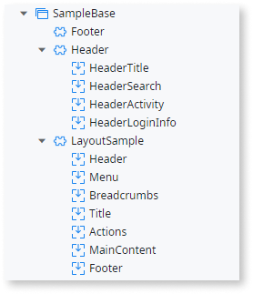

# Themes

A theme contains the details for visual presentation of your application. Changing a theme changes how your application looks. A theme can be applied to an entire application or to a UI Flow.

The default OutSystems Themes are part of the OutSystems UI Framework. The OutSystems UI Themes work well with scaffolding, so you can quickly create CRUD interfaces, insert screens by dragging entities to UI Flows and use other accelerators. The OutSystems UI Framework is optimized for performance, which is particularly important in mobile development.

## The structure of a OutSystems UI theme

The themes in the OutSystems UI framework follow a structure which is based on the screen requirements of an OutSystems app. Each Theme includes several Blocks (for example, a Header block) and each Block consists of one or more Placeholders (for example, Header Title and Header Search).

The following diagram shows how a new Theme inherits the layout from the base Theme, and how the platform uses the Blocks and Placeholders to generate a page. The main layout has Placeholders whose content are Blocks (the Header placeholder will be replaced by the content generated in the Header block). The CSS is also inherited from the base theme, but can be overridden by the application CSS.

## Blocks

Different types of Screen require different Blocks. The following table specifies the required Blocks for the different type of Screens in web applications:

<table markdown="1">
<thead>
<tr>
<th rowspan="2">
Type of Screen
</th>
<th colspan="7">
Web Block
</th>
</tr>
<tr>
<th>
Layout
</th>
<th>
Info Balloon
</th>
<th>
Pop-up Editor
</th>
<th>
Email
</th>
<th>
Header
</th>
<th>
Menu
</th>
<th>
Footer
</th>
</tr>
</thead>
<tbody>
<tr>
<th>
Blank Screen
</th>
<td>
Required
</td>
<td></td>
<td></td>
<td></td>
<td>
Required
</td>
<td>
Required
</td>
<td>
Required
</td>
</tr>
<tr>
<th>
List Screen
</th>
<td>
Required
</td>
<td></td>
<td></td>
<td></td>
<td>
Required
</td>
<td>
Required
</td>
<td>
Required
</td>
</tr>
<tr>
<th>
Show Screen
</th>
<td>
Required
</td>
<td></td>
<td></td>
<td></td>
<td>
Required
</td>
<td>
Required
</td>
<td>
Required
</td>
</tr>
<tr>
<th>
Edit Screen
</th>
<td>
Required
</td>
<td></td>
<td></td>
<td></td>
<td>
Required
</td>
<td>
Required
</td>
<td>
Required
</td>
</tr>
<tr>
<th>
Info Balloon
</th>
<td></td>
<td>
Required
</td>
<td></td>
<td></td>
<td></td>
<td></td>
<td></td>
</tr>
<tr>
<th>
Pop-up Editor
</th>
<td></td>
<td></td>
<td>
Required
</td>
<td></td>
<td></td>
<td></td>
<td></td>
</tr>
<tr>
<th>
Email
</th>
<td></td>
<td></td>
<td></td>
<td>
Required
</td>
<td></td>
<td></td>
<td></td>
</tr>
</tbody>
</table>

The table can be interpreted like this:

* When creating or editing a blank screen in a web application, there should be web blocks for the layout, header, menu and footer, or
* When creating or editing an Email web application, there is only one block required.

The main content of the screens is placed in the block named **Layout**. Depending on the platform for which the theme is developed, the layout can consist of different placeholders. For example, the layout in web application must have a placeholder that will show content (MainContent), but the breadcrumbs placeholder is optional.

This is the list of reserved names for the **Layout**  placeholders in the web themes.

* Title
* MainContent
* Breadcrumbs
* Actions
* Header
* Menu
* Footer

A mobile theme can have these placeholders in the layout block:

* HeaderLeft
* Title
* HeaderRight
* HeaderContent
* Content
* Bottom

The mobile themes have the block-specific events and actions, which are later compiled into JavaScript/React event listeners and functions. Do not delete default events and actions relevant for the screen purpose. 

## Placeholders

What placeholders to use depends on the type of screen. Here is an overview for the web applications:

<table markdown="1">
<thead>
<tr>
    <th>Type of Screen / Placeholder</th>
    <th>Title</th>
    <th>MainContent</th>
    <th>Actions</th>
    <th>Header</th>
    <th>Menu</th>
    <th>Footer</th>
</tr>
</thead>
<tbody>
<tr>
<th>Blank Screen</th>
<td></td>
<td>Required</td>
<td></td>
<td>Optional</td>
<td>Optional</td>
<td>Optional</td>
</tr>
<tr>
<th>List Screen</th>
<td>Required</td>
<td>Required</td>
<td>Optional</td>
<td>Optional</td>
<td>Optional</td>
<td>Optional</td>
</tr>
<tr>
<th>Edit Screen</th>
<td>Required</td>
<td>Required</td>
<td>Optional</td>
<td>Optional</td>
<td>Optional</td>
<td>Optional</td>
</tr>
<tr>
<th>Info Balloon</th>
<td></td>
<td>Required</td>
<td></td>
<td></td>
<td></td>
<td></td>
</tr>
<tr>
<th>Pop-up Editor</th>
<td></td>
<td>Required</td>
<td></td>
<td></td>
<td></td>
<td></td>
</tr>
<tr>
<th>Email</th>
<td>Optional</td>
<td>Required</td>
<td></td>
<td></td>
<td></td>
<td></td>
</tr>
</tbody>
</table>

Some examples:

* If, in the theme properties, a web application has a web block assigned for Blank Screen, the only required placeholder for that web block is MainContent, or
* If, in the theme properties, a web application has a web block assigned for Email, the only required placeholder for that web block is MainContent, while Title is optional.

Menu items in web can be created automatically by drag and drop. If you want to keep the same functionality in your themes, create a menu web block with the required input parameters and the entities. Refer to the existing themes for input parameters and entities.

Here is an example of blocks for a web theme and their placeholders:

## Creating a theme from a base theme

When you create a new app it already contains a copy of the CSS which you can edit. You can create new, additional, themes manually.

1. In the **Interface** tab right-click **Themes** and select **Add Theme**.
1. Enter the name of your new theme.
1. Optionally, change the **Base Theme**. If you do not see the theme you want in the list, add a reference to it.
1. With your theme selected in the Properties Pane, click on **Style Sheet**.
1. Enter your styles in the first tab of the CSS editor. You cannot edit the original theme, but you can create new styles with the same class names and override the original styles.
