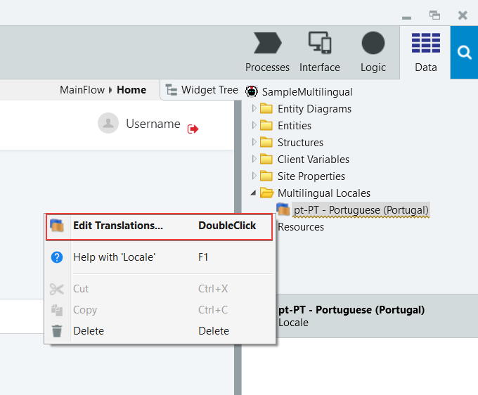
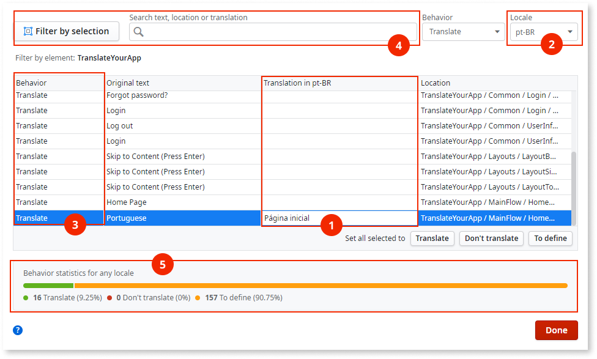

# Translating with the translation editor

The **translation editor** lets you translate text and manage your translation directly from Service Studio. To open the editor go to the **Data** > right-click the **Multilingual Locales** folder > click **Edit Translations**.

Translation editor also opens when you [add a new translation language](translate-your-app.md).

Once you open the translation editor, you can:

* **Translate** text by entering the translation in the **Translation in (language code)** column (1).
* **Switch languages for translation** by selecting the language code in the **Locale (language code)** dropdown (2).
* **Set text as translatable/non-translatable** by selecting one of the options in the **Behavior** list column (3). 
* **Filter and search** the text by using the tools in the **Filter** section of the translation editor (4). With the translation window open, select an element in the screen, and then click the button with the arrow icon to show that element in the editor.
* **Navigate to a text in the module** by double-clicking a **Text** field to see the text in context.
* **See the translation progress**, as it shows in the **Statistics** section (5).

If a translatable text has no translation, the app shows the text in the default language of the app (**en-US**).

## Translatable and non-translatable text

Use the **Behavior** column in the translation editor to set the as text as translatable or non-translatable:

| **Behavior**        | Translation shows in UI | Exported |
| ------------------- | ----------------------- | -------- |
| **Translate**       | Yes                     | Yes      |
| **Don't translate** | No                      | No       |
| **Not defined**     | No                      | No       |

Here are notes with more information:

* When you set the text as **Translate**, you tell Service Studio that the text is **translatable**. You need to supply the translation for the text, otherwise the app shows the original text.
* If you set text as **Don't translate**, Service Studio treats it as **non-translatable**. The app shows the original text for the non-translatable text **even if you supply the translation**. This is useful if you want to protect text like brand name, product name, or strings with special purpose in your app.
* If the text is **Not defined**, Service Studio has no information about how the text should appear in the app. For the purposes of optimization, the app shows the original text even if you supply the translation. To show the translation, set the **Behavior** to **Translate**. To protect the text, set it to **Don't translate**.

For more information about exporting text for translation see [Translation management](translation-management.md).

Service Studio automatically sets as translatable the following text:  

* Screen titles
* Button labels
* Text in the screens

