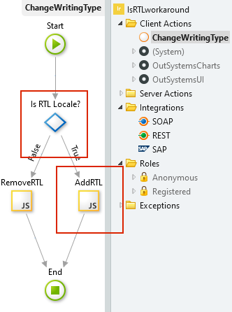
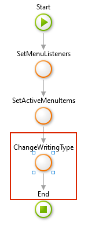

# Troubleshooting and known issues

The Multilingual feature for Reactive Web Apps and Mobile Apps is in a technical preview phase. OutSystems is collecting feedback and improving the  feature. Until the feature is generally available, use this document to read about the issues and recommended workarounds.

## Know issues and workarounds

This section contains more details about known issues.

### Right-to-left languages don't show properly

Apps show content for the right-to-left (RTL) languages left to right instead of right to left. This is a known issue and OutSystems is working on the improvements. Until the fix is public, you can use the workaround to control how the content shows in your apps.

#### Workaround

The CSS class `is-rtl` defines the styles for the RTL locales. Create custom logic to add the **is-rtl** class for all your locales that are RTL, while removing it for non-RTL locales.

1.  Compile a list of the identifiers for the RTL locales your app supports.

1. Create a new client action that checks if the current locale is RTL, and then add or remove the CSS **is-rtl** class. In this example, the action is **ChangeWritingType**. 

    

    The If node checks the condition **GetCurrentLocale() =** `"ar-AE"`. As `"ar-AE"` is one of the RTL locales, the logic runs the **AddRTL** node.

    Here is the code for the **JavaScript** nodes:

    * Add RTL class: `document.body.classList.add("is-rtl");` 
    * Remove RTL class: `document.body.classList.remove("is-rtl");`

1. Go to **UI Flows** > **Common** > **Menu** and add the client action you just created to the logic flow of **OnRender** action under **Menu**.

    

    Add your action in the OnRender action of an element that runs **in all screens of the app**. In this example, the action is in the OnRender of the Menu block.
