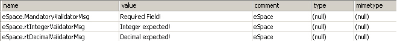
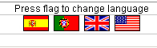

# Multilingual Web Applications

Applies only to Traditional Web Apps.

Besides the language that your Module was designed in (the default language) you may add other languages for which your Module is translated and executed. Each language is specified by its **Locale** which is defined by the **primary language** or the **primary language and the region**, as some languages vary from region to region.

These instructions are for translating Traditional Web Apps only. For Reactive Web and Mobile Apps see [Multilingual apps](../multilingual-tp/intro.md).  

You can translate the following elements of your Module:

* Text in the screens
* Screens Title
* Labels of Buttons, processes, and process activities
* Instructions of Human Activities
* Text in Links
* Special List Options of the Combo Box widget
* Messages displayed to the end user that are embedded in the application (validation messages, widgets' confirmation, and empty messages)
* Text literals found in all types of expressions (including Unescaped Expressions and JavaScript)
* Images
* Static Entities (make sure the `Use Translations` advanced property is enabled)

From the translation process view, these elements will be considered **translatable resources**. You can select how each translatable resource in your Module is handled - whether it should effectively be translated (text or images that should be different in different languages) or not (for instance, a brand name that is the same across different languages) - using the [Translations Behavior Editor](./translations-editor.md). 

## Add Other Languages

All the Locales are expressed according to the [RFC 1766](https://tools.ietf.org/html/rfc1766) standard format. Here are some examples:

| English   | French   | Portuguese   | Spanish   |
|-----------|----------|--------------|-----------|
| en: English | fr: French | pt: Portuguese | es: Spanish |
| en-GB: English (United Kingdom) | fr-CA: French (Canada) | pt-BR: Portuguese (Brazil) | es-AR: Spanish (Argentina) |
| en-US: English (United States) | fr-FR: French (France) | pt-PT: Portuguese (Portugal) | es-ES: Spanish (Spain) |

To add a language Locale, do the following:

1. Right-click the **Multilingual Locales** folder in the elements tree of the **Data Tab** and select **Add Locale...** option.

1. Select the language Locale to be added from the Select Locale window.

If an element has no translation defined for the language region while executing the application, the translation defined in the primary language is used.

## Resources Translation Process

The translation of your Module is made using files containing the **translatable resources**. OutSystems exports the translatable resources to these files, which are sent to the translator, and then, after being translated, imported back to your Module.

### Export the Resources for Translation

To export your translatable resources follow these steps:

1. Open the Module menu, point to **Export** and select one of the **Language Resources To &lt;format&gt;** options; where **&lt;format&gt;** is one of the following file formats:

    * **Excel**

        OutSystems Platform exports all translatable resources to a single Excel file listed in lines and columns as follows:

        **Key**: the key of the translatable resource. It's unique within the module and it doesn't change. New translatable resources get a different key.
        
        **Location**: the location of the translatable resource in the module.
        
        **Text to be translated**: the text to be translated.
        
        **Locale(s)**: columns for each language locale in your module. Set the translated text here, however, if you want to keep using the original text just leave the translation text empty.

    * **.resX (.NET resource format)**

        OutSystems exports all translatable resources to .resX files, one file **for each language locale** in your Module and one more file for the Module default language. The translatable resources information is organized in a XML way consisting basically in pairs of `<name, value>`, although a comment is also added:

        **Name**: The name (key) of the translatable resource. It's unique within the module and it doesn't change. New translatable resources get a different name.
        
        **Value**: This is the field where you should put the translated text replacing the existing one.
        
        **Comment**: The location of the translatable resource in the Module.

        Note: Depending on the .NET Framework you are using, the translatable resource files can have more attributes than these; these extra attributes are ignored by Service Studio.

        

    

    An alternative way to complete this step is to open the **Data tab**, right-click the Multilingual Locales folder, point to **Export Language Resources** and select one of the **To &lt;format&gt;** options.

    

1. Select the folder where you want to save the files. 
    
    Notice that no file name is asked and this is because Service Studio uses fixed names for its language translatable resource files, as follows:

    Excel Files
    :   The name of the Excel file obeys to the following rule: `<module name> + 'Language' + '.' + <Excel extension>`. For example, if your Module name is 'Recruitment' the language translatable resources file name is 'RecruitmentLanguage.xls'.

    .resX Files
    :   The name of the .resX files obey to the following rule: `<module name> + 'Language' + '.' + <Language locale> + '.resX'`. For example, if your Module name is 'Recruitment' and has the following language locales: 'French (France)' (fr-FR) and 'French (Canada)' (fr-CA). Three files are generated: 'RecruitmentLanguage.fr-FR.resX', 'RecruitmentLanguage.fr-CA.resX, and 'RecruitmentLanguage.resX' (for the default language).

### Export the Images for Translation

Your Images must be manually exported by saving them to files. For that, right-click each original image to be translated and select **Save Image As...** option to save the image. Repeat this procedure for each language you have to translate the image.

Name your translated images using the convention: `<image name> + '.' + <language locale> + '.' + <image extension>`. This allows Service Studio to automatically determine the locale when you add the translated image.

### Import the Translations of the Resources

To import the translations of your translatable resources back to the Module follow these steps: 

1. Open the Module menu, point to **Import** and select **Language Resources**. 

    

    An alternative way to complete this step is to open the **Data tab**, right-click the Multilingual Locales folder and select **Import Language Resources**.

    

1. Select the file to be imported.

    You can import files in one of the following formats:

    Excel Files
    :   Select the Excel file containing your translatable resources translations to be imported: **all languages translations are updated.**

    .resX Files
    :   Select the .resX file for the language you wish to import the translatable resources translations: **only the translations for the imported language are updated.**

### Import Translated Images

Your translated Images must be manually imported in one of two ways:  

* **The translated image already exists:** right-click the translated Image, select **Change Localized Image...** option and select the new translated image.

* **The translated image does not exist:** add the translated image.

To add an image for a specific language, do the following:

1. Go to the **Images folder** in the elements tree of the **Interface Tab**.
1. Right-click the original image and select **Add Localized Image** option.
1. Select the image and add it.
1. Select the new added localized image and set its `Locale` property with the right language locale.

## Change the Application Language

You may change the language in which the application is running using the [SetCurrentLocale System Action](<../../../ref/apis/auto/system-actions.final.md#SetCurrentLocale>).

As an example, use this System Action to allow the end user to change the operating language of your application:

Each flag has a link that, when pressed, invokes a screen action that changes the language locale. Here is the example for the Spanish flag:

**Spanish Flag Link**

**'ChangeLanguage' Action Flow**

**'SetCurrentLocale' Properties**

## Display the Current Language to End User

You can obtain your application current language locale using the [GetCurrentLocale built-in function](<../../../ref/lang/auto/builtinfunction.Environment.final.md#GetCurrentLocale>).

As an example, you may display to the end user a flag and the locale code (in [RFC 1766](<https://tools.ietf.org/html/rfc1766>) format) of the language which the application is operating:

