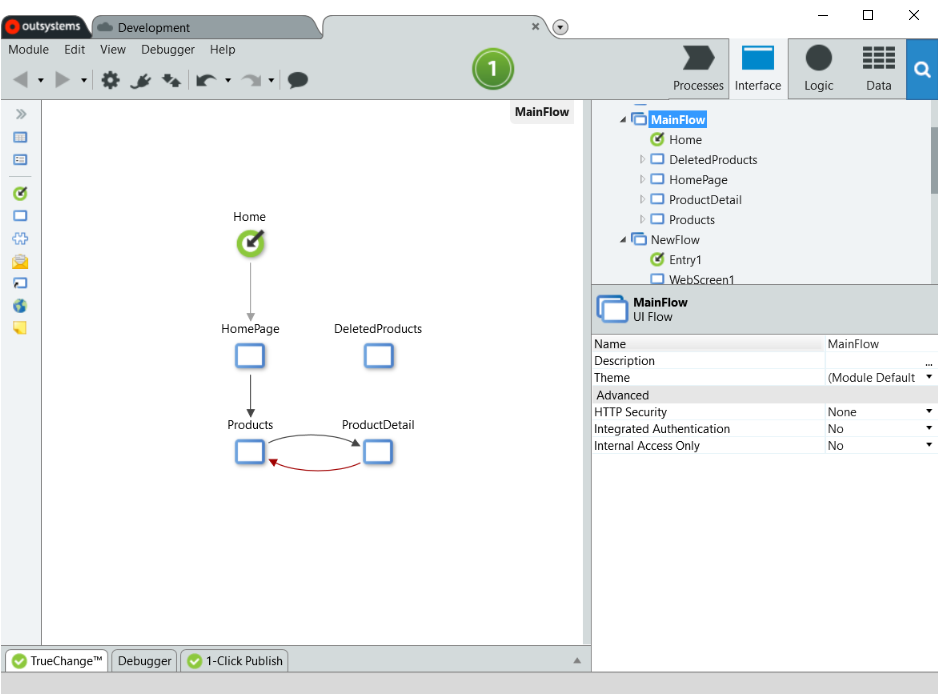
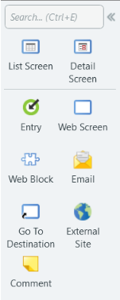

# UI Flows

Use UI Flows to organize your screens into groups and have an overview of the interfaces and interactions. The Main Editor shows the connections between the screens. The black line indicates a simple link navigation, while the red line means there is processing involved before navigating. Even though you can draw connectors in the Main Editor of the UI Flow, these connections are only visual — the connections must be defined in the screens. All screens in the same flow share common settings.

## UI Flows in Web

A UI Flow in web applications has an Entry Point which defines the URL within the application. The Entry Point with the property **Is Default** set to true is the index page of the web application.

You can drag and drop screens and entities in a UI Flow for web to start the accelerators (scaffolding). The same can be achieved by using the tools **List Screen** and **Detail Screen**. A UI Flow of web applications has security settings that are applied to all screens within the flow.

## UI Flows in Mobile

The default screen in mobile applications is defined in the **Default Screen** property of the module. Due to the mobile architecture, the accelerators for lists do not exist in the mobile runtime.

## UI Flow toolbox

These are the tools you can use by dragging them to the Main Editor of a UI Flow.

| Toolbox in Web Runtime | Toolbox in Mobile Runtime |
|---|---|
|  |  |

The table below describes the UI Flow tools and specifies if they are available for web or mobile apps.

| Tool | Description | Runtime |
|---|---|---|
| List Screen | Launches a wizard to select an entity and creates a list page with search and pagination. | web |
| Detail Screen | Launches a wizard to select an entity and creates a page for editing entity records. | web |
| [Entry](../../../ref/lang/auto/Class.Entry.final.md) | Creates the entry point to the flow and defines part of the URL. | web |
| [Web Screen](../../../ref/lang/auto/Class.Web Screen.final.md) | Creates a web screen. | web |
| [Screen](../../../ref/lang/auto/Class.Screen.final.md) | Creates a mobile screen. | mobile |
| [Web Block](../../../ref/lang/auto/Class.Web Block.final.md) | Creates a web block. | web |
| [Block](../../../ref/lang/auto/Class.Block.final.md) | Creates a block. | mobile |
| [Email](../../../ref/lang/auto/Class.Email.final.md) | Creates content for email. | web |
| [Go To Destination](../../../ref/lang/auto/Class.Go To Destination.final.md) | Navigates to a screen. | web |
| [External Site](../../../ref/lang/auto/Class.External Site.final.md) | Navigates to the specified URL. | web, mobile |
| [Comment](../../../ref/lang/auto/Class.Comment.final.md) | Creates a comment for developers, visible in Service Studio. The Comment node is not part of the logic. | web, mobile |
